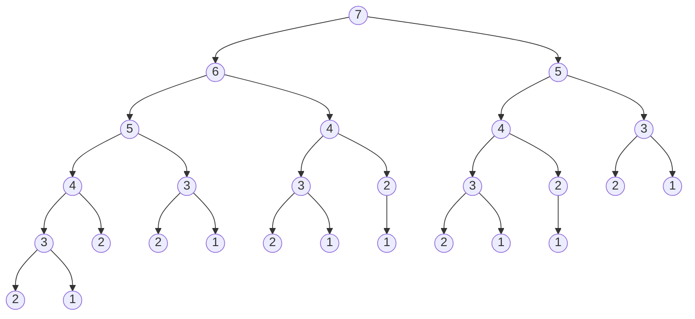

## leetCode 70 爬楼梯

假设你正在爬楼梯。需要 `n` 阶你才能到达楼顶。

每次你可以爬 `1` 或 `2` 个台阶。你有多少种不同的方法可以爬到楼顶呢？

**示例1:**
> 输入：`n = 2`<br/>
> 输出：`2`<br/>
> 解释: 有两种方法可以爬到楼顶
> 1. 1 阶 + 1 阶
> 2. 2 阶

**示例2:**
> 输入：`n = 3`<br/>
> 输出：`3`<br/>
> 解释: 有三种方法可以爬到楼顶
> 1. 1 阶 + 1 阶 + 1 阶
> 2. 1 阶 + 2 阶
> 3. 2 阶 + 1 阶

**提示:**
- $1 \leq n \leq 45$

### 分析
1. 爬 3 阶, 从 2 阶上来是一种方法, 从 1 阶上来是另外一种方法
2. 因此爬 3 阶的方法数 = 爬 2 阶的方法数 + 爬 1 阶的方法数
3. 也就是 `f(n) = f(n-1) + f(n-2)`, 发现此递推公式符合斐波那契数列
### 解法1: 递归
```py
def dfs(n: int) -> int:
    if n <= 2:
        return n # f(1)=1, f(2)=2
    return dfs(n - 1) + dfs(n - 2)
```
**复杂度分析:**
- 时间复杂度: $O(2^n)$, 这个递归解法相当于搜索一个课高为 `n` 的二叉树
- 空间复杂度: $O(n)$, 递归栈的深度为 `n`

例如 n=7

> [!warning]
> 发现计算了过多的重复子问题
### 解法2: 递归 + 记录返回值 = 记忆化搜索
> [!note]
> 可以存储已经计算过的值, 以避免重复计算, 例如可以使用 array or hash_map 来存储<br/>
> 不过 python 中内置了, `functools.lru_cache{:py}` 装饰器, 可以直接用于这个需求
```py
from functools import lru_cache

@lru_cache(maxsize=None)
def dfs(n: int) -> int:
    if n <= 2:
        return n # f(1)=1, f(2)=2
    return dfs(n - 1) + dfs(n - 2)
```
使用记忆化搜索后的复杂度是$O(n)$, 只需要计算每个子问题一次, 递归栈的深度为 `n`, 所以空间复杂度也是 $O(n)$<br/>
图示如下:

### 解法3: 动态规划
> [!note]
> **动态规划(Dynamic Programming, DP)** 可以被看作是将递归问题转化为迭代问题的一种算法，但它的核心思想不仅仅是简单的转化，而是通过 **分解问题** 和 **存储子问题的解** 来优化计算过程
```py
def climbStairs(n: int) -> int:
    if n <= 2:
        return n
    dp = [0] * (n + 1)
    dp[1], dp[2] = 1, 2
    for i in range(3, n + 1):
        dp[i] = dp[i - 1] + dp[i - 2]
    return dp[n]
```
### 解法4: DP + 状态压缩
- 在这个 解法3 中, `dp[i]` 的值只依赖于 `dp[i-1]` 和 `dp[i-2]`
- 因此，我们不需要存储整个 `dp` 数组，只需要用两个变量来保存最近的两个状态即可
- 状态压缩的时间复杂度与普通动态规划相同，但它的 空间复杂度更低，从 $O(n)$ 降到了 $O(1)$
- 在实际运行中，减少内存分配和访问的开销会使程序运行得更快
```py
def climbStairs(n: int) -> int:
    if n <= 2:
        return n
    prev, curr = 1, 2  # 初始化 f(1) 和 f(2)
    for i in range(3, n + 1):
        prev, curr = curr, prev + curr  # 更新状态
    return curr
```