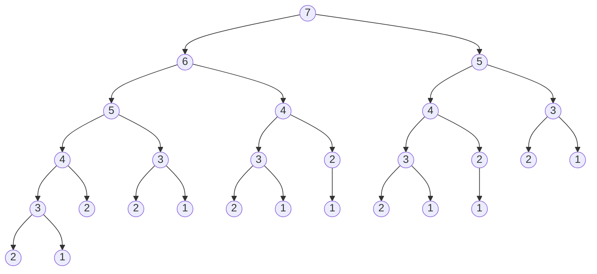

## leetCode 70 爬楼梯

假设你正在爬楼梯。需要 `n` 阶你才能到达楼顶。

每次你可以爬 `1` 或 `2` 个台阶。你有多少种不同的方法可以爬到楼顶呢？

**示例1:**
> 输入：`n = 2`<br/>
> 输出：`2`<br/>
> 解释: 有两种方法可以爬到楼顶
> 1. 1 阶 + 1 阶
> 2. 2 阶

**示例2:**
> 输入：`n = 3`<br/>
> 输出：`3`<br/>
> 解释: 有三种方法可以爬到楼顶
> 1. 1 阶 + 1 阶 + 1 阶
> 2. 1 阶 + 2 阶
> 3. 2 阶 + 1 阶

**提示:**
- $1 \leq n \leq 45$

### 分析
1. 爬 3 阶, 从 2 阶上来是一种方法, 从 1 阶上来是另外一种方法
2. 因此爬 3 阶的方法数 = 爬 2 阶的方法数 + 爬 1 阶的方法数
3. 也就是 `f(n) = f(n-1) + f(n-2)`, 发现此递推公式符合斐波那契数列
### 解法1: 递归
```py
def dfs(n: int) -> int:
    if n <= 2:
        return n # f(1)=1, f(2)=2
    return dfs(n - 1) + dfs(n - 2)
```
**复杂度分析:**
- 时间复杂度: $O(2^n)$, 这个递归解法相当于搜索一个课高为 `n` 的二叉树
- 空间复杂度: $O(n)$, 递归栈的深度为 `n`

例如 n=7

> [!warning]
> 发现计算了过多的重复子问题
### 解法2: 递归 + 记录返回值 = 记忆化搜索
> [!note]
> 可以存储已经计算过的值, 以避免重复计算, 例如可以使用 array or hash_map 来存储<br/>
> 不过 python 中内置了, `functools.lru_cache{:py}` 装饰器, 可以直接用于这个需求
```py
from functools import lru_cache

@lru_cache(maxsize=None)
def dfs(n: int) -> int:
    if n <= 2:
        return n # f(1)=1, f(2)=2
    return dfs(n - 1) + dfs(n - 2)
```
使用记忆化搜索后的复杂度是$O(n)$, 只需要计算每个子问题一次, 递归栈的深度为 `n`, 所以空间复杂度也是 $O(n)$<br/>
图示如下:

### 解法3: 动态规划
> [!note]
> **动态规划(Dynamic Programming, DP)** 可以被看作是将**递归问题**转化为**迭代问题**的一种算法，但它的核心思想不仅仅是简单的转化，而是通过 **分解问题** 和 **存储子问题的解** 来优化计算过程
```py
def climbStairs(n: int) -> int:
    if n <= 2:
        return n
    dp = [0] * (n + 1)
    dp[1], dp[2] = 1, 2
    for i in range(3, n + 1):
        dp[i] = dp[i - 1] + dp[i - 2]
    return dp[n]
```
### 解法4: DP + 状态压缩(滚动数组)
- 在这个 解法3 中, `dp[i]` 的值只依赖于 `dp[i-1]` 和 `dp[i-2]`
- 因此，我们不需要存储整个 `dp` 数组，只需要用两个变量来保存最近的两个状态即可
- 状态压缩的时间复杂度与普通动态规划相同，但它的 空间复杂度更低，从 $O(n)$ 降到了 $O(1)$
- 在实际运行中，减少内存分配和访问的开销会使程序运行得更快
```py
def climbStairs(n: int) -> int:
    if n <= 2:
        return n
    prev, curr = 1, 2  # 初始化 f(1) 和 f(2)
    for i in range(3, n + 1):
        prev, curr = curr, prev + curr  # 更新状态
    return curr
```
### 解法5: 解通项公式
```math
\begin{align*}
&f(n) = f(n-1) + f(n-2) \\
&\rightarrow f(n) = \frac{1}{\sqrt{5}}(\phi^n - \psi^n) \\
&\phi = \frac{1 + \sqrt{5}}{2} \quad （黄金比例） \\
&\psi = \frac{1 - \sqrt{5}}{2} \\
\end{align*}
```
```py
from math import sqrt
def climbStairs(n: int) -> int:
    sqrt5 = sqrt(5)
    phi = (1 + sqrt5) / 2
    n += 1 # 注意这题求的是 f(n+1)
    return round((phi**n - (1 - phi)**n) / sqrt5)
```
> [!note]
> 这个解法的时间复杂度是 $O(1)$, 但是由于浮点数精度问题, 当 `n` 较大时可能会出现误差
#### 证明
```math
f(n) = f(n-1) + f(n-2)
```
这是一个 **线性递推关系**, 并且它的系数是常数 (即 `1` 和 `1`) 。对于这种递推关, Binet's Formula 提供了一种通用的解法，可以直接推导出数列的通项公式

##### 待定系数法 推导

**1. 递推关系:**
```math
f(n) = f(n-1) + f(n-2)
```
这是一个二阶线性递推关系

**2. 特征方程:**

为了求解这个递推关系, 我们假设通解的形式为
```math
f(n) = x^n
```
- 将其代入递推关系中, 得到:
```math
x^n = x^{n-1} + x^{n-2}
```
- 除以 $x^{n-2}$ (假设 $x \neq 0$), 得到:
```math
x^2 = x + 1
```
这就是斐波那契数列的 **特征方程**

**3. 求解特征方程:**

- 解这个方程可以得到两个根:
```math
\begin{align*}
&x_1 = \frac{1 + \sqrt{5}}{2} \quad (黄金比例) \quad\quad
&x_2 = \frac{1 - \sqrt{5}}{2}
\end{align*}
```
**4. 通解的形式:**

根据线性递推关系，通解可以表示为特征根的线性组合：
```math
f(n) = A \cdot x_1^n + B \cdot x_2^n
```
**5. 确定系数:**
- 通过初始条件来确定系数 `A` 和 `B`
```math
\begin{aligned}
&\left\{
\begin{aligned}
f(0) &= A \cdot x_1^0 + B \cdot x_2^0 = 0, \\
f(1) &= A \cdot x_1 + B \cdot x_2 = 1, \\
f(2) &= A \cdot x_1^2 + B \cdot x_2^2 = 2.
\end{aligned}
\right. 
\\
&\left\{
\begin{aligned}
A + B &= 0, \\
A \cdot x_1 + B \cdot x_2 &= 1.
\end{aligned}
\right.
\end{aligned}
```
```math
A \cdot \frac{1 + \sqrt{5}}{2} + (-A) \cdot \frac{1 - \sqrt{5}}{2} = 1 
```
解得
```math
\left\{
\begin{aligned}
&A \cdot \sqrt{5} = 1, \\
&A = \frac{1}{\sqrt{5}}, \\
&B = -\frac{1}{\sqrt{5}}.
\end{aligned}
\right.
```
- 斐波那契数列的通项公式为:
```math
f(n) = \frac{1}{\sqrt{5}}(x_1^n - x_2^n)
```
### 总结: 不同解法对比
| 解法 | 时间复杂度 | 空间复杂度 | 优点 | 缺点 |
|------|------------|------------|------|------|
| 递归 | $O(2^n)$   | $O(n)$     | 简单易懂 | 重复计算, 效率低 |
| 记忆化搜索 | $O(n)$   | $O(n)$     | 避免重复计算 | 需要额外的存储空间 |
| 动态规划(数组) | $O(n)$   | $O(n)$     | 直观易懂 | 需要额外的数组存储空间 |
| 动态规划(状态压缩) | $O(n)$   | $O(1)$     | 节省空间 | 代码稍复杂 |
| 数学解法(斐波那契公式) | $O(1)$   | $O(1)$     | 理论最快，常数时间复杂度 | 浮点运算可能导致精度问题 |

## leetCode 198 打家劫舍
你是一个专业的小偷，计划偷窃沿街的房屋。每间房内都藏有一定的现金，影响你偷窃的唯一制约因素就是相邻的房屋装有相互连通的防盗系统，**如果两间相邻的房屋在同一晚上被小偷闯入，系统会自动报警**。

给定一个代表每个房屋存放金额的非负整数数组，计算你 **不触动警报装置的情况下** ，一夜之内能够偷窃到的最高金额。

**示例1:**
> 输入：`nums = [1,2,3,1]`<br/>
> 输出：`4`<br/>
> 解释：偷窃 1 号房屋 (金额 = 1) ，然后偷窃 3 号房屋 (金额 = 3) 。偷窃到的最高金额 = 1 + 3 = 4 。

**示例2:**
> 输入：`nums = [2,7,9,3,1]`<br/>
> 输出：`12`<br/>
> 解释：偷窃 1 号房屋 (金额 = 2)，然后偷窃 3 号房屋 (金额 = 9)，最后偷窃 5 号房屋 (金额 = 1)。偷窃到的最高金额 = 2 + 9 + 1 = 12 。

**提示:**
- `1 <= nums.length <= 100`
- `0 <= nums[i] <= 400`

```py
def rob(self, nums: List[int]) -> int:
    n = len(nums)
    if n == 0:
        return 0
    if n == 1:
        return nums[0]
    dp = [0] * n
    dp[0] = nums[0]
    dp[1] = max(nums[0], nums[1])
    for i in range(2, n):
        dp[i] = max(dp[i - 1], dp[i - 2] + nums[i])
    return dp[-1]
```
易懂解法
```py
def rob(self, nums: List[int]) -> int:
    n = len(nums)
    if n == 0:
        return 0
    if n == 1:
        return nums[0]
    dp = [[0, 0] for _ in range(n)]
    dp[0][0] = 0
    dp[0][1] = nums[0]
    for i in range(1, n):
        dp[i][0] = max(dp[i - 1][0], dp[i - 1][1])
        dp[i][1] = dp[i - 1][0] + nums[i]
    return max(dp[-1][0], dp[-1][1])
```

## 背包问题

$N$ 个物品, 价值为 $v_i$, 重量为 $w_i$, 背包总容量为 $W$, 找到背包能装下的最大价值
- 0-1背包问题: 每个物品只能选择 0 或 1 次
- 完全背包问题: 每个物品可以选择多次
- 多重背包问题: 每个物品最多选择 $s_i$ 次
- 分组背包问题: 物品分为若干组, 每组只能选择 0 或 1 次

### 0-1背包问题
状态表示: `dp[i][j]{:py}` 表示前 `i` 个物品, 背包容量为 `j` 时的最大价值

那么 `dp[N][W]{:py}` 就是我们要求的最大价值

从 `i-1` 到 `i` 这个过程, 有两种情况, 即选第 `i` 个物品和不选第 `i` 个物品:
- 如果不选第 `i` 个物品, 那么最大价值就是前 `i-1` 个物品的最大价值, 即 `dp[i-1][j]{:py}`
- 如果选第 `i` 个物品, 那么最大价值就是前 `i-1` 个物品的最大价值加上第 `i` 个物品的价值, 即 `dp[i-1][j-w_i] + v_i{:py}`

> [!note]
> 这里需要注意, 如果选第 `i` 个物品, 那么背包的容量就要减去第 `i` 个物品的重量, 即 `j-w_i`<br/>
> 因此 `dp[i][j]{:py}` 就是 `dp[i-1][j]{:py}` 和 `dp[i-1][j-w_i] + v_i{:py}` 的最大值<br/>
> 注意: 需要判断 `j` 是否大于等于 `w_i`, 如果小于 `w_i`, 那么就不能选第 `i` 个物品, 也就是 `dp[i][j] = dp[i-1][j]{:py}`

状态转移方程:
```math
dp[i][j] = \left\{
\begin{aligned}
&dp[i-1][j] & j < w_i \\
&max(dp[i-1][j], dp[i-1][j-w_i] + v_i) & j \geq w_i
\end{aligned}
\right.
```

## 例题

### 魔法巡游
**问题描述**

小蓝与小桥，肩负着维护时空秩序的使命。他们每人分别持有 N 个符文石，这些石头被赋予了强大的力量，每一块上都刻有一个介于 1 到 10^9 之间的数字符号。小蓝的符文石集合标记为 $s_1,s_2,…,s_N$​，小桥的则为 $t_1,t_2,…,t_N$​。

两位魔法使者的任务是通过使用符文石，在各个时空节点间巡游。每次巡游遵循这样一条法则：当小蓝使用了符文石 $s_i$​ 到达新的节点后，小桥必须选用一个序号更大的符文石（即某个 $t_j$​ 满足 $j>i$）前往下一个节点。同理，小桥抵达之后，小蓝需要选择一个序号 $j>i$ 的符文石 $s_j$​ 继续他们的巡游。

为了成功地穿梭时空，两个连续使用的符文石上的数字符号必须有共鸣，这种共鸣只有当数字符号中至少包含一个特定的元素——星火（数字 0）、水波（数字 2）或者风语（数字 4）时，才会发生。例如，符号序列 126,552,24,4 中的每对连续符文都包含了至少一个共鸣元素，则它们是一系列成功的巡游；而如果是 15,51,5，则不成立，因为它们之间的共鸣元素不包含星火、水波或风语中的任意一个。

小蓝总是先启程，使用他的符文石开启巡游。

你的任务是计算这对魔法使者能够执行的最长时空巡游序列的长度。这样的序列形式为 $s_{i_1},t_{i_2},s_{i_3},t_{i_4},…$，其中序列索引满足 $i_1<i_2<i_3<i_4<…$，并且序列中每一对相邻的符文石都至少包含一个共鸣元素。

**输入格式**

第一行包含一个整数 N，表示每位魔法使者持有的符文石数量。

第二行包含 N 个由空格分隔的整数，表示小蓝的符文石上刻有的数字符号 $s_1,s_2,…,s_N$

第三行包含 N 个由空格分隔的整数，表示小桥的符文石上刻有的数字符号 $t_1,t_2,…,t_N$

**输出格式**

输出一个整数，代表小蓝和小桥在遵守所有规则的情况下，最多能进行多少次时空巡游。

**样例输入**
```md
5
126 393 581 42 44
204 990 240 46 52
```

**【样例输出】**
```
4
```
**【样例说明】**

小蓝和小桥可以选择以下符文石序列进行巡游：
$s_1(126)→t_3(240)→s_4(42)→t_5(52)$ 这里，数字 2 作为共鸣元素连接了 $s_1$​ 和 $t_3$​、$s_4$​ 和 $t_5$​，数字 2、4 作为共鸣元素连接了 $t_3$​ 和 $s_4$

**评测用例规模与约定**

对于 30% 的评测用例，$1≤N≤10^3$，$1≤s_i,t_i≤10^5 $

对于所有评测用例，$1≤N≤10^5$ ，$1≤s_i,t_i≤10^9$

**分析**:
此题会诱导我们使用贪心, 但是朴素贪心 的 **局部最优** 不等于 **全局最优**, 而枚举 O(N^4)

```py
dp_s[i] = max(dp_t)
```

```py
def contains_resonance(num):
    """判断数字是否包含共鸣元素 0, 2, 4"""
    return any(c in '024' for c in str(num))

def longest_magic_tour(N, s, t):
    # 预处理共鸣元素
    s_resonance = [contains_resonance(x) for x in s]
    t_resonance = [contains_resonance(x) for x in t]
    
    # 动态规划数组
    dp_s = [0] * N
    dp_t = [0] * N
    
    # 初始化
    dp_s[0] = 1 if s_resonance[0] else 0
    dp_t[0] = 1 if t_resonance[0] else 0
    
    # 记录最大长度
    max_length = max(dp_s[0], dp_t[0])
    
    # 动态规划计算
    for i in range(1, N):
        # 更新 dp_s[i]
        for j in range(i):
            if t_resonance[j] and s_resonance[i]:
                dp_s[i] = max(dp_s[i], dp_t[j] + 1)
        
        # 更新 dp_t[i]
        for j in range(i):
            if s_resonance[j] and t_resonance[i]:
                dp_t[i] = max(dp_t[i], dp_s[j] + 1)
        
        # 更新最大长度
        max_length = max(max_length, dp_s[i], dp_t[i])
    
    return max_length

N = int(input())
s = list(map(int, input().split()))
t = list(map(int, input().split()))
print(longest_magic_tour(N, s, t))
```

### 纯职业小组
问题描述

国王统治着一支由 n 个小队组成的强大军队。每个小队都由相同职业的士兵组成。具体地，第 i 个小队包含了 $b_i$​ 名职业为 $a_i$​ 的士兵。

近日，国王计划在王宫广场举行一场盛大的士兵检阅仪式，以庆祝王国的繁荣昌盛。然而，在士兵们入场的过程中，一场突如其来的风暴打乱了他们的行列，使得不同小队的士兵混杂在一起，次序乱成一团，

尽管国王无法知道每个士兵的具体职业，但为了确保仪式能顺利进行，国王打算从这些混乱的士兵中选出一部分，组成 k 个“纯职业小组”进行检阅。一个“纯职业小组”定义为由 3 名同职业的士兵组成的队伍。

请问，国王至少需要选择多少名士兵，才能确保这些士兵可以组成 k 个“纯职业小组”。
输入格式

输入包含多组数据。

第一行包含一个整数 T，表示有 T 组数据。

对于每组数据：

- 第一行包含两个整数 $n_t$​ 和 k，表示小队的数量和要组成的纯职业小组的数量。
- 接下来的 $n_t$​ 行，每行包含两个整数 $a_i$​ 和 $b_i$ ​，表示第 i 个小队中士兵的职业和数量。

输出格式

对于每组数据，输出一个整数，表示为了组成 k 个“纯职业小组”，国王至少需要选择的士兵数量。如果无论如何也无法组成 k 个“纯职业小组”，则输出 −1。

样例输入
```md
2
3 2
1 3
2 3
3 3
3 5
1 3
2 3
3 3
```

样例输出
```md
8
-1
```

样例说明

在第一个样例中，要想组成 2 个“纯职业小组”，国王至少需要选择 8 名士兵。若只选择了 7 名士兵，则这 7 名士兵的职业可能为 1,1,1,2,2,3,3, 无法组成 2 个“纯职业小组”。

在第二个样例中，即使选择了所有士兵，也无法组成 5 个“纯职业小组”，因此输出 −1
评测用例规模与约定

对于 50% 的评测用例，1≤T≤10 ，1≤∑t=1Tnt≤2×10^3 ，1≤ai,bi≤10^5 1≤k≤10^7

对于所有的评测用例，1≤T≤100 ，1≤∑t=1Tnt≤2×10^5 ，1≤ai,bi≤10^9 ，1≤k≤10^13 

```py
import sys

def min_soldiers_to_form_groups(T, test_cases):
    results = []
    for t in range(T):
        n, k = test_cases[t][0]
        squads = test_cases[t][1]
        
        # 统计总士兵数量
        total_soldiers = sum(b for _, b in squads)
        
        # 如果总士兵数量不足以组成 k 个小组，直接输出 -1
        if total_soldiers < 3 * k:
            results.append(-1)
            continue
        
        # 二分查找
        def can_form(x):
            groups = 0
            for _, b in squads:
                # 当前职业能贡献的小组数量
                groups += min(b, x) // 3
                if groups >= k:
                    return True
            return groups >= k
        
        # 二分查找范围
        left, right = 3 * k, total_soldiers
        answer = -1
        while left <= right:
            mid = (left + right) // 2
            if can_form(mid):
                answer = mid
                right = mid - 1
            else:
                left = mid + 1
        
        results.append(answer)
    
    return results

T = int(input())
test_cases = []
idx = 1
for _ in range(T):
    n, k = map(int, input().split())
    idx += 2
    squads = []
    for _ in range(n):
        a, b = map(int, input().split())
        squads.append((a, b))
        idx += 2
    test_cases.append(((n, k), squads))

# 计算结果
results = min_soldiers_to_form_groups(T, test_cases)

# 输出结果
print("\n".join(map(str, results)))
```