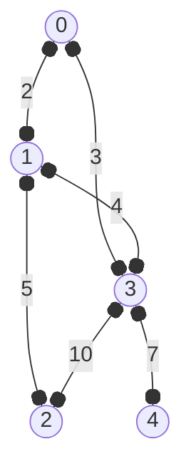
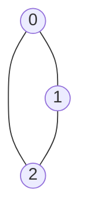
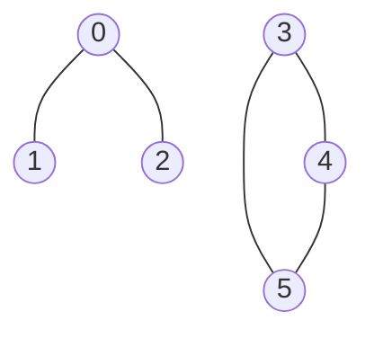

## 建图

给定 `n` 个节点, `m` 条边, 用 $g(u,v)$ 表示 $u$, $v$ 的信息, 如 连通性, 边权
```
5 6
0 1 2
1 2 5
0 3 3
1 3 4
3 4 7
3 2 10
```


### 邻接矩阵

- `g[i][j]` 表示 `i` 到 `j` 的信息
- `g[i][i] = 0`, 表示到自己的距离为 0
- 初始值为 `inf`, 表示不可达, 即距离为无穷大
- 对于无向图, `g[u][v] = g[v][u]`

```py
from math import inf
n, m = map(int, input().split())
g = [[inf] * n for _ in range(n)]
for _ in range(m):
    u, v, w = map(int, input().split())
    g[u][v] = g[v][u] = w
    g[u][u] = g[v][v] = 0 # 一般的题目中 不写这行 也是可以做对的
```
```py
g = [
  [0, 2, inf, 3, inf],
  [2, 0, 5, 4, inf],
  [inf, 5, 0, inf, inf],
  [3, 4, inf, 0, 7],
  [inf, inf, inf, 7, 0]
]
```

对于稀疏图: 边数 `<<` 节点数, 邻接矩阵会浪费很多空间, 这时可以使用邻接表

### 邻接表
```py
n ,m = map(int, input().split())
e = [[] for _ in range(n)]
for _ in range(m):
    u, v, w = map(int, input().split())
    e[u].append((v, w))
    e[v].append((u, w))
```
```math
e[u][j] = (v, w_{u,v})
```
```py
e = [
  [(1, 2), (3, 3)],
  [(0, 2), (2, 5), (3, 4)],
  [(1, 5)],
  [(0, 3), (1, 4), (4, 7), (2, 10)],
  [(3, 7)]
]
```
- 对于稀疏图, 可以节省空间, 另外 可以直接获取邻居数量
- 注意: 空间复杂度依旧是 $O(n^2)$, 只是常数小了很多

## 遍历

### dfs序

```py
s = set() # 已经访问的节点
def dfs(u):
    if u in s:
        return
    # 操作开始 ---
    # 操作
    # 操作结束 ---
    s.add(u)
    for v, w in e[u]:
        dfs(v)
```

#### leetCode 1971 寻找图中是否存在路径
https://leetcode.cn/problems/find-if-path-exists-in-graph/

有一个具有 `n` 个顶点的 双向 图，其中每个顶点标记从 `0` 到 `n - 1` (包含 `0` 和 `n - 1`) 。图中的边用一个二维整数数组 `edges` 表示，其中 `edges[i] = [u_i, v_i]{:ts}`表示顶点 `u_i` 和顶点 `v_i` 之间的双向边。 每个顶点对由 最多一条 边连接，并且没有顶点存在与自身相连的边。

请你确定是否存在从顶点 `source` 开始，到顶点 `destination` 结束的 有效路径 。

给你数组 `edges` 和整数 `n`、`source` 和 `destination`,如果从 `source` 到 `destination` 存在 有效路径 ，则返回 `true{:ts}`, 否则返回 `false{:ts}` 。

**示例1:**


> **输入：**n=3, edges = [[0,1],[1,2],[2,0]], source = 0, destination = 2<br/>
> **输出：**true<br/>
> **解释：**存在路径 0 -> 2<br/>
> **示例2:**



> **输入：** n=6, edges = [[0,1],[0,2],[3,4],[5,4],[5,3]], source = 0, destination = 5<br/>
> **输出：** false<br/>
> **解释：** 不存在路径 0 -> 5

**提示:**
- `1 <= n <= 2 * 10^4`
- `0 <= edges.length <= 2 * 10^4`
- `edges[i].length == 2`
- `0 <= u_i, v_i <= n - 1`
- `u_i != v_i`
- `0 <= source, destination <= n - 1`
- 不存在重复边
- 不存在指向自身的边

```py
def validPath(self, n: int, edges: List[List[int]], source: int, destination: int) -> bool:
    e = [[] for _ in range(n)]
    for u, v in edges:
        e[u].append(v)
        e[v].append(u)

    s = set()
    def dfs(u):
        if u in s:
            return False
        if u == destination:
            return True
        s.add(u)
        for v in e[u]:
            if dfs(v):
                return True
        return False

    return dfs(source)
```

## 例题

### 缴纳过路费

问题描述

在繁华的商业王国中，N 座城市被 M 条商路巧妙地连接在一起，形成了一个错综复杂的无向图网络。每条商路是双向通行的，并且任意两座城市之间最多只有一条直接的商路。每条商路都有它的规则，其中最引人注目的就是穿过商路，需要缴纳过路费。因此，商人们在选择商路时必须格外认真。

有一位名叫小蓝的商人，他对于商路的花费有着自己独到的见解。在小蓝眼中，一条路线包含一条或多条商路，但路线的成本并不是沿途累积的过路费总和，而是这条路线上最贵的那一次收费。这个标准简单而直接，让他能迅速评估出一条路线是否划算。

于是，他设立了一个目标，即找出所有城市对，这些城市之间的最低路线成本介于他心中预设的两个数 L 和 R 之间。他相信，这样的路线既不会太廉价，以至于路况糟糕；也不会过于昂贵，伤害他精打细算的荷包。

作为小蓝的助手，请你帮助小蓝统计出所有满足条件的城市对数量。
输入格式


第一行包含四个整数 N,M,L,R，表示有 N 座城市和 M 条双向通行的商路，以及小蓝心中预设的最高过路费的下限 LL 和上限 R。

接下来 M 行，每行包含三个整数 u,v,w，表示城市 u 和城市 v 之间有一条双向通行的商路，过路费为 w。保证每对城市之间最多只有一条直接的商路。

输出格式

输出仅一行，包含一个整数，表示满足条件的城市对数量。

样例输入
```md
5 5 1 2
1 2 2
1 3 5
1 4 1
2 4 5
2 5 4
```

样例输出
```md
3
```

样例说明

在样例中，满足条件的城市对有 (1,2)，(1,4)，(2,4)

评测用例规模与约定

对于 30% 的评测用例，1≤N≤10^3 ，1≤M≤min⁡(2×10^3,N×(N−1)2) ，1≤L≤R≤10^5 ，1≤u,v≤N,u≠v ，1≤w≤10^5

对于所有评测用例，1≤N≤10^5 ，1≤M≤min⁡(2×105,N×(N−1)2) ，1≤L≤R≤1091≤L≤R≤109,1≤u,v≤N,u≠v ，1≤w≤10^9

```py
class UnionFind:
    def __init__(self, n):
        self.parent = list(range(n + 1))
        self.size = [1] * (n + 1)

    def find(self, x):
        if self.parent[x] != x:
            self.parent[x] = self.find(self.parent[x])  # 路径压缩
        return self.parent[x]

    def unite(self, x, y):
        root_x = self.find(x)
        root_y = self.find(y)
        if root_x == root_y:
            return False
        if self.size[root_x] < self.size[root_y]:
            root_x, root_y = root_y, root_x
        self.parent[root_y] = root_x
        self.size[root_x] += self.size[root_y]
        return True

    def get_size(self, x):
        return self.size[self.find(x)]


def count_valid_pairs(n, m, l, r, edges):
    # 按边权排序
    edges.sort(key=lambda x: x[2])

    uf = UnionFind(n)
    result = 0

    for u, v, w in edges:
        if w > r:
            break  # 超过上限，直接退出
        if w >= l:
            # 当前边权在范围内，统计连通分量的大小
            size_u = uf.get_size(u)
            size_v = uf.get_size(v)
            result += size_u * size_v
        uf.unite(u, v)  # 合并集合

    return result

n, m, l, r = map(int, input().split())
edges = []
for i in range(1, m + 1):
    u, v, w = map(int, input().split())
    edges.append((u, v, w))
print(count_valid_pairs(n, m, l, r, edges))
```