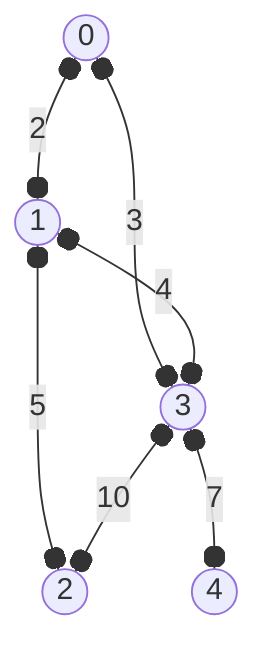
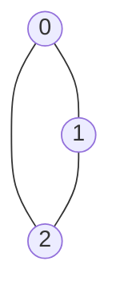
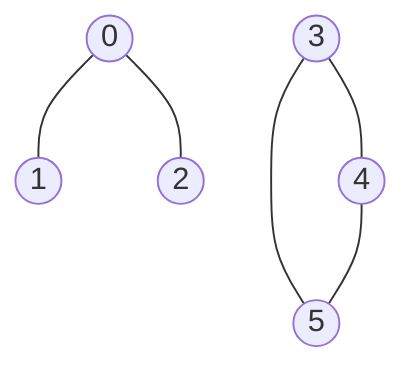

## 建图

给定 `n` 个节点, `m` 条边, 用 $g(u,v)$ 表示 $u$, $v$ 的信息, 如 连通性, 边权
```
5 6
0 1 2
1 2 5
0 3 3
1 3 4
3 4 7
3 2 10
```


### 邻接矩阵

- `g[i][j]` 表示 `i` 到 `j` 的信息
- `g[i][i] = 0`, 表示到自己的距离为 0
- 初始值为 `inf`, 表示不可达, 即距离为无穷大
- 对于无向图, `g[u][v] = g[v][u]`

```py
from math import inf
n, m = map(int, input().split())
g = [[inf] * n for _ in range(n)]
for _ in range(m):
    u, v, w = map(int, input().split())
    g[u][v] = g[v][u] = w
    g[u][u] = g[v][v] = 0 # 一般的题目中 不写这行 也是可以做对的
```
```py
g = [
  [0, 2, inf, 3, inf],
  [2, 0, 5, 4, inf],
  [inf, 5, 0, inf, inf],
  [3, 4, inf, 0, 7],
  [inf, inf, inf, 7, 0]
]
```

对于稀疏图: 边数 `<<` 节点数, 邻接矩阵会浪费很多空间, 这时可以使用邻接表

### 邻接表
```py
n ,m = map(int, input().split())
e = [[] for _ in range(n)]
for _ in range(m):
    u, v, w = map(int, input().split())
    e[u].append((v, w))
    e[v].append((u, w))
```
```math
e[u][j] = (v, w_{u,v})
```
```py
e = [
  [(1, 2), (3, 3)],
  [(0, 2), (2, 5), (3, 4)],
  [(1, 5)],
  [(0, 3), (1, 4), (4, 7), (2, 10)],
  [(3, 7)]
]
```
- 对于稀疏图, 可以节省空间, 另外 可以直接获取邻居数量
- 注意: 空间复杂度依旧是 $O(n^2)$, 只是常数小了很多

## 遍历

### dfs序

```py
s = set() # 已经访问的节点
def dfs(u):
    if u in s:
        return
    # 操作开始 ---
    # 操作
    # 操作结束 ---
    s.add(u)
    for v, w in e[u]:
        dfs(v)
```

#### leetCode 1971 寻找图中是否存在路径
https://leetcode.cn/problems/find-if-path-exists-in-graph/

有一个具有 `n` 个顶点的 双向 图，其中每个顶点标记从 `0` 到 `n - 1` (包含 `0` 和 `n - 1`) 。图中的边用一个二维整数数组 `edges` 表示，其中 `edges[i] = [u_i, v_i]{:ts}`表示顶点 `u_i` 和顶点 `v_i` 之间的双向边。 每个顶点对由 最多一条 边连接，并且没有顶点存在与自身相连的边。

请你确定是否存在从顶点 `source` 开始，到顶点 `destination` 结束的 有效路径 。

给你数组 `edges` 和整数 `n`、`source` 和 `destination`,如果从 `source` 到 `destination` 存在 有效路径 ，则返回 `true{:ts}`, 否则返回 `false{:ts}` 。

**示例1:**


> **输入：**n=3, edges = [[0,1],[1,2],[2,0]], source = 0, destination = 2<br/>
> **输出：**true<br/>
> **解释：**存在路径 0 -> 2<br/>
> **示例2:**



> **输入：** n=6, edges = [[0,1],[0,2],[3,4],[5,4],[5,3]], source = 0, destination = 5<br/>
> **输出：** false<br/>
> **解释：** 不存在路径 0 -> 5

**提示:**
- `1 <= n <= 2 * 10^4`
- `0 <= edges.length <= 2 * 10^4`
- `edges[i].length == 2`
- `0 <= u_i, v_i <= n - 1`
- `u_i != v_i`
- `0 <= source, destination <= n - 1`
- 不存在重复边
- 不存在指向自身的边

```py
def validPath(self, n: int, edges: List[List[int]], source: int, destination: int) -> bool:
    e = [[] for _ in range(n)]
    for u, v in edges:
        e[u].append(v)
        e[v].append(u)

    s = set()
    def dfs(u):
        if u in s:
            return False
        if u == destination:
            return True
        s.add(u)
        for v in e[u]:
            if dfs(v):
                return True
        return False

    return dfs(source)
```
