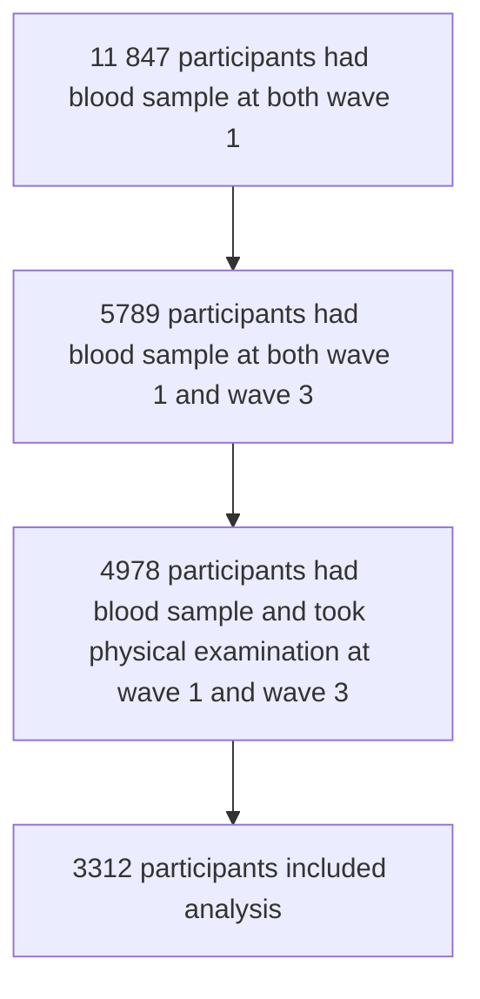

我有数学建模竞赛经验和开发经验, 会使用 python, ts 等, 也有数学竞赛经验, 机器学习, 深度学习经验, 现在我需要编写本科论文, 在选题和初稿阶段, 就是题目还没选好, 我们的数据集以 Harmonized Data 为主

多模态生物医学数据驱动的老年人健康画像构建与预测

http://vgms.fanyu.com

## 常规生物医学指标与中国老年人健康状况的相关性研究

- 第一章 dataset
  - 第一节 介绍
    - part 1 介绍
    - part 2 Harmonized 概念
    - part 3 Harmonized 问卷
    - part 4 变量查询
  - 第二节 Harmonized Core 问卷 与 选题
    - part 1 问卷模块
    - part 2 变量介绍 与 选题 思路
    - part 3 Harmonized codebook
  - 第三节 Harmonized end of life 问卷 与 选题
    - part 1 临终访谈
    - part 2 临终问卷模块
    - part 3 变量介绍 与 选题 思路
  - 第四节 Harmonized life history 问卷 与 选题
    - part 1 生命历程访谈
    - part 2 生命历程问卷模块
    - part 3 变量介绍 与 选题 思路
- 第二章 各 dataset 及选题
  - 第一节 CHARLS
    - part 1 介绍
    - part 2 采集流程
    - part 3 原始问卷
    - part 4 变量 与 选题
    - part 5 权重介绍
  - 第二节 HRS
  - 第三节 ELSA
  - ...
- 第三章 数据处理与分析
  - 第一节 描述性统计
    - part 1 应用场景
    - part 2 实战
    - part 3 结果解读
  - 第二节 回归分析: 广义线性, logistic, KM曲线+Cox
    - part 1 三大回归分析应用场景
    - part 2 实战
    - part 3 结果解读
  - 第三节 交互作用与中介效应
    - part 1 应用场景
    - part 2 实战
    - part 3 结果解读
  - 第四节 限制性立方样条 RCS
  - 第五节 亚组分析与森林图
    - part 1 介绍
    - part 2 实战
    - part 3 结果解读
  - 第六节 轨迹模型
  - 第七节 混合线性模型
  - 第八节 高分队列研究套路1: 累计平均暴露\累计暴露\累积暴露时间进程
    - part 1 介绍, 文献示例
    - part 2 适用条件
    - part 3 实战
  - 第九节 高分队列研究套路2: 访视期间变异性\年度变化百分比\绝对年变化率
    - part 1 介绍, 文献示例
    - part 2 适用条件
    - part 3 实战
  - 第十节 高分队列研究套路3: 新发年龄\早发人群
    - part 1 介绍, 文献示例
    - part 2 适用条件
    - part 3 实战
  - 第十一节 高分队列研究套路4: 交叉滞后
    - part 1 介绍, 文献示例
    - part 2 适用条件
    - part 3 实战
- 第四章 顶刊论文复现
  - 第一节 如何进行研究设计及数据制备
  - 第二节 如何进行数据分析
  - 第三节 如何完成论文写作
## 数据集 Global Aging

```sh
pip install pandas pyreadstat
```

| 数据集名称 | 数据集描述 | 
| -------- | --------- |
| CHARLS | 中国健康与养老追踪调查 (CHARLS) 是一项全国性、长期的纵向调查，旨在收集中国中老年人群体的健康、经济和社会信息。 |
| Health and Retirement Study, HRS | 健康与退休调查 (HRS) 是一项针对美国中老年人群体的纵向调查，旨在研究健康、经济和社会因素对退休决策的影响。 |
| English Longitudinal Study of Ageing, ELSA | 英国老年人纵向研究 (ELSA) 是一项针对英国中老年人群体的纵向调查，旨在研究健康、经济和社会因素对老年人生活质量的影响。 |
| Survey of Health, Ageing and Retirement in Europe, SHARE | 欧洲健康、老龄化与退休调查 (SHARE) 是一项针对欧洲中老年人群体的纵向调查，旨在研究健康、经济和社会因素对老年人生活质量的影响。 |
| Korea Longitudinal Study of Ageing, KLoSA | 韩国老龄化纵向研究 (KLoSA) 是一项针对韩国中老年人群体的纵向调查，旨在研究健康、经济和社会因素对老年人生活质量的影响。 |
| The Irish Longitudinal Study on Ageing, TILDA | 爱尔兰老龄化纵向研究 (TILDA) 是一项针对爱尔兰中老年人群体的纵向调查，旨在研究健康、经济和社会因素对老年人生活质量的影响。 |
| Mexico Health and Aging Study, MHAS | 墨西哥健康与老龄化研究 (MHAS) 是一项针对墨西哥中老年人群体的纵向调查，旨在研究健康、经济和社会因素对老年人生活质量的影响。 |
| Indonesia Family Life Survey, IFLS | 印尼家庭生活调查 (IFLS) 是一项针对印尼中老年人群体的纵向调查，旨在研究健康、经济和社会因素对老年人生活质量的影响。 |
| Japanese Study of Aging and Retirement, JSTAR | 日本老龄化与退休研究 (JSTAR) 是一项针对日本中老年人群体的纵向调查，旨在研究健康、经济和社会因素对老年人生活质量的影响。 |
| Study on Global Ageing and Adult Health, SAGE | 全球老龄化与成人健康研究 (SAGE) 是一项针对全球中老年人群体的纵向调查，旨在研究健康、经济和社会因素对老年人生活质量的影响。 |
| Global Ageing Data Repository, GADR | 全球老龄化数据存储库 (GADR) 是一项针对全球中老年人群体的纵向调查，旨在研究健康、经济和社会因素对老年人生活质量的影响。 |


### Harmonized Data

#### 队列研究

CHARLS 的 Harmonized Data 包含 4 波数据，从流行病学统计的角度来看，它既可以被视为一个***队列研究***，也可以在某些情况下被视为多个**横断面研究**

**队列研究的角度**
- 定义: 队列研究是指对一组特定人群（队列）进行长期随访，观察其暴露因素与结局之间的关系
- CHARLS 的特点:
  - CHARLS 是一个纵向研究，对同一组受访者在多个时间点（波次）进行随访
  - 通过多波数据，可以分析变量的动态变化（如健康状况、经济状况）以及这些变化与结局（如疾病发生）的关系
  - 例如，研究 TyG-WHtR 的变化与 CVD 风险的关系时，CHARLS 的多波数据可以很好地支持这种动态分析

**横断面研究的角度**
- 定义: 横断面研究是在某一特定时间点对研究对象进行观察，分析暴露因素与结局的关系
- CHARLS 的特点:
  - 每一波数据（如 Wave 1、Wave 2 等）都可以被视为一个独立的横断面数据集
  - 如果只分析某一波的数据（如 Wave 1 的健康状况与经济状况的关系），那么这实际上是一个横断面研究

| 标题 | 翻译标题 | 自变量 | 因变量 | link | dataset | score |
| :-: | :-----: | :---: | :---: | :--: | :-----: | :---: |
| Association between triglyceride glucose body mass index and cardiovascular disease in adults: evidence from NHANES 2011-2020 | 甘油三酯葡萄糖体重指数与成人心血管疾病的关系：来自 NHANES 2011-2020 的证据 | TyG-bmi | CVD | | NHANES | 3.9/Q2 |
| Association between the cumulative average triglyceride glucose-body mass index and cardiovascular disease incidence among the middle-aged and older population: a prospective nationwide cohort study in China | 中老年人群积累平均甘油三酯葡萄糖体重指数与心血管疾病发生率的关系：中国前瞻性全国性队列研究 | cumulative TyG-bmi | CVD | | CHARLS | 8.5/Q1 |

```csv
ID,householdID,communityID,hhid,hhidc,pnc,pn,ID_w1,householdID_w1,s1id,s2id,s3id,s4id,s1pn,s2pn,s3pn,s4pn,raspid1,raspid2,h1coupid,h2coupid,h3coupid,h4coupid,inw1,inw2,inw3,inw4,r1iwstat,r2iwstat,r3iwstat,r4iwstat,s1iwstat,s2iwstat,s3iwstat,s4iwstat,hacohort_c,r1wthh,r2wthh,r3wthh,r4wthh,r2wthhl,r1wthha,r2wthha,r3wthha,r4wthha,r1wtresp,r2wtresp,r3wtresp,r4wtresp,s1wtresp,s2wtresp,s3wtresp,s4wtresp,r2wtrespl,s2wtrespl,r1wtrespa,r2wtrespa,r3wtrespa,s1wtrespa,s2wtrespa,s3wtrespa,r1wtrespb,r2wtrespb,r3wtrespb,r4wtrespb,s1wtrespb,s2wtrespb,s3wtrespb,s4wtrespb,r1wtrespbioa,s1wtrespbioa,r1wtrespbiob,r2wtrespbiob,r3wtrespbiob,s1wtrespbiob,s2wtrespbiob,s3wtrespbiob,h1hhresp,h2hhresp,h3hhresp,h4hhresp,h1cpl,h2cpl,h3cpl,h4cpl,r1famr,r2famr,r3famr,r4famr,s1famr,s2famr,s3famr,s4famr,h1anyfam,h2anyfam,h3anyfam,h4anyfam,r1iwy,r2iwy,r3iwy,r4iwy,s1iwy,s2iwy,s3iwy,s4iwy,r1iwm,r2iwm,r3iwm,r4iwm,s1iwm,s2iwm,s3iwm,s4iwm,rabday,s1bday,s2bday,s3bday,s4bday,rafbday,s1fbday,s2fbday,s3fbday,s4fbday,rabmonth,s1bmonth,s2bmonth,s3bmonth,s4bmonth,rafbmonth,s1fbmonth,s2fbmonth,s3fbmonth,s4fbmonth,rabyear,s1byear,s2byear,s3byear,s4byear,rafbyear,s1fbyear,s2fbyear,s3fbyear,s4fbyear,rafbdate,s1fbdate,s2fbdate,s3fbdate,s4fbdate,raidbyear,s1idbyear,s2idbyear,s3idbyear,s4idbyear,raidbmonth,s1idbmonth,s2idbmonth,s3idbmonth,s4idbmonth,raidbday,s1idbday,s2idbday,s3idbday,s4idbday,rafidbdate,s1fidbdate,s2fidbdate,s3fidbdate,s4fidbdate,radyear,s1dyear,radmonth,s1dmonth,r1agey,r2agey,r3agey,r4agey,s1agey,s2agey,s3agey,s4agey,ragender,s1gender,s2gender,s3gender,s4gender,rafgendr,s2fgendr,s3fgendr,s4fgendr,raeduc_c,s1educ_c,s2educ_c,s3educ_c,s4educ_c,raeducl,s1educl,s2educl,s3educl,s4educl,r1mstat,r2mstat,r3mstat,r4mstat,s1mstat,s2mstat,s3mstat,s4mstat,r1mstath,r2mstath,r3mstath,r4mstath,s1mstath,s2mstath,s3mstath,s4mstath,r1mnev,r2mnev,r3mnev,r4mnev,s1mnev,s2mnev,s3mnev,s4mnev,r1mrct,r2mrct,s1mrct,s2mrct,r1mcurln,r2mcurln,s1mcurln,s2mcurln,rabplace_c,s1bplace_c,s2bplace_c,s3bplace_c,s4bplace_c,r1hukou,r2hukou,r3hukou,r4hukou,s1hukou,s2hukou,s3hukou,s4hukou,h1rural,h2rural,h3rural,h4rural,r1rural2,r2rural2,r3rural2,r4rural2,s1rural2,s2rural2,s3rural2,s4rural2,r2nhmliv,r3nhmliv,r4nhmliv,s2nhmliv,s3nhmliv,s4nhmliv,r1shlt,r2shlt,r3shlt,s1shlt,s2shlt,s3shlt,r1shltf,r2shltf,r3shltf,s1shltf,s2shltf,s3shltf,r1shlta,r2shlta,r3shlta,r4shlta,s1shlta,s2shlta,s3shlta,s4shlta,r1shltaf,r2shltaf,r3shltaf,s1shltaf,s2shltaf,s3shltaf,r1hlthlm_c,r2hlthlm_c,r3hlthlm_c,r4hlthlm_c,s1hlthlm_c,s2hlthlm_c,s3hlthlm_c,s4hlthlm_c,r3hlthlm,r4hlthlm,s3hlthlm,s4hlthlm,r1dressa,r2dressa,r3dressa,r4dressa,s1dressa,s2dressa,s3dressa,s4dressa,r1batha,r2batha,r3batha,r4batha,s1batha,s2batha,s3batha,s4batha,r1eata,r2eata,r3eata,r4eata,s1eata,s2eata,s3eata,s4eata,r1beda,r2beda,r3beda,r4beda,s1beda,s2beda,s3beda,s4beda,r1toilta,r2toilta,r3toilta,r4toilta,s1toilta,s2toilta,s3toilta,s4toilta,r1urina,r2urina,r3urina,r4urina,s1urina,s2urina,s3urina,s4urina,r2phonea,r3phonea,r4phonea,s2phonea,s3phonea,s4phonea,r1moneya,r2moneya,r3moneya,r4moneya,s1moneya,s2moneya,s3moneya,s4moneya,r1medsa,r2medsa,r3medsa,r4medsa,s1medsa,s2medsa,s3medsa,s4medsa,r1shopa,r2shopa,r3shopa,r4shopa,s1shopa,s2shopa,s3shopa,s4shopa,r1mealsa,r2mealsa,r3mealsa,r4mealsa,s1mealsa,s2mealsa,s3mealsa,s4mealsa,r1housewka,r2housewka,r3housewka,r4housewka,s1housewka,s2housewka,s3housewka,s4housewka,r1joga,r2joga,r3joga,r4joga,s1joga,s2joga,s3joga,s4joga,r1walk1kma,r2walk1kma,r3walk1kma,r4walk1kma,s1walk1kma,s2walk1kma,s3walk1kma,s4walk1kma,r1walk100a,r2walk100a,r3walk100a,r4walk100a,s1walk100a,s2walk100a,s3walk100a,s4walk100a,r1chaira,r2chaira,r3chaira,r4chaira,s1chaira,s2chaira,s3chaira,s4chaira,r1climsa,r2climsa,r3climsa,r4climsa,s1climsa,s2climsa,s3climsa,s4climsa,r1stoopa,r2stoopa,r3stoopa,r4stoopa,s1stoopa,s2stoopa,s3stoopa,s4stoopa,r1lifta,r2lifta,r3lifta,r4lifta,s1lifta,s2lifta,s3lifta,s4lifta,r1dimea,r2dimea,r3dimea,r4dimea,s1dimea,s2dimea,s3dimea,s4dimea,r1armsa,r2armsa,r3armsa,r4armsa,s1armsa,s2armsa,s3armsa,s4armsa,r1adla_c,r2adla_c,r3adla_c,r4adla_c,s1adla_c,s2adla_c,s3adla_c,s4adla_c,r1adlab_c,r2adlab_c,r3adlab_c,r4adlab_c,s1adlab_c,s2adlab_c,s3adlab_c,s4adlab_c,r1adlwa,r2adlwa,r3adlwa,r4adlwa,s1adlwa,s2adlwa,s3adlwa,s4adlwa,r1adlwam,r2adlwam,r3adlwam,r4adlwam,s1adlwam,s2adlwam,s3adlwam,s4adlwam,r1adlam_c,r2adlam_c,r3adlam_c,r4adlam_c,s1adlam_c,s2adlam_c,s3adlam_c,s4adlam_c,r1adlabm_c,r2adlabm_c,r3adlabm_c,r4adlabm_c,s1adlabm_c,s2adlabm_c,s3adlabm_c,s4adlabm_c,r1adlfive,r2adlfive,r3adlfive,r4adlfive,s1adlfive,s2adlfive,s3adlfive,s4adlfive,r1adlfivem,r2adlfivem,r3adlfivem,r4adlfivem,s1adlfivem,s2adlfivem,s3adlfivem,s4adlfivem,r2iadla,r3iadla,r4iadla,s2iadla,s3iadla,s4iadla,r2iadlam,r3iadlam,r4iadlam,s2iadlam,s3iadlam,s4iadlam,r2iadlza,r3iadlza,r4iadlza,s2iadlza,s3iadlza,s4iadlza,r2iadlzam,r3iadlzam,r4iadlzam,s2iadlzam,s3iadlzam,s4iadlzam,r1mobilsev,r2mobilsev,r3mobilsev,r4mobilsev,s1mobilsev,s2mobilsev,s3mobilsev,s4mobilsev,r1mobilsevm,r2mobilsevm,r3mobilsevm,r4mobilsevm,s1mobilsevm,s2mobilsevm,s3mobilsevm,s4mobilsevm,r1lowermob,r2lowermob,r3lowermob,r4lowermob,s1lowermob,s2lowermob,s3lowermob,s4lowermob,r1lowermobm,r2lowermobm,r3lowermobm,r4lowermobm,s1lowermobm,s2lowermobm,s3lowermobm,s4lowermobm,r1uppermob,r2uppermob,r3uppermob,r4uppermob,s1uppermob,s2uppermob,s3uppermob,s4uppermob,r1uppermobm,r2uppermobm,r3uppermobm,r4uppermobm,s1uppermobm,s2uppermobm,s3uppermobm,s4uppermobm,r1hibpe,r2hibpe,r3hibpe,r4hibpe,s1hibpe,s2hibpe,s3hibpe,s4hibpe,r1hibpf,r2hibpf,r3hibpf,r4hibpf,s1hibpf,s2hibpf,s3hibpf,s4hibpf,r1diabe,r2diabe,r3diabe,r4diabe,s1diabe,s2diabe,s3diabe,s4diabe,r1diabf,r2diabf,r3diabf,r4diabf,s1diabf,s2diabf,s3diabf,s4diabf,r1cancre,r2cancre,r3cancre,r4cancre,s1cancre,s2cancre,s3cancre,s4cancre,r1cancrf,r2cancrf,r3cancrf,r4cancrf,s1cancrf,s2cancrf,s3cancrf,s4cancrf,r1lunge,r2lunge,r3lunge,r4lunge,s1lunge,s2lunge,s3lunge,s4lunge,r1lungf,r2lungf,r3lungf,r4lungf,s1lungf,s2lungf,s3lungf,s4lungf,r1hearte,r2hearte,r3hearte,r4hearte,s1hearte,s2hearte,s3hearte,s4hearte,r1heartf,r2heartf,r3heartf,r4heartf,s1heartf,s2heartf,s3heartf,s4heartf,r1stroke,r2stroke,r3stroke,r4stroke,s1stroke,s2stroke,s3stroke,s4stroke,r1strokf,r2strokf,r3strokf,r4strokf,s1strokf,s2strokf,s3strokf,s4strokf,r1psyche,r2psyche,r3psyche,r4psyche,s1psyche,s2psyche,s3psyche,s4psyche,r1psychf,r2psychf,r3psychf,r4psychf,s1psychf,s2psychf,s3psychf,s4psychf,r1arthre,r2arthre,r3arthre,r4arthre,s1arthre,s2arthre,s3arthre,s4arthre,r1arthrf,r2arthrf,r3arthrf,r4arthrf,s1arthrf,s2arthrf,s3arthrf,s4arthrf,r1dyslipe,r2dyslipe,r3dyslipe,r4dyslipe,s1dyslipe,s2dyslipe,s3dyslipe,s4dyslipe,r1dyslipf,r2dyslipf,r3dyslipf,r4dyslipf,s1dyslipf,s2dyslipf,s3dyslipf,s4dyslipf,r1livere,r2livere,r3livere,r4livere,s1livere,s2livere,s3livere,s4livere,r1liverf,r2liverf,r3liverf,r4liverf,s1liverf,s2liverf,s3liverf,s4liverf,r1kidneye,r2kidneye,r3kidneye,r4kidneye,s1kidneye,s2kidneye,s3kidneye,s4kidneye,r1kidneyf,r2kidneyf,r3kidneyf,r4kidneyf,s1kidneyf,s2kidneyf,s3kidneyf,s4kidneyf,r1digeste,r2digeste,r3digeste,r4digeste,s1digeste,s2digeste,s3digeste,s4digeste,r1digestf,r2digestf,r3digestf,r4digestf,s1digestf,s2digestf,s3digestf,s4digestf,r1asthmae,r2asthmae,r3asthmae,r4asthmae,s1asthmae,s2asthmae,s3asthmae,s4asthmae,r1asthmaf,r2asthmaf,r3asthmaf,r4asthmaf,s1asthmaf,s2asthmaf,s3asthmaf,s4asthmaf,r1memrye,r2memrye,r3memrye,r4memrye,s1memrye,s2memrye,s3memrye,s4memrye,r1memryf,r2memryf,r3memryf,r4memryf,s1memryf,s2memryf,s3memryf,s4memryf,r1rxhibp,r2rxhibp,r3rxhibp,r4rxhibp,s1rxhibp,s2rxhibp,s3rxhibp,s4rxhibp,r1rxhibp_c,r2rxhibp_c,r3rxhibp_c,r4rxhibp_c,s1rxhibp_c,s2rxhibp_c,s3rxhibp_c,s4rxhibp_c,r1rxdiabi,r2rxdiabi,r3rxdiabi,r4rxdiabi,s1rxdiabi,s2rxdiabi,s3rxdiabi,s4rxdiabi,r1rxdiab,r2rxdiab,r3rxdiab,r4rxdiab,s1rxdiab,s2rxdiab,s3rxdiab,s4rxdiab,r1rxdiab_c,r2rxdiab_c,r3rxdiab_c,r4rxdiab_c,s1rxdiab_c,s2rxdiab_c,s3rxdiab_c,s4rxdiab_c,r1cncrmeds,r2cncrmeds,r3cncrmeds,r4cncrmeds,s1cncrmeds,s2cncrmeds,s3cncrmeds,s4cncrmeds,r1cncrmeds_c,r2cncrmeds_c,r3cncrmeds_c,r4cncrmeds_c,s1cncrmeds_c,s2cncrmeds_c,s3cncrmeds_c,s4cncrmeds_c,r1cncrchem,r2cncrchem,r3cncrchem,r4cncrchem,s1cncrchem,s2cncrchem,s3cncrchem,s4cncrchem,r1cncrsurg,r2cncrsurg,r3cncrsurg,r4cncrsurg,s1cncrsurg,s2cncrsurg,s3cncrsurg,s4cncrsurg,r1cncrradn,r2cncrradn,r3cncrradn,r4cncrradn,s1cncrradn,s2cncrradn,s3cncrradn,s4cncrradn,r1rxlung,r2rxlung,r3rxlung,r4rxlung,s1rxlung,s2rxlung,s3rxlung,s4rxlung,r1rxlung_c,r2rxlung_c,r3rxlung_c,r4rxlung_c,s1rxlung_c,s2rxlung_c,s3rxlung_c,s4rxlung_c,r1rxheart,r2rxheart,r3rxheart,r4rxheart,s1rxheart,s2rxheart,s3rxheart,s4rxheart,r1rxheart_c,r2rxheart_c,r3rxheart_c,r4rxheart_c,s1rxheart_c,s2rxheart_c,s3rxheart_c,s4rxheart_c,r1rxstrok,r2rxstrok,r3rxstrok,r4rxstrok,s1rxstrok,s2rxstrok,s3rxstrok,s4rxstrok,r1rxstrok_c,r2rxstrok_c,r3rxstrok_c,r4rxstrok_c,s1rxstrok_c,s2rxstrok_c,s3rxstrok_c,s4rxstrok_c,r1rxpsych,r2rxpsych,r3rxpsych,r4rxpsych,s1rxpsych,s2rxpsych,s3rxpsych,s4rxpsych,r1trpsych,r2trpsych,r3trpsych,r4trpsych,s1trpsych,s2trpsych,s3trpsych,s4trpsych,r1rxarthr,r2rxarthr,r3rxarthr,r4rxarthr,s1rxarthr,s2rxarthr,s3rxarthr,s4rxarthr,r1rxarthr_c,r2rxarthr_c,r3rxarthr_c,r4rxarthr_c,s1rxarthr_c,s2rxarthr_c,s3rxarthr_c,s4rxarthr_c,r1rxdyslip,r2rxdyslip,r3rxdyslip,r4rxdyslip,s1rxdyslip,s2rxdyslip,s3rxdyslip,s4rxdyslip,r1rxdyslip_c,r2rxdyslip_c,r3rxdyslip_c,r4rxdyslip_c,s1rxdyslip_c,s2rxdyslip_c,s3rxdyslip_c,s4rxdyslip_c,r1rxliver,r2rxliver,r3rxliver,r4rxliver,s1rxliver,s2rxliver,s3rxliver,s4rxliver,r1rxliver_c,r2rxliver_c,r3rxliver_c,r4rxliver_c,s1rxliver_c,s2rxliver_c,s3rxliver_c,s4rxliver_c,r1rxkidney,r2rxkidney,r3rxkidney,r4rxkidney,s1rxkidney,s2rxkidney,s3rxkidney,s4rxkidney,r1rxkidney_c,r2rxkidney_c,r3rxkidney_c,r4rxkidney_c,s1rxkidney_c,s2rxkidney_c,s3rxkidney_c,s4rxkidney_c,r1rxdigest,r2rxdigest,r3rxdigest,r4rxdigest,s1rxdigest,s2rxdigest,s3rxdigest,s4rxdigest,r1rxdigest_c,r2rxdigest_c,r3rxdigest_c,r4rxdigest_c,s1rxdigest_c,s2rxdigest_c,s3rxdigest_c,s4rxdigest_c,r1rxmemry,r2rxmemry,r3rxmemry,r4rxmemry,s1rxmemry,s2rxmemry,s3rxmemry,s4rxmemry,r1rxmemry_c,r2rxmemry_c,r3rxmemry_c,r4rxmemry_c,s1rxmemry_c,s2rxmemry_c,s3rxmemry_c,s4rxmemry_c,r1vgact_c,r2vgact_c,r3vgact_c,r4vgact_c,s1vgact_c,s2vgact_c,s3vgact_c,s4vgact_c,r1vgactx_c,r2vgactx_c,r3vgactx_c,r4vgactx_c,s1vgactx_c,s2vgactx_c,s3vgactx_c,s4vgactx_c,r1mdact_c,r2mdact_c,r3mdact_c,r4mdact_c,s1mdact_c,s2mdact_c,s3mdact_c,s4mdact_c,r1mdactx_c,r2mdactx_c,r3mdactx_c,r4mdactx_c,s1mdactx_c,s2mdactx_c,s3mdactx_c,s4mdactx_c,r1ltact_c,r2ltact_c,r3ltact_c,r4ltact_c,s1ltact_c,s2ltact_c,s3ltact_c,s4ltact_c,r1ltactx_c,r2ltactx_c,r3ltactx_c,r4ltactx_c,s1ltactx_c,s2ltactx_c,s3ltactx_c,s4ltactx_c,r1drinkev,r2drinkev,r3drinkev,r4drinkev,s1drinkev,s2drinkev,s3drinkev,s4drinkev,r1drinkl,r2drinkl,r3drinkl,r4drinkl,s1drinkl,s2drinkl,s3drinkl,s4drinkl,r1drinkn_c,r2drinkn_c,r3drinkn_c,r4drinkn_c,s1drinkn_c,s2drinkn_c,s3drinkn_c,s4drinkn_c,r1drinkr_c,r2drinkr_c,r3drinkr_c,r4drinkr_c,s1drinkr_c,s2drinkr_c,s3drinkr_c,s4drinkr_c,r1drinknr,r2drinknr,s1drinknr,s2drinknr,r1smokev,r2smokev,r3smokev,r4smokev,s1smokev,s2smokev,s3smokev,s4smokev,r1smoken,r2smoken,r3smoken,r4smoken,s1smoken,s2smoken,s3smoken,s4smoken,r1smokef,r2smokef,r3smokef,r4smokef,s1smokef,s2smokef,s3smokef,s4smokef,r1hosp1y,r2hosp1y,r3hosp1y,r4hosp1y,s1hosp1y,s2hosp1y,s3hosp1y,s4hosp1y,r1hsptim1y,r2hsptim1y,r3hsptim1y,r4hsptim1y,s1hsptim1y,s2hsptim1y,s3hsptim1y,s4hsptim1y,r1hspnite,r2hspnite,r3hspnite,r4hspnite,s1hspnite,s2hspnite,s3hspnite,s4hspnite,r1doctor1m,r2doctor1m,r3doctor1m,r4doctor1m,s1doctor1m,s2doctor1m,s3doctor1m,s4doctor1m,r1doctim1m,r2doctim1m,r3doctim1m,r4doctim1m,s1doctim1m,s2doctim1m,s3doctim1m,s4doctim1m,r1trdmed1m,r2trdmed1m,r3trdmed1m,r4trdmed1m,s1trdmed1m,s2trdmed1m,s3trdmed1m,s4trdmed1m,r1trdmdtim1m,r2trdmdtim1m,r3trdmdtim1m,r4trdmdtim1m,s1trdmdtim1m,s2trdmdtim1m,s3trdmdtim1m,s4trdmdtim1m,r2dentst1y,r3dentst1y,s2dentst1y,s3dentst1y,r2dentim1y,r3dentim1y,s2dentim1y,s3dentim1y,r1oophos1y,r2oophos1y,r3oophos1y,r4oophos1y,s1oophos1y,s2oophos1y,s3oophos1y,s4oophos1y,r1tothos1y,r2tothos1y,r3tothos1y,r4tothos1y,s1tothos1y,s2tothos1y,s3tothos1y,s4tothos1y,r1oopdoc1m,r2oopdoc1m,r3oopdoc1m,r4oopdoc1m,s1oopdoc1m,s2oopdoc1m,s3oopdoc1m,s4oopdoc1m,r1totdoc1m,r2totdoc1m,r3totdoc1m,r4totdoc1m,s1totdoc1m,s2totdoc1m,s3totdoc1m,s4totdoc1m,r2oopden1y,r3oopden1y,s2oopden1y,s3oopden1y,r2totden1y,r3totden1y,s2totden1y,s3totden1y,r1higov,r2higov,r3higov,r4higov,s1higov,s2higov,s3higov,s4higov,r1hipriv,r2hipriv,r3hipriv,r4hipriv,s1hipriv,s2hipriv,s3hipriv,s4hipriv,r1hiothp,r2hiothp,r3hiothp,r4hiothp,s1hiothp,s2hiothp,s3hiothp,s4hiothp,r1slfmem,r2slfmem,r3slfmem,r4slfmem,s1slfmem,s2slfmem,s3slfmem,s4slfmem,r1imrc,r2imrc,r3imrc,r4imrc,s1imrc,s2imrc,s3imrc,s4imrc,r1dlrc,r2dlrc,r3dlrc,r4dlrc,s1dlrc,s2dlrc,s3dlrc,s4dlrc,r1ser7,r2ser7,r3ser7,r4ser7,s1ser7,s2ser7,s3ser7,s4ser7,r1mo,r2mo,r3mo,r4mo,s1mo,s2mo,s3mo,s4mo,r1dy,r2dy,r3dy,r4dy,s1dy,s2dy,s3dy,s4dy,r1yr,r2yr,r3yr,r4yr,s1yr,s2yr,s3yr,s4yr,r1dw,r2dw,r3dw,r4dw,s1dw,s2dw,s3dw,s4dw,r1orient,r2orient,r3orient,r4orient,s1orient,s2orient,s3orient,s4orient,r1draw,r2draw,r3draw,r4draw,s1draw,s2draw,s3draw,s4draw,r1tr20,r2tr20,r3tr20,r4tr20,s1tr20,s2tr20,s3tr20,s4tr20,c2009cpindex,c2010cpindex,c2011cpindex,c2012cpindex,c2013cpindex,c2014cpindex,c2015cpindex,c2016cpindex,c2017cpindex,c2018cpindex,h1achck,h2achck,h3achck,h4achck,h1astck,h2astck,h3astck,h4astck,h1abond,h2abond,h3abond,h4abond,h1aothr,h2aothr,h3aothr,h4aothr,h1adebt,h2adebt,h3adebt,h4adebt,h1atotfa,h2atotfa,h3atotfa,h4atotfa,hh1arles,hh2arles,h3arles,h4arles,hh2arlfg,hh1ahousa,hh2ahousa,hh3ahousa,hh4ahousa,hh1ahrto,hh2ahrto,hh3ahrto,h4ahrto,hh1ahous,hh2ahous,hh3ahous,h4ahous,hh1afhousar,hh2afhousar,hh1amort,hh2amort,hh1atoth,hh2atoth,hh1atran,hh2atran,h3atran,h4atran,hh1adurbl,hh2adurbl,h3adurbl,h4adurbl,hh1afixc,hh2afixc,h3afixc,h4afixc,hh1aland,hh2aland,h3aland,h4aland,hh1aagri,hh2aagri,hh3aagri,hh4aagri,hh1alend,hh2alend,h3alend,h4alend,hh1aborr,hh2aborr,h2aborr,h3aborr,h4aborr,hh1aploan,hh2aploan,h3aploan,h4aploan,hh1afsst,hh2afsst,hh1afloa,hh2afloa,hh1afhhm,hh2afhhm,hh1atotf,hh2atotf,h3atotf,h4atotf,hh1atotb,hh2atotb,h3atotb,h4atotb,r1itearn,r2itearn,r3itearn,r4itearn,s1itearn,s2itearn,s3itearn,s4itearn,r1isftearn,r2isftearn,s1isftearn,s2isftearn,r1itsemp,r2itsemp,r3itsemp,s1itsemp,s2itsemp,s3itsemp,hh1itsemp,hh2itsemp,hh3itsemp,hh4itsemp,r1itrest,r2itrest,s1itrest,s2itrest,hh1itrest,hh2itrest,hh1irent,hh2irent,hh3irent,hh4irent,hh1icap,hh2icap,hh3icap,hh4icap,r1ipeni,r2ipeni,s1ipeni,s2ipeni,r1ipena,r2ipena,r3ipena,r4ipena,s1ipena,s2ipena,s3ipena,s4ipena,r1ipubpen,r2ipubpen,r3ipubpen,r4ipubpen,s1ipubpen,s2ipubpen,s3ipubpen,s4ipubpen,r1ipen,r2ipen,r3ipen,r4ipen,s1ipen,s2ipen,s3ipen,s4ipen,r1isfpen,r2isfpen,s1isfpen,s2isfpen,r1igxfr,r2igxfr,r3igxfr,r4igxfr,s1igxfr,s2igxfr,s3igxfr,s4igxfr,hh1igxfro,hh2igxfro,hh3igxfro,hh4igxfro,hh1igxfri,hh2igxfri,hh3igxfri,hh4igxfri,hh1igxfrh,hh2igxfrh,hh3igxfrh,hh4igxfrh,hh1igxfrt,hh2igxfrt,hh3igxfrt,hh4igxfrt,hh1igxfr,hh2igxfr,hh3igxfr,hh4igxfr,r1iothr,r2iothr,r3iothr,r4iothr,s1iothr,s2iothr,s3iothr,s4iothr,hh1iothhh,hh2iothhh,hh3iothhh,hh4iothhh,hh1itot,hh2itot,hh3itot,hh4itot,hh1cfood,hh2cfood,hh3cfood,hh4cfood,hh1cnf1m,hh2cnf1m,hh3cnf1m,hh4cnf1m,hh1cnf1y,hh2cnf1y,hh3cnf1y,hh4cnf1y,hh1ctot,hh2ctot,hh3ctot,hh4ctot,hh1cperc,hh2cperc,hh3cperc,hh4cperc,h1hhres,h2hhres,h3hhres,h4hhres,h1son,h2son,h3son,h4son,h1dau,h2dau,h3dau,h4dau,h1child,h2child,h3child,h4child,h1dson,h2dson,h3dson,h4dson,h1ddau,h2ddau,h3ddau,h4ddau,h1dchild,h2dchild,h3dchild,h4dchild,r1livbro,r2livbro,r3livbro,r4livbro,s1livbro,s2livbro,s3livbro,s4livbro,r1livsis,r2livsis,r3livsis,r4livsis,s1livsis,s2livsis,s3livsis,s4livsis,r1livsib,r2livsib,r3livsib,r4livsib,s1livsib,s2livsib,s3livsib,s4livsib,r1decbro,r2decbro,r3decbro,r4decbro,s1decbro,s2decbro,s3decbro,s4decbro,r1decsis,r2decsis,r3decsis,r4decsis,s1decsis,s2decsis,s3decsis,s4decsis,r1decsib,r2decsib,r3decsib,r4decsib,s1decsib,s2decsib,s3decsib,s4decsib,r1momliv,r2momliv,r3momliv,r4momliv,s1momliv,s2momliv,s3momliv,s4momliv,r1fmomliv,r2fmomliv,s1fmomliv,s2fmomliv,r1dadliv,r2dadliv,r3dadliv,r4dadliv,s1dadliv,s2dadliv,s3dadliv,s4dadliv,r1fdadliv,r2fdadliv,s1fdadliv,s2fdadliv,r1livpar,r2livpar,r3livpar,r4livpar,s1livpar,s2livpar,s3livpar,s4livpar,r1momage,r2momage,r3momage,r4momage,s1momage,s2momage,s3momage,s4momage,r1dadage,r2dadage,r3dadage,r4dadage,s1dadage,s2dadage,s3dadage,s4dadage,rameduc_c,s1meduc_c,s2meduc_c,s3meduc_c,s4meduc_c,rafeduc_c,s1feduc_c,s2feduc_c,s3feduc_c,s4feduc_c,ramomeducl,s1momeducl,s2momeducl,s3momeducl,s4momeducl,radadeducl,s1dadeducl,s2dadeducl,s3dadeducl,s4dadeducl,ramomoccup_c,s1momoccup_c,s2momoccup_c,s3momoccup_c,s4momoccup_c,radadoccup_c,s1dadoccup_c,s2dadoccup_c,s3dadoccup_c,s4dadoccup_c,h1coresd,h2coresd,h3coresd,h4coresd,h1lvnear,h2lvnear,h3lvnear,h4lvnear,h1pcnt,h2pcnt,h3pcnt,h4pcnt,h1kcntf,h2kcntf,h3kcntf,h4kcntf,h1kcntpm,h2kcntpm,h3kcntpm,h4kcntpm,h1kcnt,h2kcnt,h3kcnt,h4kcnt,r1socwk,r2socwk,r3socwk,r4socwk,s1socwk,s2socwk,s3socwk,s4socwk,h1fcany,h2fcany,h3fcany,h4fcany,h1fcamt,h2fcamt,h3fcamt,h4fcamt,h1tcany,h2tcany,h3tcany,h4tcany,h1tcamt,h2tcamt,h3tcamt,h4tcamt,h1fpany,h2fpany,h3fpany,h4fpany,h1fpamt,h2fpamt,h3fpamt,h4fpamt,h1tpany,h2tpany,h3tpany,h4tpany,h1tpamt,h2tpamt,h3tpamt,h4tpamt,h1foany,h2foany,h3foany,h4foany,h1foamt,h2foamt,h3foamt,h4foamt,h1toany,h2toany,h3toany,h4toany,h1toamt,h2toamt,h3toamt,h4toamt,h1frec,h2frec,h3frec,h4frec,h1tgiv,h2tgiv,h3tgiv,h4tgiv,h1ftot,h2ftot,h3ftot,h4ftot,r1work,r2work,r3work,r4work,s1work,s2work,s3work,s4work,r1work2,r2work2,r3work2,r4work2,s1work2,s2work2,s3work2,s4work2,r1lbrf_c,r2lbrf_c,r3lbrf_c,r4lbrf_c,s1lbrf_c,s2lbrf_c,s3lbrf_c,s4lbrf_c,r1slfemp,r2slfemp,r3slfemp,r4slfemp,s1slfemp,s2slfemp,s3slfemp,s4slfemp,r1jhours_c,r2jhours_c,r3jhours_c,r4jhours_c,s1jhours_c,s2jhours_c,s3jhours_c,s4jhours_c,r1jhour2,r2jhour2,r3jhour2,r4jhour2,s1jhour2,s2jhour2,s3jhour2,s4jhour2,r1jhourtot,r2jhourtot,r3jhourtot,r4jhourtot,s1jhourtot,s2jhourtot,s3jhourtot,s4jhourtot,r1jweeks_c,r2jweeks_c,r3jweeks_c,r4jweeks_c,s1jweeks_c,s2jweeks_c,s3jweeks_c,s4jweeks_c,r1jgovtemp,r2jgovtemp,r3jgovtemp,r4jgovtemp,s1jgovtemp,s2jgovtemp,s3jgovtemp,s4jgovtemp,r1jsalary_c,r2jsalary_c,r3jsalary_c,r4jsalary_c,s1jsalary_c,s2jsalary_c,s3jsalary_c,s4jsalary_c,r2jbonus,r3jbonus,r4jbonus,s2jbonus,s3jbonus,s4jbonus,r1jmsick,r2jmsick,r3jmsick,r4jmsick,s1jmsick,s2jmsick,s3jmsick,s4jmsick,r1jnsickagr,r2jnsickagr,r3jnsickagr,r4jnsickagr,s1jnsickagr,s2jnsickagr,s3jnsickagr,s4jnsickagr,r1jnsickemp,r2jnsickemp,r3jnsickemp,r4jnsickemp,s1jnsickemp,s2jnsickemp,s3jnsickemp,s4jnsickemp,r1jnsicksf,r2jnsicksf,r3jnsicksf,r4jnsicksf,s1jnsicksf,s2jnsicksf,s3jnsicksf,s4jnsicksf,r1jbgyr,r2jbgyr,r3jbgyr,r4jbgyr,s1jbgyr,s2jbgyr,s3jbgyr,s4jbgyr,r1jbgmo,r2jbgmo,r3jbgmo,r4jbgmo,s1jbgmo,s2jbgmo,s3jbgmo,s4jbgmo,r1jrsleft,r2jrsleft,r3jrsleft,s1jrsleft,s2jrsleft,s3jrsleft,r1jrsleft_c,r2jrsleft_c,r3jrsleft_c,r4jrsleft_c,s1jrsleft_c,s2jrsleft_c,s3jrsleft_c,s4jrsleft_c,r1retemp,r2retemp,r3retemp,r4retemp,s1retemp,s2retemp,s3retemp,s4retemp,r1fret_c,r2fret_c,r3fret_c,r4fret_c,s1fret_c,s2fret_c,s3fret_c,s4fret_c,r1fretf_c,r2fretf_c,r3fretf_c,r4fretf_c,s1fretf_c,s2fretf_c,s3fretf_c,s4fretf_c,r1retmon,r2retmon,r3retmon,r4retmon,s1retmon,s2retmon,s3retmon,s4retmon,r1retyr,r2retyr,r3retyr,r4retyr,s1retyr,s2retyr,s3retyr,s4retyr,r1rplnya,r2rplnya,r3rplnya,r4rplnya,s1rplnya,s2rplnya,s3rplnya,s4rplnya,r1wkaftret,r2wkaftret,r3wkaftret,r4wkaftret,s1wkaftret,s2wkaftret,s3wkaftret,s4wkaftret,r1retrs_c,r2retrs_c,r3retrs_c,r4retrs_c,s1retrs_c,s2retrs_c,s3retrs_c,s4retrs_c,r1pubpen,r2pubpen,r3pubpen,r4pubpen,s1pubpen,s2pubpen,s3pubpen,s4pubpen,r2fpubpen,r3fpubpen,r4fpubpen,s2fpubpen,s3fpubpen,s4fpubpen,r1pubage,r2pubage,r3pubage,r4pubage,s1pubage,s2pubage,s3pubage,s4pubage,r1peninc,r2peninc,r3peninc,r4peninc,s1peninc,s2peninc,s3peninc,s4peninc,r2fpeninc,r3fpeninc,r4fpeninc,s2fpeninc,s3fpeninc,s4fpeninc,r1othpen,r2othpen,r3othpen,r4othpen,s1othpen,s2othpen,s3othpen,s4othpen,r1jcpen,r2jcpen,r3jcpen,r4jcpen,s1jcpen,s2jcpen,s3jcpen,s4jcpen,r1wspeed1,r2wspeed1,r3wspeed1,s1wspeed1,s2wspeed1,s3wspeed1,r1wspeed2,r2wspeed2,r3wspeed2,s1wspeed2,s2wspeed2,s3wspeed2,r1wspeed,r2wspeed,r3wspeed,s1wspeed,s2wspeed,s3wspeed,r1walkcomp,r2walkcomp,r3walkcomp,s1walkcomp,s2walkcomp,s3walkcomp,r1walkflr_c,r2walkflr_c,r3walkflr_c,s1walkflr_c,s2walkflr_c,s3walkflr_c,r1walkaid,r2walkaid,r3walkaid,s1walkaid,s2walkaid,s3walkaid,r1walkcompl,r2walkcompl,r3walkcompl,s1walkcompl,s2walkcompl,s3walkcompl,r1walksft,r2walksft,r3walksft,s1walksft,s2walksft,s3walksft,r1walkref,r2walkref,r3walkref,s1walkref,s2walkref,s3walkref,r1walktryu,r2walktryu,r3walktryu,s1walktryu,s2walktryu,s3walktryu,r1walkequp,r2walkequp,r3walkequp,s1walkequp,s2walkequp,s3walkequp,r1walkothr,r2walkothr,r3walkothr,s1walkothr,s2walkothr,s3walkothr,r1systo1,r2systo1,r3systo1,s1systo1,s2systo1,s3systo1,r1systo2,r2systo2,r3systo2,s1systo2,s2systo2,s3systo2,r1systo3,r2systo3,r3systo3,s1systo3,s2systo3,s3systo3,r1systo,r2systo,r3systo,s1systo,s2systo,s3systo,r1diasto1,r2diasto1,r3diasto1,s1diasto1,s2diasto1,s3diasto1,r1diasto2,r2diasto2,r3diasto2,s1diasto2,s2diasto2,s3diasto2,r1diasto3,r2diasto3,r3diasto3,s1diasto3,s2diasto3,s3diasto3,r1diasto,r2diasto,r3diasto,s1diasto,s2diasto,s3diasto,r1pulse1,r2pulse1,r3pulse1,s1pulse1,s2pulse1,s3pulse1,r1pulse2,r2pulse2,r3pulse2,s1pulse2,s2pulse2,s3pulse2,r1pulse3,r2pulse3,r3pulse3,s1pulse3,s2pulse3,s3pulse3,r1pulse,r2pulse,r3pulse,s1pulse,s2pulse,s3pulse,r1bpcomp,r2bpcomp,r3bpcomp,s1bpcomp,s2bpcomp,s3bpcomp,r1bpact30,r2bpact30,r3bpact30,s1bpact30,s2bpact30,s3bpact30,r1bldpos,r2bldpos,r3bldpos,s1bldpos,s2bldpos,s3bldpos,r1bparm,r2bparm,r3bparm,s1bparm,s2bparm,s3bparm,r1bpcompl,r2bpcompl,r3bpcompl,s1bpcompl,s2bpcompl,s3bpcompl,r1bpsft,r2bpsft,r3bpsft,s1bpsft,s2bpsft,s3bpsft,r1bpref,r2bpref,r3bpref,s1bpref,s2bpref,s3bpref,r1bptryu,r2bptryu,r3bptryu,s1bptryu,s2bptryu,s3bptryu,r1bpequp,r2bpequp,r3bpequp,s1bpequp,s2bpequp,s3bpequp,r1bpothr,r2bpothr,r3bpothr,s1bpothr,s2bpothr,s3bpothr,r1domhand,r2domhand,r3domhand,s1domhand,s2domhand,s3domhand,r1lgrip1,r2lgrip1,r3lgrip1,s1lgrip1,s2lgrip1,s3lgrip1,r1lgrip2,r2lgrip2,r3lgrip2,s1lgrip2,s2lgrip2,s3lgrip2,r1lgrip,r2lgrip,r3lgrip,s1lgrip,s2lgrip,s3lgrip,r1rgrip1,r2rgrip1,r3rgrip1,s1rgrip1,s2rgrip1,s3rgrip1,r1rgrip2,r2rgrip2,r3rgrip2,s1rgrip2,s2rgrip2,s3rgrip2,r1rgrip,r2rgrip,r3rgrip,s1rgrip,s2rgrip,s3rgrip,r1gripsum,r2gripsum,r3gripsum,s1gripsum,s2gripsum,s3gripsum,r1gripcomp,r2gripcomp,r3gripcomp,s1gripcomp,s2gripcomp,s3gripcomp,r1gripeff,r2gripeff,r3gripeff,s1gripeff,s2gripeff,s3gripeff,r1grippos,r2grippos,r3grippos,s1grippos,s2grippos,s3grippos,r1griprsta,r2griprsta,r3griprsta,s1griprsta,s2griprsta,s3griprsta,r1gripsft,r2gripsft,r3gripsft,s1gripsft,s2gripsft,s3gripsft,r1gripref,r2gripref,r3gripref,s1gripref,s2gripref,s3gripref,r1griptryu,r2griptryu,r3griptryu,s1griptryu,s2griptryu,s3griptryu,r1gripequp,r2gripequp,r3gripequp,s1gripequp,s2gripequp,s3gripequp,r1gripothr,r2gripothr,r3gripothr,s1gripothr,s2gripothr,s3gripothr,r1mheight,r2mheight,r3mheight,s1mheight,s2mheight,s3mheight,r1mweight,r2mweight,r3mweight,s1mweight,s2mweight,s3mweight,r1mwaist,r2mwaist,r3mwaist,s1mwaist,s2mwaist,s3mwaist,r1mbmi,r2mbmi,r3mbmi,s1mbmi,s2mbmi,s3mbmi,r1mbmicata,r2mbmicata,r3mbmicata,s1mbmicata,s2mbmicata,s3mbmicata,r1htcomp,r2htcomp,r3htcomp,s1htcomp,s2htcomp,s3htcomp,r1wtcomp,r2wtcomp,r3wtcomp,s1wtcomp,s2wtcomp,s3wtcomp,r1watcomp,r2watcomp,r3watcomp,s1watcomp,s2watcomp,s3watcomp,r1htcompl,r2htcompl,r3htcompl,s1htcompl,s2htcompl,s3htcompl,r1wtcompl,r2wtcompl,r3wtcompl,s1wtcompl,s2wtcompl,s3wtcompl,r1watcompl,r2watcompl,r3watcompl,s1watcompl,s2watcompl,s3watcompl,r1wtflr_c,r2wtflr_c,r3wtflr_c,s1wtflr_c,s2wtflr_c,s3wtflr_c,r1shoew,r2shoew,r3shoew,s1shoew,s2shoew,s3shoew,r1bulky,r2bulky,r3bulky,s1bulky,s2bulky,s3bulky,r1hghtsft,r2hghtsft,r3hghtsft,s1hghtsft,s2hghtsft,s3hghtsft,r1hghtref,r2hghtref,r3hghtref,s1hghtref,s2hghtref,s3hghtref,r1hghttryu,r2hghttryu,r3hghttryu,s1hghttryu,s2hghttryu,s3hghttryu,r1hghtequp,r2hghtequp,r3hghtequp,s1hghtequp,s2hghtequp,s3hghtequp,r1hghtothr,r2hghtothr,r3hghtothr,s1hghtothr,s2hghtothr,s3hghtothr,r1wghtsft,r2wghtsft,r3wghtsft,s1wghtsft,s2wghtsft,s3wghtsft,r1wghtref,r2wghtref,r3wghtref,s1wghtref,s2wghtref,s3wghtref,r1wghttryu,r2wghttryu,r3wghttryu,s1wghttryu,s2wghttryu,s3wghttryu,r1wghtequp,r2wghtequp,r3wghtequp,s1wghtequp,s2wghtequp,s3wghtequp,r1wghtothr,r2wghtothr,r3wghtothr,s1wghtothr,s2wghtothr,s3wghtothr,r1wstsft,r2wstsft,r3wstsft,s1wstsft,s2wstsft,s3wstsft,r1wstref,r2wstref,r3wstref,s1wstref,s2wstref,s3wstref,r1wsttryu,r2wsttryu,r3wsttryu,s1wsttryu,s2wsttryu,s3wsttryu,r1wstequp,r2wstequp,r3wstequp,s1wstequp,s2wstequp,s3wstequp,r1wstothr,r2wstothr,r3wstothr,s1wstothr,s2wstothr,s3wstothr,r1puff1,r2puff1,r3puff1,s1puff1,s2puff1,s3puff1,r1puff2,r2puff2,r3puff2,s1puff2,s2puff2,s3puff2,r1puff3,r2puff3,r3puff3,s1puff3,s2puff3,s3puff3,r1puff,r2puff,r3puff,s1puff,s2puff,s3puff,r1puffcomp,r2puffcomp,r3puffcomp,s1puffcomp,s2puffcomp,s3puffcomp,r1puffpos,r2puffpos,r3puffpos,s1puffpos,s2puffpos,s3puffpos,r1puffeff,r2puffeff,r3puffeff,s1puffeff,s2puffeff,s3puffeff,r1puffsft,r2puffsft,r3puffsft,s1puffsft,s2puffsft,s3puffsft,r1puffref,r2puffref,r3puffref,s1puffref,s2puffref,s3puffref,r1pufftryu,r2pufftryu,r3pufftryu,s1pufftryu,s2pufftryu,s3pufftryu,r1puffequp,r2puffequp,r3puffequp,s1puffequp,s2puffequp,s3puffequp,r1puffothr,r2puffothr,r3puffothr,s1puffothr,s2puffothr,s3puffothr,r1semitan,r2semitan,r3semitan,s1semitan,s2semitan,s3semitan,r1semidone,r2semidone,r3semidone,s1semidone,s2semidone,s3semidone,r1semicomp,r2semicomp,r3semicomp,s1semicomp,s2semicomp,s3semicomp,r1semitanc,r2semitanc,r3semitanc,s1semitanc,s2semitanc,s3semitanc,r1fulltan,r2fulltan,r3fulltan,s1fulltan,s2fulltan,s3fulltan,r1fulldone,r2fulldone,r3fulldone,s1fulldone,s2fulldone,s3fulldone,r1fullcomp,r2fullcomp,r3fullcomp,s1fullcomp,s2fullcomp,s3fullcomp,r1fulltanc,r2fulltanc,r3fulltanc,s1fulltanc,s2fulltanc,s3fulltanc,r1sbstan,r2sbstan,r3sbstan,s1sbstan,s2sbstan,s3sbstan,r1sbsdone,r2sbsdone,r3sbsdone,s1sbsdone,s2sbsdone,s3sbsdone,r1sbscomp,r2sbscomp,r3sbscomp,s1sbscomp,s2sbscomp,s3sbscomp,r1sbstanc,r2sbstanc,r3sbstanc,s1sbstanc,s2sbstanc,s3sbstanc,r1balance,r2balance,r3balance,s1balance,s2balance,s3balance,r1balflr,r2balflr,r3balflr,s1balflr,s2balflr,s3balflr,r1balcompl,r2balcompl,r3balcompl,s1balcompl,s2balcompl,s3balcompl,r1balsft,r2balsft,r3balsft,s1balsft,s2balsft,s3balsft,r1balref,r2balref,r3balref,s1balref,s2balref,s3balref,r1baltryu,r2baltryu,r3baltryu,s1baltryu,s2baltryu,s3baltryu,r1balequp,r2balequp,r3balequp,s1balequp,s2balequp,s3balequp,r1balothr,r2balothr,r3balothr,s1balothr,s2balothr,s3balothr,r1chr5sec,r2chr5sec,r3chr5sec,s1chr5sec,s2chr5sec,s3chr5sec,r1chr5num,r2chr5num,r3chr5num,s1chr5num,s2chr5num,s3chr5num,r1chr5comp,r2chr5comp,r3chr5comp,s1chr5comp,s2chr5comp,s3chr5comp,r1chr5bmv,r2chr5bmv,r3chr5bmv,s1chr5bmv,s2chr5bmv,s3chr5bmv,r1chr5sft,r2chr5sft,r3chr5sft,s1chr5sft,s2chr5sft,s3chr5sft,r1chr5ref,r2chr5ref,r3chr5ref,s1chr5ref,s2chr5ref,s3chr5ref,r1chr5tryu,r2chr5tryu,r3chr5tryu,s1chr5tryu,s2chr5tryu,s3chr5tryu,r1chr5equp,r2chr5equp,r3chr5equp,s1chr5equp,s2chr5equp,s3chr5equp,r1chr5othr,r2chr5othr,r3chr5othr,s1chr5othr,s2chr5othr,s3chr5othr,r2dresshlp,r3dresshlp,r4dresshlp,s2dresshlp,s3dresshlp,s4dresshlp,r2bathehlp,r3bathehlp,r4bathehlp,s2bathehlp,s3bathehlp,s4bathehlp,r2eathlp,r3eathlp,r4eathlp,s2eathlp,s3eathlp,s4eathlp,r2bedhlp,r3bedhlp,r4bedhlp,s2bedhlp,s3bedhlp,s4bedhlp,r2toilethlp,r3toilethlp,r4toilethlp,s2toilethlp,s3toilethlp,s4toilethlp,r1walkre,r2walkre,r3walkre,r4walkre,s1walkre,s2walkre,s3walkre,s4walkre,r2toilte,r3toilte,r4toilte,s2toilte,s3toilte,s4toilte,r2shophlp,r3shophlp,r4shophlp,s2shophlp,s3shophlp,s4shophlp,r2medhlp,r3medhlp,r4medhlp,s2medhlp,s3medhlp,s4medhlp,r2hswkhlp,r3hswkhlp,r4hswkhlp,s2hswkhlp,s3hswkhlp,s4hswkhlp,r2mealhlp,r3mealhlp,r4mealhlp,s2mealhlp,s3mealhlp,s4mealhlp,r2phonehlp,r3phonehlp,r4phonehlp,s2phonehlp,s3phonehlp,s4phonehlp,r2moneyhlp,r3moneyhlp,r4moneyhlp,s2moneyhlp,s3moneyhlp,s4moneyhlp,r1ftrhlp,r2ftrhlp,r3ftrhlp,r4ftrhlp,s1ftrhlp,s2ftrhlp,s3ftrhlp,s4ftrhlp,r2ftrsp,r3ftrsp,r4ftrsp,s2ftrsp,s3ftrsp,s4ftrsp,r1ftrkids,r2ftrkids,r3ftrkids,r4ftrkids,s1ftrkids,s2ftrkids,s3ftrkids,s4ftrkids,r1ftrothr,r2ftrothr,r3ftrothr,r4ftrothr,s1ftrothr,s2ftrothr,s3ftrothr,s4ftrothr,r1ftrpro,r2ftrpro,r3ftrpro,r4ftrpro,s1ftrpro,s2ftrpro,s3ftrpro,s4ftrpro,r2racany,r3racany,r4racany,s2racany,s3racany,s4racany,r2ricany,r3ricany,r4ricany,s2ricany,s3ricany,s4ricany,r1rcany,r2rcany,r3rcany,r4rcany,s1rcany,s2rcany,s3rcany,s4rcany,r2racaany,s2racaany,r2ricaany,s2ricaany,r1rcaany,r2rcaany,r3rcaany,r4rcaany,s1rcaany,s2rcaany,s3rcaany,s4rcaany,r2rascare,s2rascare,r2riscare,s2riscare,r1rscare,r2rscare,r3rscare,r4rscare,s1rscare,s2rscare,s3rscare,s4rscare,r2rascaren,s2rascaren,r2riscaren,s2riscaren,r2rscaren,s2rscaren,r1rscaredpm,r3rscaredpm,r4rscaredpm,s1rscaredpm,s3rscaredpm,s4rscaredpm,r1rscarehr,r3rscarehr,r4rscarehr,s1rscarehr,s3rscarehr,s4rscarehr,r1rscarepd,r3rscarepd,s1rscarepd,s3rscarepd,r2raccare,s2raccare,r2riccare,s2riccare,r1rccare,r2rccare,r3rccare,r4rccare,s1rccare,s2rccare,s3rccare,s4rccare,r2raccaren_c,s2raccaren_c,r2riccaren_c,s2riccaren_c,r2rccaren_c,s2rccaren_c,r1rccaren,r3rccaren,r4rccaren,s1rccaren,s3rccaren,s4rccaren,r1rccaredpm,r3rccaredpm,r4rccaredpm,s1rccaredpm,s3rccaredpm,s4rccaredpm,r2rccaredpm_c,s2rccaredpm_c,r1rccarehr,r3rccarehr,r4rccarehr,s1rccarehr,s3rccarehr,s4rccarehr,r2rccarehr_c,s2rccarehr_c,r1rccarepd,r3rccarepd,s1rccarepd,s3rccarepd,r2rccarepd_c,s2rccarepd_c,r2rarcare,s2rarcare,r2rircare,s2rircare,r1rrcare,r2rrcare,r3rrcare,r4rrcare,s1rrcare,s2rrcare,s3rrcare,s4rrcare,r2rarcaren,s2rarcaren,r2rircaren,s2rircaren,r1rrcaren,r2rrcaren,r3rrcaren,r4rrcaren,s1rrcaren,s2rrcaren,s3rrcaren,s4rrcaren,r1rrcaredpm,r3rrcaredpm,r4rrcaredpm,s1rrcaredpm,s3rrcaredpm,s4rrcaredpm,r1rrcarehr,r3rrcarehr,r4rrcarehr,s1rrcarehr,s3rrcarehr,s4rrcarehr,r1rrcarepd,r3rrcarepd,s1rrcarepd,s3rrcarepd,r2rafcare,s2rafcare,r2rifcare,s2rifcare,r1rfcare,r2rfcare,r3rfcare,r4rfcare,s1rfcare,s2rfcare,s3rfcare,s4rfcare,r3rfcaren,r4rfcaren,s3rfcaren,s4rfcaren,r1rfcaredpm,r3rfcaredpm,s1rfcaredpm,s3rfcaredpm,r1rfcarehr,r3rfcarehr,s1rfcarehr,s3rfcarehr,r1rfcarepd,r3rfcarepd,s1rfcarepd,s3rfcarepd,r2rafaany,s2rafaany,r2rifaany,s2rifaany,r1rfaany,r2rfaany,r3rfaany,r4rfaany,s1rfaany,s2rfaany,s3rfaany,s4rfaany,r1rpfcare,s1rpfcare,r1rpfcaredpm,s1rpfcaredpm,r1rpfcarehr,s1rpfcarehr,r1rufcare,s1rufcare,r1rufcaredpm,s1rufcaredpm,r1rufcarehr,s1rufcarehr,r1hlppdn,s1hlppdn,r2hlppdn_c,s2hlppdn_c,r3hlppdni,s3hlppdni,r1hlppdamt,r3hlppdamt,s1hlppdamt,s3hlppdamt,r2hlppdamt_c,s2hlppdamt_c,h1gpcare,h2gpcare,h4gpcare,h1gkcare,h2gkcare,h3gkcare,h4gkcare,r1gcaresck,r2gcaresck,r3gcaresck,r4gcaresck,s1gcaresck,s2gcaresck,s3gcaresck,s4gcaresck,ramomdrug,s1momdrug,s2momdrug,s3momdrug,s4momdrug,radaddrug,s1daddrug,s2daddrug,s3daddrug,s4daddrug,rapadrug,s1padrug,s2padrug,s3padrug,s4padrug,r1lifethe,r2lifethe,r3lifethe,r4lifethe,s1lifethe,s2lifethe,s3lifethe,s4lifethe,r1chdeathe,r2chdeathe,r3chdeathe,r4chdeathe,s1chdeathe,s2chdeathe,s3chdeathe,s4chdeathe,rahltcom,s1hltcom,s2hltcom,s3hltcom,s4hltcom,ramischlth,s1mischlth,s2mischlth,s3mischlth,s4mischlth,rafinacom,s1finacom,s2finacom,s3finacom,s4finacom,ramomeft,s1momeft,s2momeft,s3momeft,s4momeft,ramomatt_c,s1momatt_c,s2momatt_c,s3momatt_c,s4momatt_c,ramomgrela,s1momgrela,s2momgrela,s3momgrela,s4momgrela,radadgrela,s1dadgrela,s2dadgrela,s3dadgrela,s4dadgrela,ramwarmm_c,s1mwarmm_c,s2mwarmm_c,s3mwarmm_c,s4mwarmm_c,ramwarm_c,s1mwarm_c,s2mwarm_c,s3mwarm_c,s4mwarm_c,r1depresl,r2depresl,r3depresl,r4depresl,s1depresl,s2depresl,s3depresl,s4depresl,r1effortl,r2effortl,r3effortl,r4effortl,s1effortl,s2effortl,s3effortl,s4effortl,r1sleeprl,r2sleeprl,r3sleeprl,r4sleeprl,s1sleeprl,s2sleeprl,s3sleeprl,s4sleeprl,r1whappyl,r2whappyl,r3whappyl,r4whappyl,s1whappyl,s2whappyl,s3whappyl,s4whappyl,r1flonel,r2flonel,r3flonel,r4flonel,s1flonel,s2flonel,s3flonel,s4flonel,r1botherl,r2botherl,r3botherl,r4botherl,s1botherl,s2botherl,s3botherl,s4botherl,r1goingl,r2goingl,r3goingl,r4goingl,s1goingl,s2goingl,s3goingl,s4goingl,r1mindtsl,r2mindtsl,r3mindtsl,r4mindtsl,s1mindtsl,s2mindtsl,s3mindtsl,s4mindtsl,r1fhopel,r2fhopel,r3fhopel,r4fhopel,s1fhopel,s2fhopel,s3fhopel,s4fhopel,r1fearll,r2fearll,r3fearll,r4fearll,s1fearll,s2fearll,s3fearll,s4fearll,r1cesd10,r2cesd10,r3cesd10,r4cesd10,s1cesd10,s2cesd10,s3cesd10,s4cesd10,r1cesd10m,r2cesd10m,r3cesd10m,r4cesd10m,s1cesd10m,s2cesd10m,s3cesd10m,s4cesd10m,r1satlife,r2satlife,r3satlife,r4satlife,s1satlife,s2satlife,s3satlife,s4satlife,r1satlifez,r2satlifez,r3satlifez,r4satlifez,s1satlifez,s2satlifez,s3satlifez,s4satlifez
```

些数据集通常都有 Harmonized Data（标准化数据）。Harmonized Data 是对原始数据进行标准化和一致化处理后的数据集，目的是方便跨国家或跨地区的比较研究。这种数据处理方式特别适用于像你提到的这些关于老龄化、健康和退休的纵向调查数据

Harmonized Data 是通过对不同数据集的变量进行标准化处理后生成的统一数据集。它的主要特点包括：
1. 变量一致性
2. 跨数据集的可比性
3. 便于分析
#### Gateway to Global Aging Data
官网地址：https://g2aging.org/

Gateway to Global Aging Data 是由 加州大学洛杉矶分校（UCLA） 提供的一个平台，专注于全球老龄化相关数据的整合和标准化。它为多个国家的老龄化研究数据（如 CHARLS、HRS、ELSA 等）提供了 Harmonized Data，以便研究者进行跨国家和跨地区的比较研究

#### Preface 前言
The China Health and Retirement Longitudinal Study (CHARLS) is a longitudinal study of
individuals over age 45 in China. It was designed to better understand the socioeconomic
determinants and consequences of aging. The survey includes a rich set of questions
regarding economic standing, physical and psychological health, demographics, and social
networks of aged persons. The survey is designed to ensure comparability with the Health and
Retirement Survey (HRS) in the United States and related aging surveys, such as the English
Longitudinal Study of Aging (ELSA) in England and the Survey of Health, Aging and Retirement
in Europe (SHARE) in Europe and Israel. Part of the reason for the close connection is to allow
cross-country comparisons using these data.
> [!NOTE]- 翻译
> 中国健康与退休纵向研究 (CHARLS) 是一项针对中国 45 岁以上人群的纵向研究。其目的是更好地了解老龄化的社会经济决定因素和后果。调查包括有关经济状况、身体和心理健康、人口统计学和老年人社会网络的一系列丰富问题。该调查旨在确保与美国健康与退休调查 (HRS) 以及相关的老龄化调查（例如英国的老龄化纵向研究 (ELSA) 和欧洲及以色列的健康、老龄化和退休调查 (SHARE)）之间的可比性。密切联系的部分原因是允许使用这些数据进行跨国比较。

In order to make the data more accessible to researchers and to facilitate such comparisons,
we the USC Gateway to Global Aging Data team, created the Harmonized CHARLS, a user-
friendly version of a subset of the CHARLS interviews. The Harmonized CHARLS initiative is
part of a larger set of projects. With funding and support from the National Institute on Aging,
we have also created Harmonized HRS (USA), Harmonized MHAS (Mexico), Harmonized ELSA
(England), Harmonized SHARE (Europe and Israel), Harmonized CRELES (Costa Rica),
Harmonized KLoSA (South Korea), Harmonized JSTAR (Japan), Harmonized TILDA (Ireland),
Harmonized LASI (India), and Harmonized MARS (Malaysia). Further information about these
Harmonized data files with questionnaires and other searchable metadata is available on our
website, https://g2aging.org/.
> [!NOTE]- 翻译
> 为了使数据更易于研究人员访问并促进此类比较，我们 USC 全球老龄化数据门户网站团队创建了 Harmonized CHARLS，这是 CHARLS 访谈子集的用户友好版本。Harmonized CHARLS 计划是更大项目集的一部分。在国家老龄化研究所的资助和支持下，我们还创建了 Harmonized HRS（美国）、Harmonized MHAS（墨西哥）、Harmonized ELSA（英国）、Harmonized SHARE（欧洲和以色列）、Harmonized CRELES（哥斯达黎加）、Harmonized KLoSA（韩国）、Harmonized JSTAR（日本）、Harmonized TILDA（爱尔兰）、Harmonized LASI（印度）和 Harmonized MARS（马来西亚）。有关这些 Harmonized 数据文件及其问卷和其他可搜索元数据的更多信息，请访问我们的网站 https://g2aging.org/。

In creating the Harmonized data files, we have followed the RAND HRS and Harmonized HRS
conventions of variable naming and data structure. The RAND HRS is a user-friendly version of
a subset of the HRS that the RAND Center for the Study of Aging created to increase usability.
The Harmonized HRS is a supplementary dataset to the RAND HRS, which also include a
subset of the HRS data, that the Gateway to Global Aging Data team has created to increase
usability of a greater number of HRS variables. The Harmonized CHARLS includes variables
with a similar naming convention that mimics the RAND HRS, Harmonized HRS, and other
Harmonized variables. This document describes these data.
> [!NOTE]- 翻译
> 在创建 Harmonized 数据文件时，我们遵循了 RAND HRS 和 Harmonized HRS 变量命名和数据结构的约定。RAND HRS 是 RAND 老龄化研究中心创建的 HRS 子集的用户友好版本，以提高可用性。Harmonized HRS 是 RAND HRS 的补充数据集，其中还包括一部分 HRS 数据，全球老龄化数据门户网站团队创建了该数据集，以提高更多 HRS 变量的可用性。Harmonized CHARLS 包括具有类似命名约定的变量，模仿 RAND HRS、Harmonized HRS 和其他 Harmonized 变量。本文档描述了这些数据。

We are grateful for the continuing support of and funding from NIA. In working with the
CHARLS data, we greatly benefited from the help from Dr. Yaohui Zhao, Dr. Yafeng Wang, Dr.
John Strauss, Dr. Albert Park and the CHARLS team members. We have greatly benefited
from discussions with and the suggestions from our colleagues Arie Kapteyn, Marco
Angrisani, Erik Meijer, and Bas Weerman. We would also like to acknowledge our current
and former colleagues at the Gateway to Global Aging Data: Sidney Beaumaster, Sandy
Chien, Samuel Lau, and Ashley Lin.
> [!NOTE]- 翻译
> 我们感谢 NIA 的持续支持和资助。在使用 CHARLS 数据时，我们非常感谢赵耀辉博士、王亚峰博士、约翰·斯特劳斯博士、阿尔伯特·帕克博士和 CHARLS 团队成员的帮助。我们从与我们的同事 Arie Kapteyn、Marco Angrisani、Erik Meijer 和 Bas Weerman 的讨论和建议中受益匪浅。我们还要感谢全球老龄化数据门户网站的现任和前任同事：Sidney Beaumaster、Sandy Chien、Samuel Lau 和 Ashley Lin。

#### Requested Acknowledgment 要求致谢
We ask all users of the Harmonized CHARLS to please inform our team of any written analysis using data from the Harmonized CHARLS or information from the Harmonized CHARLS Codebook by sending an email to papers@g2aging.org. We also ask users to include the following acknowledgement in their written work:
> [!NOTE]- 翻译
> 我们要求所有 使用 《Harmonized CHARLS》 的用户, 请通过发送邮件至 papers@g2aging.org 的方式告知我们的团队任何使用 《Harmonized CHARLS》 数据或《Harmonized CHARLS Codebook》信息的书面分析。我们还要求用户在书面作品中包含以下致谢：

"This analysis uses data or information from the Harmonized CHARLS dataset and Codebook, Version D as of June 2021 developed by the Gateway to Global Aging Data. The development of the Harmonized CHARLS was funded by the National Institute on Aging (R01 AG030153, RC2 AG036619, R03 AG043052). For more information, please refer to https://g2aging.org/.”
> [!NOTE]- 翻译
> “本分析使用了全球老龄化数据门户网站开发的截至 2021 年 6 月的 Harmonized CHARLS 数据集和代码手册版本 D 的数据或信息。Harmonized CHARLS 的开发得到了国家老龄化研究所 (R01 AG030153、RC2 AG036619、R03 AG043052) 的资助。有关更多信息，请访问 https://g2aging.org/。”

#### CHARLS Version and Acknowledgment CHARLS 版本和致谢
This document used CHARLS Waves 1 through 4 as of June 2021. CHARLS is supported by Peking University, the National Natural Science Foundation of China, the National Institute on Aging, and the World Bank.
> [!NOTE]- 翻译
> 本文档使用了截至 2021 年 6 月的 CHARLS 第 1 至第 4 波数据。CHARLS 得到了北京大学、中国国家自然科学基金、美国国家老龄化研究所和世界银行的支持。
#### Contents
- PREFACE ........... 1
- REQUESTED ACKNOWLEDGMENT ............ 2
- CHARLS VERSION AND ACKNOWLEDGMENT .... 2
- WHAT’S NEW IN VERSION D OF THE HARMONIZED CHARLS? ................. 5
1. INTRODUCTION AND OVERVIEW ... 9
    - 1.1. Gateway to Global Aging Data ...................10
    - 1.2. Unit of Observation ...........11
    - 1.3. Data File Structure ............11
    - 1.4. Variable Naming Convention .....................11
    - 1.5. Missing Values, Nonresponse, and Imputations .....13
    - 1.6. Weighting and Accounting for Survey Design .................13
    - 1.7. Availability of Stress Measures ..................14
2. WEALTH AND INCOME VARIABLES .................... 15
    - 2.1 Units of Observation and financial respondent......15
    - 2.2. Currency ..................16
3. STRUCTURE OF CODEBOOK ..... 17
4. DISTRIBUTION AND TECHNICAL NOTES ............ 21
5. DATA CODEBOOK ... 22
- SECTION A: DEMOGRAPHICS AND IDENTIFIERS ... 23
- SECTION B: HEALTH .... 76
- SECTION C: HEALTH CARE UTILIZATION AND INSURANCE ..... 173
- SECTION D: COGNITION ............... 203
- SECTION E: FINANCIAL AND HOUSING WEALTH ... 223
- SECTION F: INCOME AND CONSUMPTION ........... 290
- SECTION G: FAMILY STRUCTURE ......................... 383
- SECTION H: EMPLOYMENT HISTORY ................... 496
- SECTION I: RETIREMENT .............. 538
- SECTION J: PENSION .................... 556

#### What’s New in Version D of the Harmonized CHARLS?
Version D incorporates the latest released version of CHARLS data, and adds variables for Wave 4. It contains 25,586 observations or rows. It is a Respondent-level file so each row represents a unique Respondent. It also adds new variables and makes adjustments and corrections.
> [!NOTE]- 翻译
> 版本 D 包含 CHARLS 数据的最新发布版本，并添加了第 4 波的变量。它包含 25,586 个观察值或行。它是一个受访者级别的文件，因此每一行代表一个唯一的受访者。它还添加了新变量并进行了调整和更正。
  
We have added the following new sections to the file:
> [!NOTE]- 翻译
> 我们在文件中添加了以下新部分：

**Physical Measures:**
> [!NOTE]- 翻译
> 身体测量

- We created the Physical Measures section, which contains variables pertaining to timed walk measurements, blood pressure measurements, hand grip strength measurements, height and weight measurements, waist measurements, lung function measurements, balance tests, and chair stand tests.
> [!NOTE]- 翻译
> 我们创建了身体测量部分，其中包含与计时步态测量、血压测量、握力测量、身高和体重测量、腰围测量、肺功能测量、平衡测试和椅子站立测试相关的变量。

**Assistance and Caregiving:**
- We created the Assistance and Caregiving section, which contains variables pertaining to receiving any care for individual ADLS, using assistive devices for ADLS, receiving any care for individual IADLS, future ADL needs, receiving any care for ADLs or IADLs, receiving any informal care, receiving informal care from spouse, receiving informal care from children or grandchildren, receiving informal care from non-relatives, receiving any formal care, receiving formal care from paid professionals, receiving formal care from unpaid professionals, paid help, providing care for parents and grandchildren (previously in Family Structure section), and providing informal care to sick or disabled persons.
> [!NOTE]- 翻译
> 我们创建了协助和护理部分，其中包含与接受个人 ADLS 护理、使用 ADLS 辅助设备、接受个人 IADLS 护理、未来 ADL 需求、接受 ADLs 或 IADLs 护理、接受任何非正式护理、接受配偶的非正式护理、接受来自子女或孙子女的非正式护理、接受来自非亲属的非正式护理、接受任何正式护理、接受来自付费专业人员的正式护理、接受来自非付费专业人员的正式护理、付费帮助、为父母和孙子女提供护理（以前在家庭结构部分）以及为生病或残疾人士提供非正式护理相关的变量。

**Stress:**
- We created the Stress section, which contains variables pertaining to
childhood/lifetime stressful events and self-rated childhood health and finances.
> [!NOTE]- 翻译
> 我们创建了压力部分，其中包含与童年/终生压力事件和自我评估的童年健康和财务相关的变量。

**Psychosocial:**
- We created the Psychosocial section, which contains variables pertaining to depressive symptoms using CES-D (previously in the Health section) and single life satisfaction question. This work was done in collaboration with Jacqui Smith and Lindsay Ryan of the University of Michigan.
> [!NOTE]- 翻译
> 我们创建了心理社会部分，其中包含与使用 CES-D 的抑郁症状（以前在健康部分）和单一生活满意度问题相关的变量。这项工作是与密歇根大学的 Jacqui Smith 和 Lindsay Ryan 合作完成的。

We have added the following variables to the file:

**Demographics and Identifiers:**
- We added HACOHORT_C, which is the cohort in which the household was
originally sampled.
- We added **RAFBYEAR**, **RAFBMONTH**, and **RAFBDAY**, indicating the wave at which the respondent reported the values used in **RABYEAR**, **RABMONTH**, and **RABDAY**, respectively.
- We added **RwNHMLIV** for all available waves, indicating whether the respondent lives in an institution.
- We added RwRXHIBP, RwRXHIBP_C, RwRXDIABI, RwRXDIAB, RwRXDIAB_C,
RwCNCRMEDS, RwCNCRMEDS_C, RwCNCRCHEM, RwCNCRSURG,
RwCNCRRADN, RwRXLUNG, RwRXLUNG_C, RwRXHEART, RwRXHEART_C,
RwRXSTROK, RwRXSTROK_C, RwTRPSYCH, RwRXARTHR, RwRXARTHR_C,
RwRXDYSLIP, RwRXDYSLIP_C, RwRXLIVER, RwRXLIVER_C, RwRXKIDNEY,
RwRXKIDNEY_C, RwRXDIGEST, RwRXDIGEST_C, RwRXMEMRY, and
RwRXMEMRY_C for all available waves, indicating whether and how the
respondent was treated for high blood pressure, diabetes, cancer, lung
condition, heart problems, stroke, psychiatric condition, arthritis, dyslipidemia,
liver disease, kidney disease, digestive disease, and memory problems.
- We added RwDRINKR_C at all available waves, indicating the highest range of the number of drinks per day that the respondent reports for any one of three types of alcohol (liquor, beer, or wine).
- We added RwDRINKNR at all available waves, indicating whether the respondent has ever taken a drink first thing in the morning to steady nerves or get rig of a hangover.
> [!NOTE]- 翻译
> **人口统计资料和标识符:**
> - 我们添加了 HACOHORT_C，它是最初抽样的家庭所在的队列。
> - 我们添加了 **RAFBYEAR**、**RAFBMONTH** 和 **RAFBDAY**，分别表示受访者报告用于 **RABYEAR**、**RABMONTH** 和 **RABDAY** 的值的波次。
> - 我们为所有可用波次添加了 **RwNHMLIV**，表示受访者是否住在机构中。
> - 我们添加了 RwRXHIBP、RwRXHIBP_C、RwRXDIABI、RwRXDIAB、RwRXDIAB_C、RwCNCRMEDS、RwCNCRMEDS_C、RwCNCRCHEM、RwCNCRSURG、RwCNCRRADN、RwRXLUNG、RwRXLUNG_C、RwRXHEART、RwRXHEART_C、RwRXSTROK、RwRXSTROK_C、RwTRPSYCH、RwRXARTHR、RwRXARTHR_C、RwRXDYSLIP、RwRXDYSLIP_C、RwRXLIVER、RwRXLIVER_C、RwRXKIDNEY、RwRXKIDNEY_C、RwRXDIGEST 和 RwRXDIGEST_C，表示受访者是否以及如何治疗高血压、糖尿病、癌症、肺部疾病、心脏病、中风、精神病状况、关节炎、高脂血症、肝病、肾病和消化系统疾病。
> - 我们添加了 RwRXMEMRY 和 RwRXMEMRY_C，表示受访者是否以及如何治疗记忆问题。
> - 我们为所有可用波次添加了 RwDRINKR_C，表示受访者报告的三种类型的酒精（烈酒、啤酒或葡萄酒）中任何一种的每日饮酒数量的最高范围。
> - 我们添加了 RwDRINKNR，表示受访者是否曾经在早上第一件事喝酒以稳定神经或摆脱宿醉。

**Financial and Housing Wealth:**
- We added HwABORR at all available waves, indicating the total amount of
personal loans owed to others by the respondent and spouse.
> [!NOTE]- 翻译
> **金融和住房财富:**
> - 我们在所有可用波添加了 HwABORR，表示受访者和配偶欠他人的个人贷款总额。

**Family Structure:**
- We added RAMOMEDUCL and RADADEDUCL, indicating the highest level of
education completed by the respondent’s mother and father. These variables
use a harmonized scale that is a simplified version of the 1997 International
Standard Classification of Education (ISCED) codes.
- We added RAMOMOCCUP_C and RADADOCCUP_C, indicating the occupation of
the respondent’s mother and father before the respondent was age 17.
> [!NOTE]- 翻译
> **家庭结构:**
> - 我们添加了 RAMOMEDUCL 和 RADADEDUCL，表示受访者母亲和父亲完成的最高教育水平。这些变量使用的是一个协调的量表，这是 1997 年国际教育分类标准 (ISCED) 代码的简化版本。
> - 我们添加了 RAMOMOCCUP_C 和 RADADOCCUP_C，表示受访者 17 岁之前母亲和父亲的职业。

**Employment History:**
- We added RwJHOURTOT at all available waves, indicating the total number of
hours the respondent works per week on their main job and other jobs.
- We added RwJGOVTEMP at all available waves, indicating whether the
respondent is employed by the government.
- We added RwJSALARY_C at all available waves, indicating whether the
respondent is paid salary or wages in their current job.
- We added RwJBONUS at all available waves, indicating the amount of bonuses
the respondent received in the past year.
- We added RwJMSICK at all available waves, indicating whether the respondent
missed work in the past year due to health problems.
- We added RwJNSICKAGR, RwJNSICKEMP, and RwJNSICKSF at all available
waves, indicating the number of days of agricultural work, employed work, and
self-employed work the respondent missed in the past year due to health
problems.
- We added RwJBGYR and RwJBGMO at all available waves, indicating the year
and month the respondent began their current job.
- We added RwJRSLEFT and RwJRSLEFT_C at all available waves, indicating the
reason the respondent left their last employer, if they are currently not working.
> [!NOTE]- 翻译
> **就业历史:**
> - 我们在所有可用波次添加了 RwJHOURTOT，表示受访者每周在主要工作和其他工作上工作的总小时数。
> - 我们在所有可用波次添加了 RwJGOVTEMP，表示受访者是否受雇于政府。
> - 我们在所有可用波次添加了 RwJSALARY_C，表示受访者在当前工作中是否领取薪水或工资。
> - 我们在所有可用波次添加了 RwJBONUS，表示受访者在过去一年中获得的奖金金额。
> - 我们在所有可用波次添加了 RwJMSICK，表示受访者在过去一年中因健康问题缺勤。
> - 我们在所有可用波次添加了 RwJNSICKAGR、RwJNSICKEMP 和 RwJNSICKSF，表示受访者因健康问题在过去一年中缺勤的农业工作、雇佣工作和自雇工作的天数。
> - 我们在所有可用波次添加了 RwJBGYR 和 RwJBGMO，表示受访者开始当前工作的年份和月份。
> - 我们在所有可用波次添加了 RwJRSLEFT 和 RwJRSLEFT_C，表示受访者离开上一个雇主的原因（如果他们目前没有工作）。

**Retirement:**
- We added RwFRETF_C at all available waves, indicating whether the
respondent’s previous report that they completed retirement or receding
position procedures is disputed at the current interview or a later interview.
- We added RwWKAFTRET at all available waves, indicating whether the
respondent worked after they completed the retirement process.
- We added RwRETRS_C at all available waves, indicating the respondent’s main
reason for processing early or internal retirement.
> [!NOTE]- 翻译
> **退休:**
> - 我们在所有可用波次添加了 RwFRETF_C，表示受访者之前报告的完成退休或退位程序在当前访谈或后续访谈中是否存在争议。
> - 我们在所有可用波次添加了 RwWKAFTRET，表示受访者在完成退休程序后是否工作。

We have made the following adjustments, improvements, and corrections to the data and
>  [!NOTE]- 翻译
> 我们对数据和文档进行了以下调整、改进和更正：

documentation:

**All Sections:**
- In version C of the Harmonized CHARLS, we had named the 2015 wave of
CHARLS Wave 4, coinciding with that wave’s naming in the CHARLS
documentation. Since CHARLS now refers to the 2015 wave as Wave 3 of
CHARLS, we have renamed all variables for this wave to pertain to Wave 3, and
now refer to the 2018 wave as Wave 4.
> [!NOTE]- 翻译
> **所有部分:**
> 在 Harmonized CHARLS 的版本 C 中，我们将 2015 年的 CHARLS 第 4 波命名为与该波在 CHARLS 文档中的命名相一致。由于 CHARLS 现在将 2015 年的波称为 CHARLS 的第 3 波，我们已将该波的所有变量重命名为与第 3 波相关，并且现在将第 2018 波称为第 4 波。

**Demographics and Identifiers:**
- We renamed HHID_W1 to HOUSEHOLDID_W1, indicating the 9-character
household identifier at Wave 1.
- We adjusted RABYEAR, RABMONTH, and RABDAY so that Chinese lunar
calendar birth dates are converted to solar (Gregorian) calendar birth dates. This
change impacts the value of RwAGEY.
- We adjusted RADYEAR and RADMONTH so that Chinese lunar calendar death
dates are converted to solar (Gregorian) calendar death dates.
> [!NOTE]- 翻译
> **人口统计资料和标识符:**
> - 我们将 HHID_W1 重命名为 HOUSEHOLDID_W1，表示第 1 波的 9 位字符家庭标识符。
> - 我们调整了 RABYEAR、RABMONTH 和 RABDAY，以便将农历出生日期转换为阳历（公历）出生日期。此更改会影响 RwAGEY 的值。
> - 我们调整了 RADYEAR 和 RADMONTH，以便将农历死亡日期转换为阳历（公历）死亡日期。

**Health:**
- We moved RwBMI, RwHEIGHT, and RwWEIGHT, indicating the respondent’s
body mass index, height in meters, and weight in kilograms, respectively, to the
new Physical Measures section. Also, we renamed RwBMI to RwMBMI,
RwHEIGHT to RwMHEIGHT, and RwWEIGHT to RwMWEIGHT to identify that
these values were derived from measurements conducted by CHARLS as
opposed to self-reported values.
- We renamed RwDRINK to RwDRINKEV to align better with ever drinking
variables in other Harmonized dataets.
> [!NOTE]- 翻译
> **健康:**
> - 我们将 RwBMI、RwHEIGHT 和 RwWEIGHT 移动到新的身体测量部分，分别表示受访者的身体质量指数、以米为单位的身高和以千克为单位的体重。此外，我们将 RwBMI 重命名为 RwMBMI，将 RwHEIGHT 重命名为 RwMHEIGHT，将 RwWEIGHT 重命名为 RwMWEIGHT，以识别这些值是由 CHARLS 进行测量得出的，而不是自我报告的值。
> - 我们将 RwDRINK 重命名为 RwDRINKEV，以更好地与其他 Harmonized 数据集中的饮酒变量对齐。

**Health Care Utilization and Insurance:**
- We renamed RwORDOC1M to RwTRDMED1M, indicating whether the
respondent visit a Chinese medicine hospital in the past month.
- We renamed RwORDTIM1M to RwTRDMED1M, indicating the number of times
the respondent visited a Chinese medicine hospital in the past month.
> [!NOTE]- 翻译
> **医疗保健利用和保险:**
> - 我们将 RwORDOC1M 重命名为 RwTRDMED1M，表示受访者在过去一个月是否去过中医医院。
> - 我们将 RwORDTIM1M 重命名为 RwTRDMED1M，表示受访者在过去一个月内去中医医院的次数。

**Financial and Housing Wealth:**
- We updated the values of CyyyyCPINDEX based on updated values from the
OECD. We continue to use 2010 as the base year.
> [!NOTE]- 翻译
> **金融和住房财富:**
> - 我们根据 OECD 的最新值更新了 CyyyyCPINDEX 的值。我们继续使用 2010 年作为基年。

**Family Structure:**
- We renamed HwPCNTF to HwPCNT, indicating whether the respondent and
spouse had any weekly contact with parents/parents-lin-law in person, to avoid
confusion with non-comparable HwPCNTF variables in other Harmonized
datasets.
- We moved HwGRCARE and HwGKCARE, indicating whether the respondent gave
care to parents/parents-in-law and grandchildren, respectively, to the new
Assistance and Caregiving section. Also, we renamed HwGRCARE to HwGPCARE.
- Financial support to and from others at Wave 3, H3FOAMT, H3FOANY,
H3TOAMT, and H3TOANY (previously named H4FOAMT, H4FOANY, H4TOAMT,
and H4TOANY), were adjusted to also include support to and from siblings.
> [!NOTE]- 翻译
> **家庭结构:**
> - 我们将 HwPCNTF 重命名为 HwPCNT，表示受访者和配偶是否与父母/岳父母有任何面对面的每周联系，以避免与其他 Harmonized 数据集中不可比较的 HwPCNTF 变量混淆。
> - 我们将 HwGRCARE 和 HwGKCARE 移动到新的协助和护理部分，分别表示受访者是否照顾父母/岳父母和孙子女。此外，我们将 HwGRCARE 重命名为 HwGPCARE。
> - 第 3 波对他人提供和接受的经济支持 H3FOAMT、H3FOANY、H3TOAMT 和 H3TOANY（以前命名为 H4FOAMT、H4FOANY、H4TOAMT 和 H4TOANY）进行了调整，以包括对兄弟姐妹的支持。

**Employment History:**
- We adjusted RwLBRF_C at all waves, indicating the respondent’s labor force
status, to include both an agricultural employed work and an agricultural self-
employed work category instead of one general agricultural work category.
> [!NOTE]- 翻译
> **就业历史:**
> - 我们在所有波次调整了 RwLBRF_C，表示受访者的劳动参与状态，以包括农业雇佣工作和农业自雇工作类别，而不是一个一般的农业工作类别。

**Retirement:**
- We removed RwRPLYNR, indicating the year when the respondent plans to stop
working.
> [!NOTE]- 翻译
> **退休:**
> - 我们删除了 RwRPLYNR，表示受访者计划停止工作的年份。

#### Introduction and Overview (介绍和概述)
This report documents the Harmonized CHARLS data files, a streamlined collection of
variables derived from the China Health and Retirement Longitudinal Study (CHARLS).
CHARLS is a panel survey of people aged 45 and over and their partners regardless of age in
China. The main goal is to provide a high quality nationally representative sample of
Chinese residents’ data to serve the needs of scientific research on health, economic
position, and quality of life as people age. The survey elicits information about
demographics, income, assets, health, cognition, family structure and connections, health
care use and costs, housing, job status and history, expectations, biomarkers, and insurance.
> [!NOTE]- 翻译
> 本报告记录了 Harmonized CHARLS 数据文件，这是从中国健康与退休纵向研究 (CHARLS) 派生的变量的精简集合。CHARLS 是一项针对 45 岁及以上人群及其伴侣（无论年龄）的面板调查。主要目标是提供高质量的全国代表性样本，以满足科学研究对健康、经济状况和生活质量的需求。调查收集有关人口统计、收入、资产、健康、认知、家庭结构和联系、医疗保健使用和成本、住房、工作状态和历史、预期、生物标志物和保险的信息。

CHARLS is supported by Peking University, the National Natural Science Foundation of
China, the Behavioral and Social Research Division of the National Institute on Aging, and
the World Bank. CHARLS shares the same basic guidelines as the Health and Retirement
Study (HRS) and related aging surveys, (such as the English Longitudinal Study of Aging (ELSA) in England) and the Survey of Health, Aging and Retirement in Europe (SHARE) in
Europe and Israel.
> [!NOTE]- 翻译
> CHARLS 得到了北京大学、中国国家自然科学基金、中国国家老龄化研究所行为与社会研究部和世界银行的支持。CHARLS 与健康与退休研究 (HRS) 和相关的老龄化调查（例如，英国的老龄化纵向研究 (ELSA) 和欧洲和以色列的健康、老龄化和退休调查 (SHARE)）具有相同的基本准则。

The first wave of CHARLS was conducted between June 2011 and March 2012. The sample
population was selected as part of a stratified, multistage probability design. The first
component of this sampling framework was the probability proportion to size (PPS)
sampling of all county-level unit except for Tibet after stratifying by region, characteristic of
the county (urban or rural), and per-capita gross domestic product (GDP). Households were
selected within PSUs using a CHARLS-designed mapping/listing software (CHARLS-GIS) that
uses Google Earth images to list all dwelling units in all residential buildings to create
sampling frames. If the sampled household had occupants older than 40, one of them was
randomly selected. If the selected person was aged 45 or older, they became a respondent.
If the selected person was between age 40 and 44, they were reserved as a refreshment
sample. This initial sample included 17,708 respondents in 10,257 households in 450
villages/urban communities in 150 counties/districts in 28 provinces. The second wave was
conducted between July 2013 and January 2014 and included a refreshment sample
consisting of individuals aged between 43 and 44 at Wave 1 and their partners. The third
wave was conducted between July 2015 and January 2016 and included a refreshment
sample consisting of individuals aged between 41 and 42 at Wave 1 and their partners. The
fourth wave was conducted between July and November 2018 and included a refreshment
sample consisting of individuals who were 40-years-old at Wave 1 and their partners.
> [!NOTE]- 翻译
> CHARLS 的第一波调查于 2011 年 6 月至 2012 年 3 月进行。样本人口是分层的多阶段概率设计的一部分。该抽样框架的第一个组成部分是在按地区、县的特征（城市或农村）和人均国内生产总值 (GDP) 分层后，对除西藏以外的所有县级单位进行按规模概率比例 (PPS) 抽样。使用 CHARLS 设计的映射/列表软件 (CHARLS-GIS) 在 PSU 内选择家庭，该软件使用 Google 地球图像列出所有住宅建筑中的所有居住单元以创建抽样框架。如果抽样家庭中有 40 岁以上的居民，则随机选择其中一人。如果选定的人年龄在 45 岁或以上，则他们成为受访者。如果选定的人年龄在 40 岁到 44 岁之间，则他们被保留为补充样本。该初始样本包括来自 28 个省份的 150 个县/区的 10,257 个家庭中的 17,708 名受访者。第二波调查于 2013 年 7 月至 2014 年 1 月进行，并包括由第 1 波中年龄在 43 岁和 44 岁之间的个人及其伴侣组成的补充样本。第三波调查于 2015 年 7 月至 2016 年 1 月进行，并包括由第 1 波中年龄在 41 岁和 42 岁之间的个人及其伴侣组成的补充样本。第四波调查于2018年7月至11月进行，包括由第1波中40岁的人及其伴侣组成的补充样本。

The data include any individual interviewed at least once. This includes respondents and
current and former spouses regardless of age.
> [!NOTE]- 翻译
> 数据包括至少接受过一次采访的任何个人。这包括受访者和当前和前配偶（无论年龄）。

The Harmonized CHARLS data file incorporates the demographic background data, family
information data, family transfer data, health care and insurance data, health status and
function data, household income data, household roster data, housing characteristics data,
individual income data, weight data, and work, retirement and pension data. It does not
include any data which is not for public release.
> [!NOTE]- 翻译
> Harmonized CHARLS 数据文件包含人口统计背景数据、家庭信息数据、家庭转移数据、医疗保健和保险数据、健康状况和功能数据、家庭收入数据、家庭名册数据、住房特征数据、个人收入数据、权重数据以及工作、退休和养老金数据。它不包括任何不公开发布的数据。
##### Gateway to Global Aging Data
The Health and Retirement Study (HRS) has achieved remarkable scientific success, as
demonstrated by an impressive number of users, research studies, and publications using it. Its
success has generated substantial interest in collecting similar data as population aging has
progressed in every region of the world.
> [!NOTE]- 翻译
> 健康与退休研究 (HRS) 取得了显著的科学成功，这一点通过大量用户、研究和使用它的出版物得到了证明。随着世界各地人口老龄化的加剧，它的成功引起了人们对收集类似数据的极大兴趣。

The result has been a number of surveys designed to be comparable with the HRS: the Mexican
Health & Aging Survey (MHAS), the English Longitudinal Study of Ageing (ELSA), the Survey of
Health, Ageing and Retirement in Europe (SHARE), the Korean Longitudinal Study of Aging
(KLoSA), the Japanese Study on Aging Retirement (JSTAR), the Irish Longitudinal Study on
Ageing (TILDA), the China Health and Retirement Longitudinal Study (CHARLS), Health and
Aging in Africa: A Longitudinal Study of an INDEPTH Community in South Africa (HAALSI), the
Brazilian Longitudinal Study of Ageing (ELSI), Healthy Ageing in Scotland (HAGIS), the Northern
Ireland Cohort Longitudinal Study of Ageing (NICOLA), the Longitudinal Aging Study in India
(LASI), and the Malaysia Ageing and Retirement Survey (MARS). The overview of this family of
surveys, including their research designs, samples, and key domains can be found in Lee,
Phillips, and Wilkens (2019).
> [!NOTE]- 翻译
> 结果是一些旨在与 HRS 可比的调查：墨西哥健康与老龄化调查 (MHAS)、英国老龄化纵向研究 (ELSA)、欧洲健康、老龄化和退休调查 (SHARE)、韩国老龄化纵向研究 (KLoSA)、日本老龄化退休研究 (JSTAR)、爱尔兰老龄化纵向研究 (TILDA)、中国健康与退休纵向研究 (CHARLS)、南非 INDEPTH 社区的健康与非洲老龄化：纵向研究 (HAALSI)、巴西老龄化纵向研究 (ELSI)、苏格兰健康老龄化 (HAGIS)、北爱尔兰队列纵向研究 (NICOLA)、印度老龄化纵向研究 (LASI) 和马来西亚老龄化与退休调查 (MARS)。有关这组调查的概述，包括它们的研究设计、样本和关键领域，请参见 Lee、Phillips 和 Wilkens（2019 年）。

As these surveys were designed with harmonization as a goal, they provide remarkable
opportunities for cross-country studies. The value of comparative analyses, especially the
opportunities they offer for learning lessons resulting from policies adopted elsewhere, is
widely recognized. Yet there are only a limited number of empirical studies exploiting such
opportunities. This is partly due to the difficulty associated with learning multiple surveys and
the policies and institutions of each country.
> [!NOTE]- 翻译
> 由于这些调查的设计目标是协调，因此它们为跨国研究提供了显着的机会。比较分析的价值，尤其是它们为从其他地方采用的政策中吸取教训所提供的机会，得到了广泛认可。然而，利用这些机会的实证研究数量有限。这在一定程度上是由于学习多项调查以及每个国家的政策和制度所带来的困难。

Identifying comparable questions across surveys is the first step toward cross-country analyses.
The Gateway to Global Aging Data (Gateway) helps users understand and use these large-scale
population surveys on health and retirement. The Gateway includes several tools to facilitate
cross-national health and retirement research. It includes a digital library of survey questions
for all participating surveys. Its search engine enables users to find relevant survey questions.
The Gateway also includes a concordance with information comparing measures within and
across surveys over time. Using these tools, researchers can identify all questions related to
particular key words or within a domain. The Gateway also includes population and sub-
population estimates for key harmonized variables and presents them in graphs and tables that
can be downloaded.
> [!NOTE]- 翻译
> 确定调查中可比较的问题是跨国分析的第一步。全球老龄化数据门户 (Gateway) 帮助用户理解和使用这些大规模人口调查数据。该门户包括几个工具来促进跨国健康和退休研究。它包括所有参与调查的调查问题的数字图书馆。其搜索引擎使用户能够找到相关的调查问题。该门户还包括一个一致性表，其中包含有关随时间推移在调查中和调查之间比较措施的信息。使用这些工具，研究人员可以识别与特定关键字或领域相关的所有问题。该门户还包括关键协调变量的人口和子群体估计，并以图形和表格的形式呈现，可以下载。

The Gateway can be accessed at https://g2aging.org/. For more information about using the
Gateway visit the Help page. For more information about obtaining the Harmonized CHARLS or
downloading the Stata file used to create the Harmonized CHARLS using the Gateway see
“Chapter 4.Distribution and Technical Notes.”
> [!NOTE]- 翻译
> 可以通过 https://g2aging.org/ 访问 Gateway。有关使用 Gateway 的更多信息，请访问帮助页面。有关获取 Harmonized CHARLS 或下载用于使用 Gateway 创建 Harmonized CHARLS 的 Stata 文件的更多信息，请参阅“第 4 章。分发和技术说明。”
##### Unit of Observation 
Like in the HRS, an age-eligible individual is sampled and then this individual and their spouse or
partner regardless of age is interviewed, but no other household members, even if they are
age-eligible. We distinguish between three units of observation: individual, couple, and
household. A “couple” is a “single individual or individual with his/her spouse. A “household”
includes the single individual, spouse, and all other household members.
> [!NOTE]- 翻译
> 像 HRS 一样，选择一个符合年龄要求的个人进行抽样，然后采访该个人及其配偶或伴侣（无论年龄如何），但不采访其他家庭成员，即使他们符合年龄要求。我们区分三种观察单位：个人、夫妻和家庭。“夫妻”是“单个个人或与其配偶的个人”。“家庭”包括单个个人、配偶和所有其他家庭成员。
##### Data File Structure
The Harmonized CHARLS data contain four waves of CHARLS. The data are stored in a “fat
format” where each observation represents one respondent. The unit of observation is the
individual. Each individual is uniquely identified by the unique identifier “ID”. Households are
identified by HHID. Couples are identified by wave-specific HwCOUPID where “w” refers to the
specific wave. Households are identified by the unique identifier “HOUSEHOLDID”. It is
important to note that unlike the HRS, households in the CHARLS might include multiple
couples and other household members.
> [!NOTE]- 翻译
> Harmonized CHARLS 数据包含四波 CHARLS。数据以“胖格式”存储，其中每个观察值代表一个受访者。观察单位是个人。每个个体都由唯一标识符“ID”唯一标识。家庭由 HHID 标识。夫妻由特定波次的 HwCOUPID 标识，其中“w”指的是特定波次。家庭由唯一标识符“HOUSEHOLDID”标识。重要的是要注意，与 HRS 不同，CHARLS 中的家庭可能包括多个夫妻和其他家庭成员。
##### Variable Naming Convention
With few exceptions, variable names in the Harmonized CHARLS Data follow a consistent
pattern. The first character indicates whether the variable refers to the reference person (“R”),
spouse (“S”), a financial unit couple (“H”), and the full household (“HH”).1 2 The second
character indicates the wave to which the variable pertains: “1”, “2”, “3”, “4”, or “A”. The “A”
indicates “all,” i.e., the variable is not specific to any single wave. An example is RABDATE, the
birth date of the respondent. The remaining characters describe the concept that the variable
captures. For example:
> [!NOTE]- 翻译
> 变量命名约定
> 除少数例外，Harmonized CHARLS 数据中的变量名称遵循一致的模式。第一个字符表示变量是指参考人（“R”）、配偶（“S”）、财务单位夫妻（“H”）还是整个家庭（“HH”）。第二个字符表示变量所涉及的波次：“1”、“2”、“3”、“4”或“A”。 “A”表示“全部”，即该变量不特定于任何单一波次。一个例子是 RABDATE，受访者的出生日期。其余字符描述变量捕获的概念。例如：

S1HLTHLM
> S: Spouse <br/>
> 1: Wave 1 (2011) <br/>
> HLTHLM: Health problem limiting work

Variable S1HLTHLM captures whether the spouse of the reference person experiences an
impairment or health problem that limits the kind or amount of paid work he/she can do. The
name of the variable does not indicate who provided the information. For example, the
spouse’s health problem may have been reported by the spouse himself or herself, or it may
have been reported by the reference person as a proxy.
> [!NOTE]- 翻译
> 变量 S1HLTHLM 捕获参考人配偶是否经历了限制他/她可以做的有偿工作的种类或数量的损伤或健康问题。变量的名称没有指明谁提供了信息。例如，配偶的健康问题可能是由配偶本人报告的，也可能是由参考人作为代理人报告的。

In the text below, we may refer to variables such as SwHLTHLM for example, without specifying
the wave. This reference points at the group of variables S1HLTHLM, S2 HLTHLM, S3 HLTHLM,
and S4 HLTHLM.
> [!NOTE]- 翻译
> 在下面的文本中，我们可能会引用变量，例如 SwHLTHLM，而不指定波次。此引用指向变量组 S1HLTHLM、S2 HLTHLM、S3 HLTHLM 和 S4 HLTHLM。

Variable labels also follow a consistent pattern. The first characters denote the name of the
variable, followed by a colon. The remainder of the label describes the concept that the
variable captures. For example, the variable label of S1HLTHLM is:
> [!NOTE]- 翻译
> 变量标签也遵循一致的模式。前几个字符表示变量的名称，后跟冒号。标签的其余部分描述变量捕获的概念。例如，S1HLTHLM 的变量标签是：
```math
S1HLTHLM:W1\ Hlth\ problems\ limit\ work
```
It may seem duplicative to include the name of the variable and the wave in the variable label.
However, statistical packages often suppresses the variable name and instead uses its label in
the presentation of results.
> [!NOTE]- 翻译
> 在变量标签中包含变量名称和波次似乎是重复的。然而，统计软件包通常会抑制变量名称，而是使用其标签来呈现结果。

Variable names in the Harmonized CHARLS are generally based on the variable name used in
the RAND HRS (Bugliari et al, 2021) or Harmonized HRS (Beaumaster et al, 2018) for the same
measure. Measures which are exactly or near-exactly comparable between the Harmonized
CHARLS and RAND HRS or Harmonized HRS use the exact same name. For instance, RABYEAR is
the variable name for the respondent birth year in both the Harmonized CHARLS, as well as the
RAND HRS. If the Harmonized CHARLS measure is deemed only somewhat comparable with the
RAND HRS or Harmonized HRS version of that measure, the variable name in the Harmonized
CHARLS will often end in “_C.” This variable name suffix indicates some CHARLS-specific
difference with the RAND HRS or Harmonized HRS version of this measure. For example, the
Harmonized CHARLS variable for an ADL summary is named RwADLA_C, while the RAND HRS
variable is named RwADLA. The reason for this difference in variable name is that the CHARLS
used different components for this summary variable. Other reasons for Harmonized CHARLS-
specific variable names include: differences in survey questions, differences in survey routing,
and whether both sets of variables use imputed values. Harmonized CHARLS-specific variable
names are used to notify users that there are substantial differences between the RAND HRS or
Harmonized HRS and Harmonized CHARLS measures and comparability between these
measures is not straight-forward.
> [!NOTE]- 翻译
> Harmonized CHARLS 中的变量名称通常基于 RAND HRS（Bugliari 等，2021 年）或 Harmonized HRS（Beaumaster 等，2018 年）中用于相同测量的变量名称。Harmonized CHARLS 和 RAND HRS 或 Harmonized HRS 之间完全或近乎完全可比的测量使用完全相同的名称。例如，RABYEAR 是受访者出生年份的变量名称，在 Harmonized CHARLS 和 RAND HRS 中都是如此。如果 Harmonized CHARLS 测量被认为仅与 RAND HRS 或 Harmonized HRS 版本的测量部分可比，则 Harmonized CHARLS 中的变量名称通常以“_C”结尾。此变量名称后缀表示与 RAND HRS 或 Harmonized HRS 版本之间存在一些 CHARLS 特定差异。 例如，Harmonized CHARLS 的 ADL 摘要变量名为 RwADLA_C，而 RAND HRS 变量名为 RwADLA。变量名称不同的原因是 CHARLS 使用了不同的组件来计算该摘要变量。Harmonized CHARLS 特定变量名称的其他原因包括：调查问题、调查路由和两个变量集是否使用插补值之间的差异。Harmonized CHARLS 特定变量名称用于通知用户 RAND HRS 或 Harmonized HRS 与 Harmonized CHARLS 测量之间存在实质性差异，并且这些测量之间的可比性并不简单。
The Harmonized CHARLS includes some variables without Harmonized CHARLS-specific variable
names even though the Harmonized CHARLS measure is significantly different from the RAND HRS or Harmonized HRS measure of the same name. In particular, wealth and income measures
in the Harmonized CHARLS do not use Harmonized CHARLS-specific variable names even
though wealth and income measures in the Harmonized CHARLS are expressed in Chinese Yuan,
while income and wealth measures in the RAND HRS or Harmonized HRS are always expressed
in nominal dollars. Users should always check the “Differences with RAND HRS/Harmonized
HRS” section of each measure before comparing any Harmonized CHARLS measure to the RAND
HRS version of the same measures or any other Harmonized Dataset version of the same
measure.
> [!NOTE]- 翻译
> 尽管 Harmonized CHARLS 测量与 RAND HRS 或 Harmonized HRS 测量有显着不同，但 Harmonized CHARLS 中的一些变量没有 Harmonized CHARLS 特定的变量名称。特别是，Harmonized CHARLS 中的财富和收入测量没有使用 Harmonized CHARLS 特定的变量名称，即使 Harmonized CHARLS 中的财富和收入测量以人民币表示，而 RAND HRS 或 Harmonized HRS 中的收入和财富测量总是以名义美元表示。用户在将任何 Harmonized CHARLS 测量与 RAND HRS 版本或任何其他 Harmonized 数据集版本进行比较之前，应始终检查每个测量值的“与 RAND HRS/Harmonized HRS 的差异”部分。

##### Missing Values, Nonresponse, and Imputations 缺失值、非响应和插补
Variables may contain missing values for several reasons. Stata, SAS, and SPSS offer the
capability to distinguish multiple types of missing values, and we have attempted to record as
much information as possible. Generally, the codes adhere to the classification in Table 1.
> [!NOTE]- 翻译
> 变量可能由于多种原因而包含缺失值。Stata、SAS 和 SPSS 提供区分多种类型缺失值的功能，我们已尽力记录尽可能多的信息。通常，代码遵循表 1 中的分类。

Table 1. Missing Codes
| Code | Reason for Missing |
| ---- | ------------------ |
| .    | Missing            |
| .a   | Age ineligible     |
| .d   | Don’t know         |
| .r   | Refused            |
| .s   | Skipped due to routing |
| .k   | No kids           |
| .n   | Not applicable     |
| .u   | Reference person is not married (for spouse variables) |
| .v   | Spouse did not respond this wave (for spousal variables) |
| .m   | Other missing      |
> [!NOTE]- 翻译
> | Code | Reason for Missing |
> | ---- | ------------------ |
>| .    | 缺失            |
> | .a   | 年龄不合格     |
>| .d   | 不知道         |
>| .r   | 拒绝            |
>| .s   | 跳过路由 |
>| .k   | 没有孩子           |
>| .n   | 不适用     |
>| .u   | 参考人未婚（配偶变量） |
>| .v   | 配偶在本波次未回应（配偶变量） |
>| .m   | 其他缺失      |

The coding scheme varies across variables. Consult the Data Codebook for details on individual
variables.
> [!NOTE]- 翻译
> 编码方案因变量而异。有关单个变量的详细信息，请参阅 Data Codebook。

##### Weighting and Accounting for Survey Design
The Harmonized CHARLS includes variables to allow users to produce weighted estimates with
survey design adjusted standard errors where provided by CHARLS.
> [!NOTE]- 翻译
> Harmonized CHARLS 包括变量，以允许用户在 CHARLS 提供的地方生成加权估计和调整过的标准误差。

CHARLS produces seven different weights. There are two different weights at the household
level: one is adjusted for non-response and the other is not adjusted for non-response. At the
individual level, CHARLS produces three different weights: an individual weight without non-
response adjustment, an individual weight with household non-response adjustment, and an
individual weight with household and individual non-response adjustment. Finally, CHARLS
provides two biomarker weights, one with household non-response adjustment and the other
with household and individual non-response adjustment. Starting in Wave 2, CHARLS provides
two additional longitudinal weights at both the household and individual level. Please note
there is no individual biomarker weight with household non-response adjustment in the Wave
2 data.
> [!NOTE]- 翻译
> CHARLS 产生七个不同的权重。家庭层面有两个不同的权重：一个是针对非响应进行调整，另一个则没有针对非响应进行调整。在个人层面，CHARLS 产生三个不同的权重：一个是没有非响应调整的个人权重，一个是经过家庭非响应调整的个人权重，以及一个经过家庭和个人非响应调整的个人权重。最后，CHARLS 提供两个生物标志物权重，一个经过家庭非响应调整，另一个经过家庭和个人非响应调整。从第 2 波开始，CHARLS 在家庭和个人层面提供两个额外的纵向权重。请注意，第 2 波数据中没有经过家庭非响应调整的个人生物标志物权重。

In addition to weights, CHARLS uses a stratified (by per capita GDP of urban districts and rural
counties) multistage (county/district-village/community-household) proportionate to
population size (PPS) random sampling method to strictly control the quality of the samples.
For more detail information about weight and survey design, please see
http://charls.pku.edu.cn/en/page/documentation/2013_tracking-_survey at China Health and
Retirement Longitudinal Study (CHARLS) website.
> [!NOTE]- 翻译
> 除了权重外，CHARLS 还使用分层（按城市地区和农村县的人均 GDP）多阶段（县/区-村/社区-家庭）与人口规模成比例 (PPS) 的随机抽样方法来严格控制样本质量。有关权重和调查设计的更多详细信息，请访问中国健康与退休纵向研究 (CHARLS) 网站 http://charls.pku.edu.cn/en/page/documentation/2013_tracking-_survey。
##### Availability of Stress Measures
In 2015, Drs. Elissa Epel and Wendy Mendes partnered with the Gateway to Global Aging Data
team to form the Stress Measurement Network, funded by the National Institute on Aging
(NIA/NIH R24 AG048024). The goal of the Stress Network is to promote better theory and
measurement of psychosocial stress in population-based studies. One of the specific aims is to
facilitate the use of stress measures in population based studies, which was led by Drs. Tara
Gruenewald, Alexandra Crosswell, and Jinkook Lee. It is hoped that identification of such
measures will facilitate examination of the association of stressor conditions with cognitive-
affective and physiological distress experience and poor psychological and physical health
states hypothesized to follow from stressor exposure.
> [!NOTE]- 翻译
> 2015 年，Elissa Epel 博士和 Wendy Mendes 与全球老龄化数据门户 (Gateway to Global Aging Data) 团队合作，成立了由国家老龄化研究所 (NIA/NIH R24 AG048024) 资助的压力测量网络。压力网络的目标是促进基于人群的研究中心理社会压力的更好理论和测量。具体目标之一是促进在人口基础研究中使用压力测量，由 Tara Gruenewald 博士、Alexandra Crosswell 博士和 Jinkook Lee 博士领导。希望识别这些措施将促进对压力条件与假设因压力暴露而导致的认知情感和生理痛苦体验以及心理和身体健康状况不佳之间关系的检查。

As a result of the work of the NIA Stress Measurement Network, the Harmonized CHARLS
provides harmonized stress measures beginning in 2011, CHARLS Wave 1, and through 2018,
CHARLS Wave 4. The vast majority of the stress measures were collected in the 2014 life history
interview. Those who did not participate in the interview are assigned a special missing .a for
the applicable variables. A small number of measures are collected in the core interview.
> [!NOTE]- 翻译
> 由于 NIA 压力测量网络的工作，Harmonized CHARLS 提供了从 2011 年 CHARLS 第 1 波到 2018 年 CHARLS 第 4 波的协调压力测量。绝大多数压力测量是在 2014 年生活史访谈中收集的。那些没有参加采访的人在适用变量中被分配一个特殊的缺失值 .a。少量措施在核心访谈中收集。
CHARLS queried information on discrete events that can be categorized as major life stressors
or traumatic events (e.g., death of a child, serious traffic accident/injury). CHARLS asked
respondents to compare their health condition and financial situation to others. CHARLS
included measures of parental relationship quality.
> [!NOTE]- 翻译
> CHARLS 查询可以归类为重大生活压力源或创伤事件的信息（例如，儿童去世、严重交通事故/受伤）。CHARLS 要求受访者将他们的健康状况和财务状况与他人进行比较。CHARLS 包括父母关系质量的衡量。
For more specific information about all stress measures included in the CHARLS, as well as
comparable stress measures in HRS sister studies, please refer to the Measures of Stress in the
Health and Retirement Study (HRS) and the HRS Family of Studies (2020) user guide available
from https://g2aging.org/index.php?section=documentation.
> [!NOTE]- 翻译
> 有关 CHARLS 中包含的所有压力测量的更多具体信息，以及 HRS 姐妹研究中的可比压力测量，请参阅 https://g2aging.org/index.php?section=documentation 上提供的健康与退休研究 (HRS) 和 HRS 家族研究 (2020) 用户指南。
#### Wealth and Income Variables 财富和收入变量
##### Units of Observation and financial respondent 观察单位和财务受访者
In CHARLS, financial questions are asked at three different levels:
1. Individual level: all respondents and spouses answer about their own financial status
that include the value of cash, savings accounts, stocks, mutual funds, government
bond, debt, all other savings, individual earnings (wage and bonus), pension income,
government transfer income, other income, and capital income. Please note that
CAHRLS asks about individual wages, bonuses, and pensions in both the employment
and income modules; in order to prevent double counting the value, we only report the
higher value of the two as the corresponding income.
2. Other household members (individual-based) level: the financial respondent answers
the questions and reports every household member’s financial status, which includes
the value of financial assets, debt, earnings income (wages and bonuses), pension
income, government transfer, and other income.
3. Household level: the financial respondent reports the whole household financial status,
which includes the value of primary housing, mortgage for the primary house, other real
estate, vehicles, non-financial household assets, fixed capital assets, irrigable land,
agricultural assets, monetary assets, agricultural income, self-employed activities
income, government and/or public transfer income, and capital income.
> [!NOTE]- 翻译
> 在 CHARLS 中，财务问题分三个不同的层次进行询问：
> 1. 个人层面：所有受访者和配偶回答有关他们自己的财务状况的问题，包括现金、储蓄账户、股票、共同基金、政府债券、债务、其他所有储蓄、个人收入（工资和奖金）、养老金收入、政府转移收入、其他收入和资本收入的价值。请注意，CAHRLS 在就业和收入模块中询问个人工资、奖金和养老金；为了防止重复计算价值，我们仅报告两者中较高的值作为相应的收入。
> 2. 其他家庭成员（基于个人）级别：财务受访者回答问题并报告每个家庭成员的财务状况，包括金融资产、债务、收入（工资和奖金）、养老金收入、政府转移和其他收入的价值。
> 3. 家庭层面：财务受访者报告整个家庭的财务状况，包括主要住房的价值、主要住房的抵押贷款、其他房地产、车辆、非金融家庭资产、固定资本资产、可灌溉土地、农业资产、货币资产、农业收入、自雇活动收入、政府和/或公共转移收入以及资本收入。

In order to distinguish whether a value corresponds to the respondent, the spouse, the
respondent and spouse as a financial unit, or to the full household, financial variable names
either begin with “R”, “S”, "H", or "HH". If the value corresponds to individual level, the variable
names begin with “R” for respondent or “S” for spouse. If the value corresponds to the couple
level, then the name of the variable will start with "H". On the other hand, if the value
corresponds to the full household or other household members, then the name of the variable
will start with "HH".
> [!NOTE]- 翻译
> 为了区分一个值是对应于受访者、配偶、作为财务单位的受访者和配偶，还是对应于整个家庭，财务变量名称要么以“R”、“S”、“H”或“HH”开头。如果值对应于个人级别，则变量名称以“R”表示受访者或“S”表示配偶开头。如果值对应于夫妻级别，则变量名称将以“H”开头。另一方面，如果值对应于整个家庭或其他家庭成员，则变量名称将以“HH”开头。

For harmonization purposes, it is preferable to use the same unit of observation in different
harmonized data sets. But since the HRS neither has information on wealth and income of
household members outside the couple nor does the HRS have individual-level asset
information, measures are provided at the individual level, such as earnings, pension, etc., at
the couple level, and at the household level (e.g. asset income and wealth) where possible.
Thus, in constructing our couple-level variables, we ignore income and wealth from household
members outside the couple. These couple-level variables can be compared to the RAND HRS
income and wealth household measures.
> [!NOTE]- 翻译
> 为了协调，最好在不同的协调数据集中使用相同的观察单位。但是，由于 HRS 既没有关于夫妻以外的家庭成员的财富和收入的信息，也没有 HRS 个人级别资产信息，因此在可能的情况下，在个人级别（例如收入、养老金等）、夫妻级别和家庭级别提供测量（例如资产收入和财富）。因此，在构建我们的夫妻级变量时，我们忽略了来自夫妻以外的家庭成员的收入和财富。这些夫妻级变量可以与 RAND HRS 收入和财富家庭措施进行比较。

For more information, please visit CHARLS official website http://charls.pku.edu.cn/en.
> [!NOTE]- 翻译
> 有关更多信息，请访问 CHARLS 官方网站 http://charls.pku.edu.cn/en。
##### Currency
All CHARLS financial variables are expressed in current yuan. CHARLS asset questions are asked
about current asset values.
> [!NOTE]- 翻译
> 所有 CHARLS 财务变量均以当前人民币表示。CHARLS 资产问题是关于当前资产价值的。

For cross-country comparisons of financial variables, these values have to be converted to a
single monetary unit. The Harmonized CHARLS dataset includes exchange rates for this
purpose. It is the users’ responsibility to check what period a variable refers to and accordingly
use the appropriate exchange rate.
> [!NOTE]- 翻译
> 对于金融变量的跨国比较，这些值必须转换为单一货币单位。Harmonized CHARLS 数据集包括用于此目的的汇率。用户有责任检查变量所指的时间段，并相应地使用适当的汇率。

#### Structure of Codebook
The Data Codebook contains the codebook documenting all variables in the Harmonized
CHARLS Data. This section explains how to interpret the codebook entries. The figure below.
shows a typical codebook page; the numbers in circles correspond to comments below.
> [!NOTE]- 翻译
> 数据代码簿包含记录 Harmonized CHARLS 数据中所有变量的代码簿。本节解释如何解释代码簿条目。下图显示了典型的代码簿页面；圆圈中的数字对应于下面的注释。

[**Self-Report of Health**](#1-title)

| Wave | Variable | Label | Type |
| ----- | ------- | ----- | ---- |
|[1](#2-variable-names) | R1SHLT | r1shlt:w1 r self-report of health | Categ |
|2| R2SHLT| r2shlt:w2 r self-report of health| Categ|
|3| R3SHLT| r3shlt:w3 r self-report of health| Categ|
|1 |S1SHLT |s1shlt:w1 s self-report of health| Categ|
|2| S2SHLT| s2shlt:w2 s self-report of health| Categ|
|3| S3SHLT| s3shlt:w3 s self-report of health |Categ|
|1| R1SHLTA| r1shlta:w1 r Self-report of health alt| Categ|
|2| R2SHLTA| r2shlta:w2 r Self-report of health alt| Categ|
|3| R3SHLTA| r3shlta:w3 r Self-report of health alt| Categ|
|4| R4SHLTA| r4shlta:w4 r Self-report of health alt| Categ|
|1| S1SHLTA| s1shlta:w1 s Self-report of health alt| Categ|
|2| S2SHLTA| s2shlta:w2 s Self-report of health alt| Categ|
|3| S3SHLTA| s3shlta:w3 s Self-report of health alt| Categ|
|4| S4SHLTA| s4shlta:w4 s Self-report of health alt| Categ|

[**Descriptive Statistics**](#5-descriptive-statistics)
| Variable | N | Mean | Std Dev | Minimum | Maximum |
| ------- | - | ---- | ------- | ------- | ------- |
| R1SHLT | 12613 | 3.86 | 0.92 | 1.00 | 5.00 |
| R2SHLT | 17591 | 3.83 | 0.93 | 1.00 | 5.00 |
| R3SHLT | 19701 | 3.80 | 0.95 | 1.00 | 5.00 |
| S1SHLT | 10725 | 3.85 | 0.92 | 1.00 | 5.00 |
| S2SHLT | 14850 | 3.82 | 0.92 | 1.00 | 5.00 |
| S3SHLT | 16749 | 3.77 | 0.95 | 1.00 | 5.00 |
| R1SHLTA | 17561 | 3.03 | 0.92 | 1.00 | 5.00 |
| R2SHLTA | 17603 | 2.97 | 0.96 | 1.00 | 5.00 |
| R3SHLTA | 19698 | 2.89 | 0.99 | 1.00 | 5.00 |
| R4SHLTA | 18278 | 2.95 | 1.03 | 1.00 | 5.00 |
| S1SHLTA | 14846 | 3.01 | 0.92 | 1.00 | 5.00 |
| S2SHLTA | 14844 | 2.95 | 0.95 | 1.00 | 5.00 |
| S3SHLTA | 16751 | 2.87 | 0.98 | 1.00 | 5.00 |
| S4SHLTA | 15266 | 2.92 | 1.02 | 1.00 | 5.00 |

[**Categorical Variable Codes**](#6-categorical-value-codes)
| Value | R1SHLT | R2SHLT | R3SHLT |
| ----- | ------ | ------ | ------ |
| .d:dk | 8 |  |  |
| .m:missing | 5086 | 1021 | 1396 |
| .r:refuse | 1 |  |  |
| 1.Excellent | 106 | 241 | 279 |
| 2.Very good | 1146 | 1774 | 2374 |
| 3.Good | 2274 | 2512 | 2454 |
| 4.Fair | 4080 | 4712 | 4687 |
| 5.Poor | 3027 | 3278 | 3190 |

| Value | S1SHLT | S2SHLT | S3SHLT |
| ----- | ------ | ------ | ------ |
| .d:dk |  7 |  |  |
| .m:missing | 4178 | 730 | 975 |
| .u:unmar | 2260 | 2401 | 2719 |
| .v:sp nr | 538 | 622 | 650 |
| 1.Excellent | 91 | 198 | 243 |
| 2.Very good | 980 | 1520 | 2095 |
| 3.Good | 1962 | 2128 | 2099 |
| 4.Fair | 5072 | 7858 | 9064 |
| 5.Poor | 2620 | 3146 | 3248 |

| Value | R1SHLTA | R2SHLTA | R3SHLTA | R4SHLTA |
| ----- | ------- | ------- | ------- | ------- |
| .d:dk | 12 |  |  |  |
| .m:missing | 134 | 1009 | 1399 | 1538 |
| .r:refuse | 1 |  |  |  |
| 1.Very good | 1099 | 1626 | 2439 | 2229 |
| 2.Good | 3030 | 2530 | 2569 | 2348 |
| 3.Fair | 8551 | 9126 | 10305 | 8938 |
| 4.Poor | 4035 | 3399 | 3442 | 3687 |
| 5.Very Poor | 846 | 922 | 943 | 1076 |

| Value | S1SHLTA | S2SHLTA | S3SHLTA | S4SHLTA |
| ----- | ------- | ------- | ------- | ------- |
| .d:dk | 10 |  |  |  |
| .m:missing | 53 | 736 | 973 | 1096 |
| .r:refuse | 1 |  |  |  |
| .u:unmar | 2260 | 2401 | 2719 | 2926 |
| .v:sp nr | 538 | 622 | 650 | 517 |
| 1.Very good | 959 | 1400 | 2143 | 1928 |
| 2.Good | 2590 | 2144 | 2179 | 1966 |
| 3.Fair | 7281 | 7809 | 8896 | 7589 |
| 4.Poor | 3326 | 2771 | 2800 | 2947 |
| 5.Very Poor | 690 | 720 | 733 | 836 |

[**How Constructed**](#7-how-constructed)
CHARLS has two scales for respondents to self-report their current health condition. One
of the scales ranges from 1 for Excellent to 5 for Poor. The other scale ranges from 1
for Very Good to 5 for Very Poor.
> [!NOTE]- 翻译
> CHARLS 有两个量表供受访者自我报告他们的健康状况。一个量表的范围是 1（优秀）到 5（差）。另一个量表的范围是 1（非常好）到 5（非常差）。

At Waves 1 to 3, respondents were asked their health status twice, once at the beginning
of the health module and again at the end of the health module. At the beginning of the
health module, respondents are randomly assigned into two groups; the first group of
respondents is asked the first scale at the beginning and second scale at the end. The
second group of respondents is asked the second scale at the beginning and the first
scale at the end. Starting at Wave 4, respondents were only asked to self-report their
current health condition at the beginning of the health module. Respondents are asked the
second scale.
> [!NOTE]- 翻译
> 在第 1 到第 3 波中，受访者被问到两次健康状况，一次是在健康模块的开始，另一次是在健康模块的结束。在健康模块开始时，受访者随机分为两组；第一组受访者在开始时被问到第一个量表，在结束时被问到第二个量表。第二组受访者在开始时被问到第二个量表，在结束时被问到第一个量表。从第 4 波开始，受访者只需在健康模块开始时自我报告当前的健康状况。受访者被问到第二个量表。

At Waves 1 to 3, RwSHLT is the respondent's self-reported general health status using the
scale ranging from 1 for Excellent to 5 for Poor. When respondents don’t know, are
missing, or refuse to answer, RwSHLT is assigned special missing values (.d), (.m), or
(.r), respectively. RwSHLT is set to plain missing (.) for respondents who did not
respond to this wave.
> [!NOTE]- 翻译
> 在第 1 到第 3 波中，RwSHLT 是受访者自我报告的健康状况，使用的量表范围是 1（优秀）到 5（差）。当受访者不知道、缺失或拒绝回答时，RwSHLT 分别分配特殊缺失值 (.d)、(.m) 或 (.r)。对于未对该波次作出回应的受访者，RwSHLT 设置为普通缺失值 (.)。

SwSHLT is the respondent’s spouse’s self-reported general health status taken directly
from the spouse’s RwSHLT. In addition to the special missing codes used in RwSHLT, SwSHLT
employs special missing (.u) if the respondent did not report being coupled in the
current wave, and the special missing value (.v) if the respondent reports being coupled
in the current wave but their spouse is not interviewed.
> [!NOTE]- 翻译
> SwSHLT 是受访者配偶的自我报告健康状况，直接取自配偶的 RwSHLT。除了 RwSHLT 中使用的特殊缺失代码外，如果受访者没有报告在当前波次中成对，则 SwSHLT 使用特殊缺失 (.u)，如果受访者在当前波次中报告成对但其配偶未接受采访，则使用特殊缺失值 (.v)。

RwSHLTA is the respondent’s self-reported general health status ranging from 1 for Very
Good to 5 for Very Poor. When respondents don’t know, are missing, or refuse to answer,
RwSHLTA is assigned special missing values (.d), (.m), or (.r), respectively. RwSHLTA is
set to plain missing (.) for respondents who did not respond to this wave.
> [!NOTE]- 翻译
> RwSHLTA 是受访者自我报告的健康状况，范围从 1（非常好）到 5（非常差）。当受访者不知道、缺失或拒绝回答时，RwSHLTA 分别分配特殊缺失值 (.d)、(.m) 或 (.r)。对于未对该波次作出回应的受访者，RwSHLTA 设置为普通缺失值 (.)。

SwSHLTA is the respondent’s spouse’s self-reported general health status taken directly
from the spouse’s RwSHLTA. In addition to the special missing codes used in RwSHLTA,
SwSHLTA employs special missing (.u) if the respondent did not report being coupled in
the current wave, and the special missing value (.v) if the respondent reports being
coupled in the current wave but their spouse is not interviewed.
> [!NOTE]- 翻译
> SwSHLTA 是受访者配偶的自我报告健康状况，直接取自配偶的 RwSHLTA。除了 RwSHLTA 中使用的特殊缺失代码外，如果受访者没有报告在当前波次中成对，则 SwSHLTA 使用特殊缺失 (.u)，如果受访者在当前波次中报告成对但其配偶未接受采访，则使用特殊缺失值 (.v)。

[**Cross-Wave Differences in CHARLS**](#8-cross-wave-differences-in-charls)
Due to routing error that was happened in the wave 1 questionnaire, some respondents
answered the second scale of self-reported general health status twice and did not answer
the first scale of self-reported general health status. In the case that respondents have
two reports of the second scale of self-reported health status only the first report at
the beginning of the health module is used in RwSHLTA.
> [!NOTE]- 翻译
> 由于第 1 波问卷中发生的路由错误，一些受访者两次回答了第二个自我报告的健康状况量表，而没有回答第一个自我报告的健康状况量表。在受访者仅有第二个自我报告健康状况的两份报告的情况下，仅在健康模块开始时使用第一份报告中的 RwSHLTA。

Starting at Wave 4, respondents were only asked to self-report their current health
condition in the beginning of the health module. Respondents are asked the second scale.
> [!NOTE]- 翻译
> 从第 4 波开始，受访者只需在健康模块开始时自我报告当前的健康状况。受访者被问到第二个量表。

[**Differences with the RAND HRS/Harmonized HRS**](#9-differences-with-the-rand-hrs-harmonized-hrs)
Unlike the HRS, CHALRS respondents were assigned to either the beginning or end of the
health module to answer RwSHLT. RwSHLTF indicates this timing.
> [!NOTE]- 翻译
> 与 HRS 不同，CHALRS 受访者被分配到健康模块的开始或结束，以回答 RwSHLT。RwSHLTF 表示此时间。

Unlike the HRS, CHARLS also employs a second scale of self-reported general health
status. RwSHLTA is the respondent’s self-reported general health status using a scale
ranging from Very Good to Very Poor.
> [!NOTE]- 翻译
> 与 HRS 不同，CHARLS 还使用第二个自我报告的健康状况量表。RwSHLTA 是受访者自我报告的健康状况，使用的量表范围从非常好到非常差。

[**CHARLS Variables Used**](#10-charls-variables-used)

Wave 1:
- DA001 Self Comment of Your Health
- DA002 Self Comment of Your Health
- DA079 Self Comment of Your Health By Comparing With Others
- DA080 Self Comment of Your Health

Wave 2:
- DA001 Self Assessed Health Status (Excellent)
- DA002 Self Assessed Health Status (Very Good)
- DA079 Health Status(Self)
- DA080 Self Comment of Your Health

Wave 3:
- DA001 Self Assessed Health Status (Excellent)
- DA002 Self Assessed Health Status (Very Good)
- DA079 Health Status(Self)
- DA080 Self Comment of Your Health

Wave 4:
- DA002 Self-Reported Health Status

##### 1 Title
The variables are documented in groups according to the concept that
they measure. For example, there are six variables related to self-reported
health, corresponding to three waves and respondent/spouse, and eight
variables related to self-reported health using an alternate scale,
corresponding to four waves and respondent/spouse. The title is often
followed by a short description of the concept that is captured.
> [!NOTE]- 翻译
> 变量根据它们测量的概念分组记录。例如，有六个与自我报告健康相关的变量，对应于三个波次和受访者/配偶，还有八个与自我报告健康相关的变量，使用替代量表，对应于四个波次和受访者/配偶。标题后通常会有一个简短的描述，说明所捕获的概念。

##### 2 Variable Names
 This entry shows the waves of variables in the group. Not all
waves are present for all variables. For example, R1SHLT is available for the
first three waves, but R4SHLT wasn’t created for the fourth wave because the
US version of self-reported health wasn’t asked in CHARLS Wave 4.
> [!NOTE]- 翻译
> 此条目显示组中变量的波次。并非所有变量都存在于所有波次中。例如，R1SHLT 在前三个波次中可用，但 R4SHLT 在第四波次中没有创建，因为 CHARLS 第四波次没有询问自我报告健康的美国版本。

##### 3 Variable Labels
his entry shows the Stata variable labels. As discussed
above, the labels typically include the name of the variable, the file on which it
is present, and a description of its contents.
> [!NOTE]- 翻译
> 此条目显示 Stata 变量标签。如上所述，标签通常包括变量名称、变量所在的文件以及其内容的描述。

##### 4 Variable Type
This entry indicates the type of variable. It may be continuous
(Cont), categorical (Categ), or character (Char).
> [!NOTE]- 翻译
> 此条目指示变量的类型。它可以是连续的 (Cont)、分类的 (Categ) 或字符的 (Char)。

##### 5 Descriptive Statistics
This entry shows descriptive statistics on each variable.
They include the number of nonmissing values, the mean, standard deviation,
minimum value, and maximum value.
> [!NOTE]- 翻译
> 此条目显示每个变量的描述性统计信息。它们包括非缺失值的数量、均值、标准差、最小值和最大值。

##### 6 Categorical Value Codes
This entry shows the value label codes. These are
only relevant for categorical variables. The first character(s) of the value labels
indicate the value to which each label has been assigned. For example, value
“1” for R1SHLT is mapped into “1. Excellent” (not just “Excellent”). The entry
also indicates which labels are assigned to which variables, and shows
frequency tabulations for all categorical variables.
> [!NOTE]- 翻译
> 此条目显示值标签代码。这些仅与分类变量相关。值标签的第一个字符指示分配给每个标签的值。例如，R1SHLT 的值“1”映射到“1. 优秀”（而不仅仅是“优秀”）。该条目还指示哪些标签分配给哪些变量，并显示所有分类变量的频率制表。

##### 7 How Constructed
This entry provides background on the manner in which
variables were constructed.
> [!NOTE]- 翻译
> 此条目提供有关变量构造方式的背景信息。
##### 8 Cross-Wave Differences in CHARLS
This entry briefly describes differences in
question wording or contents between interview waves.
> [!NOTE]- 翻译
> 此条目简要描述了访谈波次之间问题措辞或内容的差异。

##### 9 Differences with the RAND HRS/Harmonized HRS
This entry describes any
differences between the RAND HRS or Harmonized HRS version of the variable
and the Harmonized CHARLS version of the variable. It is imperative these
differences are understood when using harmonized measures.
> [!NOTE]- 翻译
> 此条目描述了 RAND HRS 或 Harmonized HRS 版本的变量与 Harmonized CHARLS 版本的变量之间的任何差异。使用协调测量时，必须理解这些差异。
##### 10 CHARLS Variables Used
This entry provides the names and labels of raw
CHARLS variables that were used to construct the new variables.
> [!NOTE]- 翻译
> 此条目提供了用于构建新变量的原始 CHARLS 变量的名称和标签。

#### Distribution and Technical Notes 分布和技术说明
The Harmonized CHARLS Data file is distributed by the CHARLS team. The Harmonized CHARLS
Data file is made available free of charge to users who register China Health and Retirement
Longitudinal Study webiste http://charls.pku.edu.cn/en and agree to the standard conditions.
For more information on obtaining access to the CHARLS data visit: http://charls.pku.edu.cn/en
This is version D of the Harmonized CHARLS Data.
> [!NOTE]- 翻译
> Harmonized CHARLS 数据文件由 CHARLS 团队分发。Harmonized CHARLS 数据文件免费提供给注册中国健康与退休纵向研究网站 http://charls.pku.edu.cn/en 并同意标准条件的用户。有关获取 CHARLS 数据访问权限的更多信息，请访问：http://charls.pku.edu.cn/en 这是 Harmonized CHARLS 数据的 D 版本。

A copy of this Harmonized CHARLS Codebook can be obtained on the Gateway to Global Aging
Data (www.g2aging.org) under the Download tabs.
> [!NOTE]- 翻译
> 可以在全球老龄化数据门户网站 (www.g2aging.org) 的下载选项卡下获得此 Harmonized CHARLS 代码簿的副本。

#### Date Codebook

| abbr | full name | description |
| :--: | :--: | :--: |
| CVD  | cardiovascular disease | 心血管疾病,心血管疾病事件 |
| bmi  | body mass index | 体重指数 |
| wc   | waist circumference | 腰围 |
| WHR   | waist-to-hip ratio | 腰臀比 |
| WHtR | waist-to-height ratio | 腰围与身高比,$wc/height$ |
| FBG | fasting blood glucose | 空腹血糖(全血血糖),采用指尖采血法 |
| FPG | fasting plasma glucose | 空腹血糖(血浆血糖,需离心分离血浆) |
| GLU | glucose | 葡萄糖,血浆葡萄糖 |
| TC   | total cholesterol | 总胆固醇,包括血液中的所有脂蛋白结合的胆固醇总和 |
| TG   | triglycerides | 甘油三酯,主要来源于饮食脂肪和肝脏合成 |
| TyG | triglyceride-glucose index | 甘油三酯-葡萄糖指数,计算公式:$\ln(TG(mg/dl) *GLU(mg/dl)/2)$ |
| TyG-WHtR | triglyceride-glucose waist-to-height ratio index | 甘油三酯-葡萄糖-腰围-身高比指数,计算公式:$TyG\times WHtR $ |
| Cumulative TyG-WHtR | cumulative triglyceride-glucose waist-to-height ratio index | 累计甘油三酯-葡萄糖-腰围-身高比指数,计算公式:$\sum_{i=1}^{n}\text{TyG-WHtR}$ ,需要根据情况具体处理,即看作 n倍均值, 例如 将 2012和2015的数据加起来除以2 然后乘以 4,因为 n 应该是年份,但是 我们没有每年的数据 |
| HDL  | high-density lipoprotein | 高密度脂蛋白(胆固醇),又称好胆固醇 |
| HDL-C | high-density lipoprotein cholesterol | 同上 |
| non-HDL | non-high-density lipoprotein  | 非高密度脂蛋白胆固醇,即总胆固醇减去高密度脂蛋白胆固醇, 计算公式:$TC-HDL$ |
| AIP | atherogenic index of plasma | 血浆动脉粥样硬化指数,计算公式:$log_{10}(\frac{TG}{HDL})$ |
| LDL  | low-density lipoprotein | 低密度脂蛋白(胆固醇),又称坏胆固醇 |
| LDL-C | low-density lipoprotein cholesterol | 同上 |
| HbA1c | glycosylated hemoglobin | 糖化血红蛋白,反映过去2-3个月的平均血糖水平 |

#### Section A: Demographics and Identifiers (人口统计学和标识符)

##### Identifiers (标识符)
| Wave | Variable | Label | Type |
| :--: | :------: | :---: | :--: |
| 1 | ID | ID:person identifier/12-char | Char |
| 1 | HOUSEHOLDID | householdID:hhold id /10-char | Char |
| 1 | HHID | hhid:HHold ID /10-num | Cont |
| 1 | PNC | pnc:person id /2-char | Char |
| 1 | PN | pn:person id-num | Cont |
| 1 | ID_W1 | ID_w1:Wave 1 person identifier/11-char | Char |
| 1 | HOUSEHOLDID_W1 | householdID_w1:Wave 1 hhold identifier/9-char | Char |
| 1 | COMMUNITYID | communityID:community ID/7-char | Char |

> [!NOTE]- 翻译
> 标识符
> | 波 | 变量 | 标签 | 类型 |
> | :--: | :------: | :---: | :--: |
> | 1 | ID | ID:个人标识符/12-char | Char |
> | 1 | HOUSEHOLDID | householdID:家庭id /10-char | Char |
> | 1 | HHID | hhid:住户id /10-num | Cont |
> | 1 | PNC | pnc:个人 id /2-char | Char |
> | 1 | PN | pn:个人 id-数字 | Cont |
> | 1 | ID_W1 | ID_w1:第一次调查时个人id/11-char | Char |
> | 1 | HOUSEHOLDID_W1 | householdID_w1:第一次调查时家庭id/9-char | Char |
> | 1 | COMMUNITYID | communityID:社区 ID/7-char | Char |

**Descriptive Statistics**
| Variable | N | Mean | Std Dev | Minimum | Maximum |
| :--: | :--: | :--: | :--: | :--: | :--: |
| HHID | 25586 | 658330425.76 | 921189254.62 | 10104101.00 | 3477633190.00 |
| PN | 25586 | 1.47 | 0.53 | 1.00 | 5.00 |

貌似没有意义, 略过

**How Constructed:**

ID is the 12-digit character identifier that uniquely identifies each respondent starting in Wave
2. HouseholdID is a 10-digit character identifier that that uniquely identifies each household
starting in Wave 2.

ID consists of two separate parts, including:

(1) HouseholdID, which is a 10-digit character household identifier to indicate the household each
individual belonged to when entering the panel. HHID is the numeric version of the household
identifier.

(2) PNC, which is a 2-digit character person identifier used by CHARLS to indicate each participant
within the household. PN is the numeric version of the person identifier.
Please note that ID and HouseholdID are specific to the CHARLS Wave 2 and forward. Starting in wave
2, CHARLS revised the ID and HouseholdID formats to account for splitting of households due to
divorce. Wave 2 and following waves employ this 12-digit character individual identifier and this
10-digit character household identifier.

Wave 1 identifiers are ID_w1 and HouseholdID_w1. ID_w1 is an 11-digit character identifier for each
Wave 1 respondent and HouseholdID_w1 is a 9-digit character identifier for each Wave 1 household.
To merge with the original Wave 1 files requires first renaming ID_w1 to ID and HouseholdID_w1 to
HouseholdID.

CommunityID is a 7-digit character identifier that identifies which community each household
belonged to.
> [!NOTE]- 翻译
> **如何构建**

**Cross Wave Differences in CHARLS**

Starting in wave 2, CHARLS revised the householdID into a 10-digit number and the 10th digit is an
indicator for splitting household due to divorce. Also starting in wave 2, CHARLS revised the
individual identifier ID to a 12-digit number, where the last two digits identify individuals
within households, which is comparable to those in baseline individual ID.
> [!NOTE]- 翻译
> **CHARLS 中的跨波差异**
> 从第 2 波开始，CHARLS 将 householdID 修订为 10 位数字，第 10 位数字是由于离婚而拆分家庭的指示符。从第 2 波开始，CHARLS 将个人标识符 ID 修订为 12 位数字，其中最后两位数字标识家庭中的个人，这与基线个人 ID 中的个人相当。

##### Spouse Identifier (配偶标识符)

##### Couple Identifier (夫妻标识符)

##### Wave Status: Response Indicator (波次状态: 响应指示符)

**How Constructed:**

INWw indicates whether an individual in the CHARLS sample responded to a particular wave.
Respondents identified as having either a full or partial interview either in person or through a
proxy are considered to have responded and are coded as 1.
> [!NOTE]- 翻译
> INWw 指示 CHARLS 样本中的个人是否对特定波次做出回应。被认定为通过个人或代理人进行完整或部分访谈的受访者被视为已响应，并编码为 1。

##### Wave Status: Interview Status (波次状态: 访谈状态)

##### Sample Cohort (样本队列)

##### Household Analysis Weight (家庭分析权重)

##### Person-Level Analysis Weight (个人分析权重)

##### Number of Household Respondents (家庭受访者人数)

##### Whether Coupled Household (是否联合家庭)

##### Family respondent (是否回答家庭信息)

##### Interview Dates (访谈日期)

##### Birth date: Month, and Year (出生日期: 月和年)

##### Death: Month, and Year (死亡: 月和年)

##### Age at interview (in months and years) (访谈时年龄(以月和年为单位))

##### Gender (性别)

##### Education: Categorical Summary (教育: 分类摘要)

##### Current Marital Status: With partnership (当前婚姻状况: 有伴侣)

##### Current Marital Status: Without Partnership (当前婚姻状况: 没有伴侣)

##### Current Marital Status: Never Married (当前婚姻状况: 未婚)

##### Number of Marriage (结婚次数)

##### Length of Current Marriage (当前婚姻持续时间)

##### Place of Birth (出生地)

##### Hukou Region (户籍地区)

##### Live in Urban or Rural (居住在城市或农村)

#### Section B: Health (健康)

##### Self-report of Health (健康自我报告)

##### Whether health limits work (健康是否限制工作)

##### Activities of daily living (ADLs): Some difficulty (日常生活活动 (ADLs): 一些困难)

##### Instrumental activities of daily living (IADLs): Some difficulty (工具性日常生活活动 (IADLs): 一些困难)

##### Other Functional Limitations: Some difficulty (其他功能限制: 一些困难)

##### ADL Summary: sum ADLs where respondent reports any difficulty (ADL 摘要: 受访者报告任何困难的 ADLs 总和)

##### IADL Summary: sum IADLs where respondent reports any difficulty (IADL 摘要: 受访者报告任何困难的 IADLs 总和)

##### Mobility Summaries (移动摘要)

##### Doctor diagnosed health problems: Ever Had Condition (医生诊断的健康问题: 曾经有过该疾病吗)

##### Doctor diagnosed health problems: Memory-related disease (医生诊断的健康问题: 与记忆相关的疾病)

##### Whether Receives Treatment or Medication for Disease (是否接受治疗或服用药物)

##### Health behaviors: Physical Activity or Exercise (健康行为: 体育活动或锻炼)

##### Health behaviors: Drinking (健康行为: 饮酒)

##### Health behaviors: Smoking (cigarettes) (健康行为: 吸烟 (香烟))

#### Section C: Health Care Utilization and Insurance (医疗保健利用和保险)

##### Medical Care Utilization: Inpatient/Hospital Stay (医疗保健利用: 住院/医院停留)

#### Section D: Cognition (认知)

#### Section E: Financial and Housing Wealth (金融和住房财富)

#### Section F: Income and Consumption (收入和消费)

#### Section G: Family Structure (家庭结构)

#### Section H: Employment History (就业历史)

#### Section I: Retirement (退休)

##### Whether Retired: Retired Employment Status (是否退休: 退休就业状态)

#### Section J: Pension (养老金)

#### Section K: Physical Measures (身体测量)

##### Timed Walk Measurements (计时步行测量)

##### Timed Walk Measurements: Reasons Didn’t Complete (计时步行测量: 未完成的原因)

##### Blood Pressure Measurements (血压测量)

##### Blood Pressure Measurements: Reasons Didn’t Complete (血压测量: 未完成的原因)

##### Hand Grip Strength Measurements (握力测量)

##### Hand Grip Strength Measurements: Reasons Didn’t Complete (握力测量: 未完成的原因)

##### Height, Weight, and Waist Circumference Measurements (身高、体重和腰围测量)

##### Height, Weight, and Waist Circumference Measurements: Reasons Didn’t Complete (身高、体重和腰围测量: 未完成的原因)

##### Lung Function Measurements (Peak Flow) (肺功能测量 (峰值流量))

##### Lung Function Measurements (Peak Flow): Reasons Didn’t Complete (肺功能测量 (峰值流量): 未完成的原因)

##### Balance Tests (平衡测试)

##### Balance Tests: Reasons Didn’t Complete (平衡测试: 未完成的原因)

##### Chair Stand Tests (椅子站立测试)
##### Chair Stand Tests: Reasons Didn’t Complete (椅子站立测试: 未完成的原因)

#### Section L: Assistance and Caregiving (协助和护理)

##### Activities of Daily Living: Whether Receives Care for ADLs (日常生活活动: 是否接受 ADLs 护理)

#### Section M: Stress (压力)

##### Childhood/Lifetime Stressful Events (童年/终生压力事件)

##### Self-Rated Childhood Health and Finances (自评童年健康和财务)

##### Parental Warmth (父母的温暖)

#### Section Q: Psychosocial (心理社会)

##### Mental Health (CESD score) (心理健康 (CESD 分数))

##### Single Life Satisfaction Question (单身生活满意度问题)


### 选题

- 关系探索
  - 因果关系\类因果关系: 自变量 --> 因变量

**因果关系**
| 自变量 | 因变量 |
| :---: | :---: |
| TyG | CVD |
| TyG-bmi | CVD |
| TyG-WHtR | CVD |
| cumulative TyG-bmi | CVD |
| TyG-WC,TyG-WHtR,TyG-bmi | CVD |
| TyG & 心血管-肾脏-代谢综合征 | CVD |
| TyG, TG/HDL-C | CVD |
| frailty Changes | CVD |
| 经济地位、社会活动和孤独感 | 抑郁症 |
| eGDR | CVD |
| eGDR Changes | CVD |
| NHHR | CVD |
| cumulative NHHR | CVD |
| NHHR Changes | CVD |
| NHHR,2型糖尿病 | CVD |

non-HDL

- 自变量: 医学指标; 环境暴露; 社科变量
- 因变量: 健康结局

- 人群: 中老年人群体(一般人群); xx疾病人群(特定人群)
- 研究类型: 队列研究; 横断面研究

题目: xx人群自变量对因变量的影响

ABSI, AIP， BFP, BRI, CCR, CVAI, LAP, eGDR, eGFR, ePWV, Frailty, non-HDL, NHHR, PHR, RC, TyG, WHtR
| abbreviation | 英文 | 中文 | 变量类型 |
| ------------ | --- | ---- | ------ |
| ABSI | A body shape index | 身体形状指数 | 医学指标,自变量 |
| AIP | Atherogenic index of plasma | 血浆动脉粥样硬化   指数 | 医学指标,自变量 |
| BFP | Body fat percentage | 体脂百分比 | 医学指标,自变量 |
| BRI | Body roundness index | 身体圆度指数 | 医学指标,自变量 |
| CCR | Cardiometabolic risk | 心脏代谢风险 | 医学指标,自变量 |
| CVAI | Cardiovascular risk | 心血管风险 | 医学指标,自变量 |
| LAP | Lipid accumulation product | 脂质积累产物 | 医学指标,自变量 |
| PHR | Platelet/High-density lipoprotein cholesterol ratio | 血小板/高密度脂蛋白胆固醇比值 | 医学指标,自变量 |
| TyG | Triglyceride-glucose | 甘油三酯葡萄糖 | 医学指标,自变量 |
| Frailty | frailty | 虚弱 | 医学指标,自变量 |
| non-HDL | non-HDL cholesterol | 非高密度脂蛋白胆固醇 | 医学指标,自变量 |
| NHHR | Non-HDL/HDL cholesterol ratio | 非高密度脂蛋白胆固醇/高密度脂蛋白胆固醇比值 | 医学指标,自变量 |
| eGDR | Estimated glucose disposal rate | 估计葡萄糖处理率 | 医学指标,自变量 |
| eGFR | Estimated glomerular filtration rate | 估计肾小管滤过率 | 医学指标,自变量 |
| ePWV | Estimated pulse wave velocity | 估计脉搏波速度 | 医学指标,自变量 |
| RC | Resistance index | 阻力指数 | 医学指标,自变量 |
| WHtR | Waist-to-height ratio | 腰围与身高比 | 医学指标,自变量 |


#### 医学指标

| 论文题目| 翻译题目 | 自变量 | 因变量 | link | dataset |
| ------ | ------ | ----- | ----- | ---- | :-----: |
| Association between triglyceride glucose-waist height ratio index and cardiovascular disease in middle-aged and older Chinese individuals: a nationwide cohort study | 甘油三酯葡萄糖-腰高比指数与中老年中国人群心血管疾病的关系：一项全国性队列研究 | 甘油三酯葡萄糖-腰高比指数 (TyG-WHtR index) | CVD: 心血管疾病 | [BMC](https://cardiab.biomedcentral.com/articles/10.1186/s12933-024-02336-6) | CHARLS |
| Sarcopenia and mild cognitive impairment among elderly adults: The first longitudinal evidence from CHARLS | 老年人群肌少症与轻度认知障碍的关系：来自CHARLS的首个纵向证据 | 肌少症 | 轻度认知障碍 | [PubMed](https://pubmed.ncbi.nlm.nih.gov/36058563/) \ [PubMed](https://pmc.ncbi.nlm.nih.gov/articles/PMC9745544/) | CHARLS |
| Association between atherogenic index of plasma and new-onset stroke in individuals with different glucose metabolism status: insights from CHARLS | 血浆动脉粥样硬化指数与不同糖代谢状态新发中风的关系：来自CHARLS的见解 | 血浆致动脉粥样硬化指数(AIP) | 新发卒中 | [BMC](https://cardiab.biomedcentral.com/articles/10.1186/s12933-024-02314-y) | CHARLS |

#### 环境暴露
因为 CHARLS 数据有地理信息(省市), 所以可以考虑一些环境暴露的指标, 且本身包含一些环境暴露变量

| 论文题目| 翻译题目 | 自变量 | 因变量 | link | dataset | score |
| ------ | ------ | ----- | ----- | ---- | ------- | ----- |
| Comparison of Particulate Air Pollution From Different Emission sources and Incident Dementia in the US | 不同排放源的颗粒物空气污染与美国新发痴呆症的比较 | 颗粒物空气污染 | 新发痴呆症 |  | HRS | 22.3/Q1 |
| Extreme temperature events, functional dependency,and cardio-metabolic multi-morbidity: Insights from a national cohort study in China | 极端温度事件、功能依赖性和心脏代谢共病：来自中国国家队列研究的见解 | 极端温度事件 | 功能依赖性和心脏代谢共病 |  | CHARLS | 6.2/Q1 |
| Heatwave exposure in relation to decreased sleep duration in older adults | 热浪暴露与老年人睡眠时间减少的关系 | 热浪暴露 | 睡眠时间 |  | CHARLS |
| Effect of  long-term exposure to PM2.5 on the risk of type 2 diabetes and arthritis in type 2 diabetes patients: Evidence from a national cohort in China | 长期暴露于PM2.5对2型糖尿病患者2型糖尿病和关节炎风险的影响：来自中国国家队列的证据 | PM2.5 | 2型糖尿病和关节炎 | |CHARLS |
| Effect of indoor air pollution from household solid fuel use on the risk of gastrointestinal and liver disease in middle aged and elderly adults | 家庭固体燃料使用造成的室内空气污染对中老年人群胃肠道和肝脏疾病风险的影响 | 固体燃料使用 | 胃肠道和肝脏疾病 | | CHARLS |

#### PGS (多基因评分)
Global Aging 中有一些 基因数据

health and retirement study PGS
- 目前发文量低于 50

| 论文题目| 翻译题目 | 自变量 | 因变量 | link | score |
| ------ | ------ | ----- | ----- | ---- | ----- |
| **Polygenic Risk and Social** Support in Predicting Depression Under Stress | 多基因风险和社会支持在压力下预测抑郁症 | 多基因评分(PRS, 也称遗传风险评分) | 抑郁症 |  | 15.1/Q1 |
| Discriminating Heterogeneous Trajectories of Resilience and Depression After Major Life Stressors Using Polygenic Score | 使用多基因评分区分重大生活压力后韧性和抑郁症的异质轨迹 | 多基因评分(PGS) | 抑郁症 |  | 22.5/Q1 |

#### 社科变量
| 论文题目| 翻译题目 | 自变量 | 因变量 | link |
| ------ | ------ | ----- | ----- | ---- |
| Association of Adverse Childhood Experiences and Social Isolation with Later-Life Cognitive Function Among Adults in China | 童年不良经历与社会孤立对中国成年人晚年认知功能的影响 | 童年不良经历; 社会孤立 | 晚年认知功能 |  |
| Determinants and inequalities in healthy working life expectancy in China | 中国健康工作生活预期的决定因素和不平等 | 慢性病, 健康生活方式... | 健康工作预期寿命 | |

#### 多库联合

| 论文题目| 翻译题目 | 自变量 | 因变量 | link | dataset | score |
| ------ | ------ | ----- | ----- | ---- |  ------ | ----- |
| **Changes in frailty** and incident **cardiovascular disease** in three prospective cohorts | 三项前瞻性队列研究中虚弱变化与新发心血管疾病的关系 | 虚弱变化 | CVD | [PubMed](https://pubmed.ncbi.nlm.nih.gov/38241094/)  | CHARLS, HRS, ELSA | 37.6/Q1 |
| The association between adult child education and cognitive functioning among older parents: A cross-national comparison of diverse contexts | 成年子女教育与老年父母认知功能的关系：不同背景的跨国比较 | 成年子女教育 | 老年父母认知功能 |   | HRS, LASI, MHAS | 13.1/Q1 |
| The associations of socioeconomic status, social activities, and loneliness with depressive symptoms in adults aged 50 years and older across 24 countries: findings from five prospective cohort studies | 24个国家50岁及以上成年人中社会经济地位、社会活动和孤独感与抑郁症状的关系：来自五项前瞻性队列研究的发现 | 社会经济地位; 社会活动; 孤独感 | 抑郁症状 |  | CHARLS, HRS, ELSA, SHARE, MHAS | 13.4/Q1 |

#### 共病研究
将患有多种疾病(慢性病为主)的患者称为共病患者。共病是指一个人同时患有两种或两种以上的疾病或健康状况。共病通常会增加患者的医疗需求和治疗复杂性，可能导致更高的医疗费用和更差的生活质量。
- 心血管: 高血压 && 糖尿病
- 骨关节: 骨关节炎 && 内风湿关节炎

共病指标可以界定人群, 作为自变量

| 论文题目| 翻译题目 | 自变量 | 因变量 | link | dataset | score |
| ------ | ------ | ----- | ----- | ---- | ------- | ----- |
|Association between the **triglyceride glucose-body mass index** and future cardiovascular disease risk in a population with Cardiovascular-Kidney-Metabolic syndrome stage 0-3: a nationwide prospective cohort study | **甘油三酯-葡萄糖-体重指数**与心血管-肾脏-代谢综合征0-3期人群未来心血管疾病风险的关系：一项全国性前瞻性队列研究 | 甘油三酯葡萄糖-体重指数(TyG-BMI), CKM 综合征人群 | 心血管疾病(CVD) | [PubMed](https://pubmed.ncbi.nlm.nih.gov/39113004/)  | CHARLS | 8.5/Q1 |
| Long-Term Impact of Physical Activity on Mortality in Adults With Multi-morbidity: A 12-Year Cohort Longitudinal Study From the Survey on Health, Ageing and Retirement in Europe | 身体活动对多病成人死亡率的长期影响: 来自欧洲健康、老龄化和退休调查的12年队列纵向研究 | 身体活动, 共病指标 | 死亡率 |  | SHARE | 9.4/Q1 |
| Cardio-metabolic multi-morbidity, lifestyle behaviours, and cognitive function: a multi-cohort study | 心脏代谢共病、生活方式行为和认知功能: 一项多队列研究 | 心脏代谢共病, 生活方式行为 | 认知功能 |  | HRS, SHARE, CHARLS, ELSA | 13.4/Q1 |
#### 对已发布的论文进行优化

例如: 
- 随时间多次测量(纵向研究)的变量
  - 连续变量: 单次暴露 -> 累积暴露
  - 分类变量: 单次状态 -> 状态改变

| 论文题目| 翻译题目 | 自变量 | 因变量 | link | 测量方式 | dataset | score |
| ------ | ------ | ----- | ----- | ---- | ------- | ------- | ----- |
| Non-linear associations of **atherogenic index of plasma** with prediabetes and type 2 diabetes mellitus among Chinese adults aged 45 years and above: a cross-sectional study from CHARLS | 45岁及以上中国成年人**血浆动脉粥样硬化指数**与糖尿病前期和2型糖尿病的非线性关系：来自CHARLS的一项横断面研究 | 血浆动脉粥样硬化指数(AIP) | 糖尿病前期和2型糖尿病 |  | 单次测量 | CHARLS | 3.9/Q2 |
| Exposure of **cumulative atherogenic index** of plasma and the development of prediabetes in middle-aged and elderly individuals: evidence from the CHARLS cohort study | **累积血浆动脉粥样硬化指数**暴露与中老年人群糖尿病前期发展的关系：来自CHARLS队列研究的证据 | 血浆动脉粥样硬化指数(AIP) | 糖尿病前期 |  | 多次测量 |  CHARLS | 8.5/Q1 |
| | **估计血糖 控制 水平** 与中老年人**脑卒中**发病率 的关系 | eGDR(延伸的糖代谢指标) | CVD的卒中  |  | 单次测量 | CHARLS | 3.0/Q2 |4636
| | 中老年人 **估算血糖处理率 变化** 与 新发**心血管疾病**的关系: 中国全国前瞻性队列研究 | eGDR 变化 | 心血管系统疾病(CVD) |  | 多次测量 | CHARLS | 5.4/Q1 |
| | 50岁以上非糖尿病个体中 **累积 估计葡萄糖处理率** 与 **心血管疾病发病率** 之间的关联: 来自中国和美国两个大型队列的数据 | eGDR 变化 | 心血管系统疾病 |  | 多次测量 | CHARLS, HRS | 8.5/Q1 |
| | 估计的 **葡萄糖 处理 率** 和 **心血管 疾病 发病率** 的**变化**: 欧洲和亚洲的两个大型队列的数据 | eGDR 变化 | 心血管系统疾病 |  | 多次测量 | SHARE, ELSA | 8.5/Q1 |
| Cross-sectional analysis of **non-HDL/HDL cholesterol ratio** as a marker for cardiovascular disease risk in middle-aged and older adults: Evidence from the CHARLS study | 中老年人群非高密度脂蛋白胆固醇/高密度脂蛋白胆固醇比值作为心血管疾病风险标志物的横断面分析: 来自CHARLS研究的证据 | 非高密度脂蛋白胆固醇/高密度脂蛋白胆固醇比值 | CVD |  | 单次测量 | CHARLS | 2.0/Q3 |

## 数据处理与分析

### 描述性统计

## 论文分析
1. 解读行文思路
2. 解构研究设计
3. 结果呈现的顺序逻辑
4. 陈列研究包含的所有变量

### Changes in frailty and incident cardiovascular disease in three prospective cohorts
三项前瞻性队列研究中虚弱和心血管疾病发病率的变化
#### Abstract
##### Background and Aims 背景和目的
Previous studies found that frailty was an important risk factor for cardiovascular disease (CVD). However, previous studies only focused on baseline frailty status, not taking into consideration the changes in frailty status during follow-up. The aim of this study was to investigate the associations of changes in frailty status with incident CVD.
> [!info]- 翻译
> 先前的研究发现，虚弱是心血管疾病 (CVD) 的一个重要危险因素。<br/>
> 然而，以往的研究仅关注基线虚弱状态，而没有考虑随访期间虚弱状态的变化。<br/>
> 本研究的目的是调查虚弱状态变化与新发 CVD 之间的关系。
##### Methods
This study used data of three prospective cohorts: China Health and Retirement Longitudinal Study (CHARLS), English Longitudinal Study of Ageing (ELSA), and Health and Retirement Study (HRS). Frailty status was evaluated by the Rockwood frailty index and classified as robust, pre-frail, or frail. Changes in frailty status were assessed by frailty status at baseline and the second survey which was two years after the baseline. Cardiovascular disease was ascertained by self-reported physician-diagnosed heart disease (including angina, heart attack, congestive heart failure, and other heart problems) or stroke. Cox proportional hazard models were used to calculate the hazard ratio (HR) and 95% confidence interval (95% CI) after adjusting for potential confounders.
> [!info]- 翻译
> 本研究使用了三个前瞻性队列的数据：中国健康与退休纵向研究 (CHARLS)、英国老龄化纵向研究 (ELSA) 和健康与退休研究 (HRS)。<br/>
> **虚弱状态**通过 Rockwood 虚弱指数进行评估，分为健康、脆弱前期或脆弱。<br/>
> **虚弱状态的变化**通过基线和第二次调查（基线后两年）时的虚弱状态进行评估。<br/>
> **心血管疾病**通过自我报告的医生诊断的心脏病（包括心绞痛、心脏病发作、充血性心力衰竭和其他心脏问题）或中风来确定。<br/>
> Cox 比例风险模型用于计算 风险比 (HR) 和 95% 置信区间 (95% CI)，并调整潜在混杂因素。
##### Results
A total of 7116 participants from CHARLS (female: 48.6%, mean age: 57.4 years), 5303 from ELSA (female: 57.7%, mean age: 63.7 years), and 7266 from HRS (female: 64.9%, mean age: 65.1 years) were included according to inclusion and exclusion criteria. The median follow-up periods were 5.0 years in the CHARLS, 10.7 years in the ELSA, and 9.5 years in the HRS. Compared with stable robust participants, robust participants who progressed to pre-frail or frail status had increased risks of incident CVD (CHARLS, HR = 1.84, 95% CI: 1.54–2.21; ELSA, HR = 1.53, 95% CI: 1.25–1.86; HRS, HR = 1.59, 95% CI: 1.31–1.92). In contrast, frail participants who recovered to robust or pre-frail status presented decreased risks of incident CVD (CHARLS, HR = 0.62, 95% CI: 0.47–0.81; ELSA, HR = 0.49, 95% CI: 0.34–0.69; HRS, HR = 0.70, 95% CI: 0.55–0.89) when compared with stable frail participants. These decreased risks of incident CVD were also observed in pre-frail participants who recovered to robust status (CHARLS, HR = 0.66, 95% CI: 0.52–0.83; ELSA, HR = 0.65, 95% CI: 0.49–0.85; HRS, HR = 0.71, 95% CI: 0.56–0.91) when compared with stable pre-frail participants.
> [!info]- 翻译
> 根据纳入和排除标准，共纳入 7116 名来自 CHARLS 的参与者（女性：48.6%，平均年龄：57.4 岁）、<br/>
> 5303 名来自 ELSA 的参与者（女性：57.7%，平均年龄：63.7 岁）和7266名来自HRS的参与者（女性：64.9%，平均年龄：65.1岁）。<br/>
> CHARLS 的中位随访时间为 5.0 年，ELSA 为 10.7 年，HRS 为 9.5 年。<br/>
> 与稳定的健康参与者相比，<br/>
> 进展为脆弱前期或脆弱状态的健康参与者发生新发 CVD 的风险增加 (CHARLS, HR = 1.84, 95% CI: 1.54–2.21; ELSA, HR = 1.53, 95% CI: 1.25–1.86; HRS, HR = 1.59, 95% CI: 1.31–1.92)。<br/>
> 相反，与稳定的脆弱参与者相比，<br/>
> 恢复为健康或脆弱前期状态的脆弱参与者发生新发 CVD 的风险降低 (CHARLS, HR = 0.62, 95% CI: 0.47–0.81; ELSA, HR = 0.49, 95% CI: 0.34–0.69; HRS, HR = 0.70, 95% CI: 0.55–0.89)。<br/>
> 与稳定的脆弱前期参与者相比，<br/>
> 恢复为健康状态的脆弱前期参与者发生新发 CVD 的风险也降低 (CHARLS, HR = 0.66, 95% CI: 0.52–0.83; ELSA, HR = 0.65, 95% CI: 0.49–0.85; HRS, HR = 0.71, 95% CI: 0.56–0.91)。
##### Conclusion
Different changes in frailty status are associated with different risks of incident CVD. Progression of frailty status increases incident CVD risks, while recovery of frailty status decreases incident CVD risks.
> [!info]- 翻译
> 虚弱状态的不同变化与新发 CVD 的不同风险相关。<br/>
> 虚弱状态的进展增加了新发 CVD 风险，而虚弱状态的恢复降低了新发 CVD 风险。

**Structured Graphical Abstract**
Changes in frailty status and the risks of incident cardiovascular disease. CHARLS, China Health and Retirement Longitudinal Study; ELSA, English Longitudinal Study of Ageing; HRS, Health and Retirement Study; HR, hazard ratio; CI, confidence interval.
> [!info]- 翻译
> 虚弱状态的变化与新发心血管疾病的风险。<br/>
> CHARLS，中国健康与退休纵向研究；<br/>
> ELSA，英国老龄化纵向研究；<br/>
> HRS，健康与退休研究；<br/>
> HR，风险比；<br/>
> CI，置信区间。

**Keywords**: Frailty, Cardiovascular disease, Dynamic nature, Epidemiology
> [!info]- 翻译
> **关键词**：虚弱，心血管疾病，动态特征，流行病学

**Topic**: cardiovascular diseases,  frailty,  frail elderly  
**Issue Section**: Clinical Research
#### Introduction
With the ageing of the world's population, a common geriatric syndrome termed frailty is becoming an emerging health burden.[^1][^2][^3] Frailty is a state of increased vulnerability to the stressor because of decreased reserves across multiple physiological systems.[^2][^3] It is well documented that frailty increases the risks of adverse health outcomes and is a predictor of multiple age-related diseases, such as falls, disability, and all-cause mortality.[^4][^5][^6][^7] Recently, frailty has attracted great attention from cardiologists as the prevalence and incidence of cardiovascular disease (CVD) also increase with age.[^8][^9][^10][^11] Clarifying the association between frailty and CVD will provide new clues for the prevention and management of CVD in the ageing population.
> [!info]- 翻译
> 随着全球人口老龄化，一种称为虚弱的老年综合征正成为新兴的健康负担。<br/>
> 虚弱是由于多个生理系统的储备减少而对压力源的脆弱状态。<br/>
> 已有充分证据表明，虚弱增加了不良健康结果的风险，并且是多种与年龄相关的疾病的预测因子，例如跌倒、残疾和全因死亡率。<br/>
> 最近，虚弱引起了心脏病学家的极大关注，因为心血管疾病 (CVD) 的患病率和发病率也随着年龄的增长而增加。<br/>
> 阐明虚弱与 CVD 之间的关系将为老龄化人群中 CVD 的预防和管理提供新的线索。

In prior studies, frailty and pre-frailty had been found to increase the risks of incident CVD.[^12][^13][^14] However, these studies only focused on baseline frailty status, not taking into consideration the changes in frailty status during follow-up. In comparison with a single assessment of frailty status at baseline, studying changes in frailty status can reflect more comprehensive biological associations, such as the associations of frailty progression with CVD. More importantly, there is growing evidence that frailty could be reversed after appropriate intervention.[^15][^16] Assessing incident CVD risks in individuals who recover from frailty will provide crucial evidence for the necessity to conduct interventions on frailty in cardiovascular practice. Therefore, it is urgent to investigate the associations of changes in frailty status with incident CVD risks.
> [!info]- 翻译
> 在先前的研究中，虚弱和脆弱前期被发现增加了新发 CVD 的风险。<br/>
> 然而，这些研究仅关注基线虚弱状态，而没有考虑随访期间虚弱状态的变化。<br/>
> 与基线单次评估的虚弱状态相比，研究虚弱状态的变化可以反映更全面的生物学关联，例如虚弱进展与 CVD 的关联。<br/>
> 更重要的是，越来越多的证据表明，虚弱可以在适当的干预后逆转。<br/>
> 评估从虚弱中恢复的个体的新发 CVD 风险将为在心血管实践中进行虚弱干预的必要性提供重要证据。<br/>
> 因此，迫切需要研究虚弱状态变化与新发 CVD 风险之间的关系。

In the current study, we used three prospective cohorts of China Health and Retirement Longitudinal Study (CHARLS), English Longitudinal Study of Ageing (ELSA), and Health and Retirement Study (HRS). We aimed to investigate the associations of changes in frailty status with incident CVD risks. We hypothesized that progression of frailty status would increase incident CVD risks, while recovery of frailty status would decrease incident CVD risks.
> [!info]- 翻译
> 在本研究中，我们使用了中国健康与退休纵向研究 (CHARLS)、<br/>
> 英国老龄化纵向研究 (ELSA) 和健康与退休研究 (HRS) 的三个前瞻性队列。<br/>
> 我们的目的是研究虚弱状态变化与新发 CVD 风险之间的关系。<br/>
> 我们假设虚弱状态的进展会增加新发 CVD 风险，而虚弱状态的恢复会降低新发 CVD 风险。
#### Methods
##### Study design and population
The CHARLS, ELSA, and HRS were all prospective and nationally representative cohorts conducted in China, the UK, and the USA, respectively.[^17][^18][^19] Detailed study designs on these three cohorts are summarized in Supplementary data online, Methods. In this study, wave 1 (2011) of CHARLS, wave 2 (2004–05) of ELSA, and wave 8 (2006) of HRS were regarded as the baseline. Wave 2 (2013) of CHARLS, wave 3 (2006–07) of ELSA, and wave 9 (2008) of HRS were regarded as the second survey. We used data from the baseline and the second survey to evaluate the dynamic nature of frailty status. Subsequent follow-up surveys were used to follow the outcome until the final follow-up survey which was wave 4 (2018) of CHARLS, wave 9 (2018–19) of ELSA, and wave 14 (2018) of HRS. The CHARLS, ELSA, and HRS were approved by the Ethics Review Committees of Peking University, London Multi-Centre Research, and the University of Michigan, respectively. Informed consent was obtained from each participant in these three cohorts.
> [!info]- 翻译
> CHARLS、ELSA 和 HRS 都是前瞻性和全国代表性的队列，分别在中国、英国和美国进行。<br/>
> 详细的研究设计见补充数据在线方法。<br/>
> 在本研究中，CHARLS 的第 1 波 (2011) 、ELSA 的第 2 波 (2004–05) 和 HRS 的第 8 波 (2006) 被视为基线。<br/>
> CHARLS 的第 2 波 (2013) 、ELSA 的第 3 波 (2006–07) 和 HRS 的第 9 波 (2008) 被视为第二次调查。<br/>
> 我们使用基线和第二次调查的数据来评估虚弱状态的动态特征。<br/>
> 随后的随访调查用于跟踪结果，直到最后的随访调查，即 CHARLS 的第 4 波 (2018) 、ELSA 的第 9 波 (2018–19) 和 HRS 的第 14 波 (2018)。<br/>
> CHARLS、ELSA 和 HRS 分别获得了北京大学、伦敦多中心研究和密歇根大学伦理审查委员会的批准。<br/>
> 在这三个队列中均获得了每位参与者的知情同意。

Figure 1 shows the selection process of the study population. Among 44 509 participants from the CHARLS, ELSA, and HRS, we first excluded 9315 participants with missing data on the frailty index (FI) calculation at baseline. Moreover, 9147 participants with CVD at baseline or loss to follow-up were also excluded. Finally, 26 047 eligible participants were included in baseline frailty status analyses. For changes in frailty status analyses, we further excluded 6362 participants according to similar criteria. The remaining 19 685 participants were included in the final analyses.
> [!info]- 翻译
> 图 1 显示了研究人群的选择过程。在 CHARLS、ELSA 和 HRS 的 44 509 名参与者中，<br/>
> 我们首先排除了 基线时 **缺乏 FI** 数据的 9315 名参与者。<br/>
> 此外，还排除了 基线时 **患有 CVD 或失访**的 9147 名参与者。<br/>
> 最终，26 047 名符合条件的参与者被纳入 **基线虚弱状态** 分析。<br/>
> 对于 **虚弱状态变化** 分析，我们根据类似标准进一步排除了 6362 名参与者。<br/> 
> 剩余的 19 685 名参与者被纳入最终分析。


Figure 1Selection process of the study population. CHARLS, China Health and Retirement Longitudinal Study; ELSA, English Longitudinal Study of Ageing; HRS, Health and Retirement Study; FI, frailty index; CVD, cardiovascular disease
> [!info]- 翻译
> 图 1 研究人群的选择过程。<br/>
> CHARLS，中国健康与退休纵向研究；<br/>
> ELSA，英国老龄化纵向研究；<br/>
> HRS，健康与退休研究；<br/>
> FI，虚弱指数；<br/>
> CVD，心血管疾病

##### Assessment of frailty
Frailty was evaluated by the FI which was calculated by the accumulation of multiple age-related health deficits. In this study, we constructed the FI following standard procedures described previously. [^20][^21][^22] Based on the data of CHARLS, ELSA, and HRS, we selected 28 items for FI construction, involving disease (excluding heart disease and stroke), symptom, disability, physical function, depression, and cognition (see Supplementary data online, Table S1). Items 1–27 were dichotomized as 1 (presence of the deficit) or 0 (absence of the deficit) according to corresponding cut-off values, respectively. The item 28 (cognitive score) was a continuous variable which ranged from 0 to 1. A higher value of cognitive score indicated a worse cognition. For each participant, FI was calculated by the sum of the present health deficits divided by 28. Thus, the FI was a continuous variable ranging from 0 to 1, and a higher FI indicated a higher level of frailty. As suggested by previous studies,[^2][^23][^24] frailty status was classified into three categories: robust (FI ≤ 0.10), pre-frail (0.10 < FI < 0.25), and frail (FI ≥ 0.25). Changes in frailty status were evaluated by frailty status at baseline and the second survey which was conducted two years after the baseline (see Supplementary data online, Figure S1). We also used total FI and change in FI to assess the dynamic nature of frailty status. Total FI was calculated by the FI at baseline plus the FI at the second survey, while change in FI was calculated by the FI at the second survey minus the FI at baseline.
> [!info]- 翻译
> 虚弱通过 FI 进行评估，FI 是通过积累多种与年龄相关的健康缺陷计算得出的。<br/>
> 在本研究中，我们按照先前描述的标准程序构建 FI。<br/>
> 根据 CHARLS、ELSA 和 HRS 的数据，我们选择了 28 个项目用于 FI 构建，涉及疾病（不包括心脏病和中风）、症状、残疾、身体功能、抑郁和认知（见补充数据在线表 S1）。<br/>
> 项目 1–27 根据相应的临界值二分为 1（缺陷存在）或 0（缺陷不存在）。<br/>
> 项目 28（认知评分）是一个连续变量，范围从 0 到 1。<br/>
> 较高的认知评分表示更差的认知。<br/>
> 对于每个参与者，FI 通过现有健康缺陷的总和除以 28 来计算。<br/>
> 因此，FI 是一个连续变量，范围从 0 到 1，<br/>
> 较高的 FI 表示较高水平的虚弱。<br/>
> 根据先前的研究，虚弱状态分为三类：<br/>
> 健康 (FI ≤ 0.10)、脆弱前期 (0.10 < FI < 0.25) 和脆弱 (FI ≥ 0.25)。<br/>
> 虚弱状态的变化通过基线和第二次调查（基线后两年）时的虚弱状态进行评估（见补充数据在线图 S1）。<br/>
> 我们还使用总 FI 和 FI 变化来评估虚弱状态的动态特征。<br/>
> 总 FI 由基线时的 FI 加上第二次调查时的 FI 计算得出，<br/>
> 而 FI 变化由第二次调查时的 FI 减去基线时的 FI 计算得出。
##### Covariates  协变量
The covariates included age, sex, marital status, education, smoking status, drinking status, physical activity level, body mass index (BMI), glycated haemoglobin (HbA1c), systolic blood pressure (SBP), high-density lipoprotein cholesterol (HDL-C), and C-reactive protein. For consistency among the CHARLS, ELSA, and HRS, marital status was divided into two categories: married or partnered and other marital status (separated, divorced, unmarried, or widowed). Education was classified into three levels: below high school, high school, and college or above. Smoking status was categorized as never smokers and ever smokers. Ever smokers included former and current smokers. Similarly, drinking status was categorized as never drinkers and ever drinkers. Physical activity level was divided into three categories: vigorous (vigorous activity more than once a week), moderate (moderate activity more than once a week), and inactive (the rest).
> [!info]- 翻译
> 协变量包括年龄、性别、婚姻状况、教育程度、吸烟状况、饮酒状况、身体活动水平、体重指数 (BMI)、糖化血红蛋白 (HbA1c)、收缩压 (SBP)、高密度脂蛋白胆固醇 (HDL-C) 和 C 反应蛋白。<br/>
> 为了在 CHARLS、ELSA 和 HRS 之间保持一致，<br/>
> 婚姻状况分为两类：已婚或伴侣和其他婚姻状况（分居、离婚、未婚或丧偶）。<br/>
> 教育分为三个等级：高中以下、高中和大学或以上。<br/>
> 吸烟状况分为从不吸烟者和曾经吸烟者。 曾经吸烟者包括前吸烟者和当前吸烟者。<br/>
> 同样，饮酒状况分为从不饮酒者和曾经饮酒者。<br/>
> 身体活动水平分为三类：<br/>
> 剧烈（每周剧烈活动超过一次）、中等（每周中等活动超过一次）和不活跃（其余）。
##### Outcome ascertainment and follow-up 结果确认和随访
The primary outcome for this study was incident CVD. In the CHARLS, ELSA, and HRS, CVD was ascertained based on self-reported physician-diagnosed heart disease (including angina, heart attack, congestive heart failure, and other heart problems) or stroke. Details of the CVD ascertainment were described in Supplementary data online, Methods. In brief, participants were inquired whether they were diagnosed with heart disease or stroke by doctors. Those who reported being diagnosed with heart disease or stroke were considered to have CVD.
> [!info]- 翻译
> 本研究的主要结局指标是 心血管疾病事件。<br/>
> 在 CHARLS、ELSA 和 HRS 中，CVD 是根据自我报告的医生诊断的心脏病（包括心绞痛、心脏病发作、充血性心力衰竭和其他心脏问题）或中风来确定的。<br/>
> 结果确认的详细信息见补充数据在线方法。<br/>
> 简而言之，询问参与者是否被医生诊断为心脏病或中风。<br/>
> 报告被诊断为心脏病或中风的参与者被认为患有 CVD。

In the baseline frailty status analyses, follow-up was initiated from wave 1 of CHARLS, wave 2 of ELSA, and wave 8 of HRS. In the frailty status change analyses, follow-up was initiated from wave 2 of CHARLS, wave 3 of ELSA, and wave 9 of HRS. The endpoint of follow-up was at the first occurrence of CVD, death, or the censoring date, whichever came first. The censoring date was the date of the last survey in which each participant attended. Ideally, the last survey was wave 4 (2018) of CHARLS, wave 9 (2018–2019) of ELSA, and wave 14 (2018) of HRS, respectively. Death data were available up to the last survey in the CHARLS and HRS, while those were only available up to the wave 6 (2012–2013) in the ELSA. [^25][^26][^27]
> [!info]- 翻译
> 在基线虚弱状态分析中，随访从 CHARLS 的第 1 波、ELSA 的第 2 波和 HRS 的第 8 波开始。<br/>
> 在虚弱状态变化分析中，随访从 CHARLS 的第 2 波、ELSA 的第 3 波和 HRS 的第 9 波开始。<br/>
> 随访的终点是在第一次发生 CVD、死亡或审查日期时，以先发生者为准。<br/>
> 审查日期是每个参与者参加的最后一次调查的日期。<br/>
> 理想情况下，最后一次调查分别是 CHARLS 的第 4 波 (2018) 、ELSA 的第 9 波 (2018–2019) 和 HRS 的第 14 波 (2018)。<br/>
> CHARLS 和 HRS 的死亡数据可用到最后一次调查，而 ELSA 仅可用到第 6 波 (2012–2013)。
##### Statistical analyses 
For descriptive statistics, continuous variables were expressed as mean [standard deviation (SD)] or median [interquartile range (IQR)], while categorical variables were expressed as number (percentage).

> [!info]- 翻译
> 对于描述性统计，连续变量表示为均值 [标准差 (SD)] 或中位数 [四分位数范围 (IQR)]，<br/>
> 而分类变量表示为数量（百分比）。<br/>
> 统计分析使用 R 4.2.2 进行。<br/>
> 统计显著性水平设定为 0.05。

To analyse the association of baseline frailty status with the risks of incident CVD, Cox proportional hazard regression was used to calculate the hazard ratio (HR) and its 95% confidence interval (95% CI). Two models were fitted for the Cox regression using robust participants as the reference. Model 1 was unadjusted. Model 2 was multivariable-adjusted controlling for age, sex, marital status, education, smoking status, drinking status, physical activity level, BMI, SBP, HbA1c HDL-C, and C-reactive protein. The missing rates of covariates were summarized in Supplementary data online, Tables S2 and S3. The missing data of covariates were imputed using the multiple imputation with chained equation, which was described in Supplementary data online, Methods. Using similar methods, we also analysed associations of changes in frailty status, total FI, and change in FI with incident CVD. Total FI and change in FI were divided into tertiles, respectively, with the lower tertile as the reference. In analyses of change in FI, we further controlled for the baseline FI in the multivariable-adjusted model. In addition, we performed the trend test by assigning the tertile as a continuous variable.[^28][^29] Proportional hazard assumptions for these Cox regression models were confirmed by the Schoenfeld residual.[^30][^31]
> [!info]- 翻译
> 为了分析基线虚弱状态与心血管疾病（CVD）发病风险之间的关联，使用 Cox 比例风险回归计算风险比 (HR) 及其 95% 置信区间 (95% CI)。<br/>
> 使用健康参与者作为参考，对 Cox 回归进行了两个模型的拟合<br/>
> 模型 1 未调整。<br/>
> 模型 2 是多变量调整，控制年龄、性别、婚姻状况、教育程度、吸烟状况、饮酒状况、身体活动水平、BMI、SBP、HbA1c HDL-C 和 C 反应蛋白。<br/>
> 协变量的缺失率见补充数据在线表 S2 和 S3。<br/>
> 协变量的缺失数据使用链式方程的多重插补进行插补，<br/>
> 该方法在补充数据在线方法中进行了描述。<br/>
> 使用类似的方法，我们还分析了虚弱状态变化、总 FI 和 FI 变化与新发 CVD 的关系。<br/>
> 总 FI 和 FI 变化分别分为三分位数，<br/>
> 以较低的三分位数作为参考。在 FI 变化分析中，<br/>
> 我们在多变量调整模型中进一步控制基线 FI。<br/>
> 此外，我们通过将三分位数作为连续变量来进行趋势检验。<br/>
> 比例风险假设通过 Schoenfeld 残差确认。<br/>
> 统计分析使用 R 4.2.2 进行。<br/>


[^1]: Big note.
[^2]: Big note.
[^3]: Big note.
[^4]: Big note.
[^5]: Big note.
[^6]: Big note.
[^7]: Big note.
[^8]: Big note.
[^9]: Big note.
[^10]: Big note.
[^11]: Big note.
[^12]: Big note.
[^13]: Big note.
[^14]: Big note.
[^15]: Big note.
[^16]: Big note.
[^17]: Big note.
[^18]: Big note.
[^19]: Big note.
[^20]: Big note.
[^21]: Big note.
[^22]: Big note.
[^23]: Big note.
[^24]: Big note.
[^25]: 25Big note.
[^26]: 26Big note.
[^27]: 27Big note.
[^28]: 28Big note.
[^29]: 29Big note.
[^30]: 30Big note.
[^31]: 31Big note.

### Association between triglyceride glucose-waist height ratio index and cardiovascular disease in middle-aged and older Chinese individuals: a nationwide cohort study
甘油三酯-血糖-腰围身高比指数与中年及老年人心血管疾病的相关性：一项全国性队列研究
#### Abstract 摘要
##### Background
The triglyceride-glucose (TyG) index and its combination with obesity indicators can predict cardiovascular diseases (CVD). However, there is limited research on the relationship between changes in the triglyceride glucose-waist height ratio (TyG-WHtR) and CVD. Our study aims to investigate the relationship between the change in the TyG-WHtR and the risk of CVD.
> [!info]- 翻译
> 甘油三酯-葡萄糖 (TyG) 指数及其与肥胖指标的结合可以预测心血管疾病 (CVD)。然而，关于甘油三酯葡萄糖-腰围身高比 (TyG-WHtR) 变化与 CVD 之间关系的研究有限。本研究旨在探讨 TyG-WHtR 变化与 CVD 风险之间的关系。
##### Methods
Participants were from the China Health and Retirement Longitudinal Study (CHARLS). CVD was defined as self-reporting heart disease and stroke. Participants were divided into three groups based on changes in TyG-WHtR using K-means cluster analysis. Multivariable binary logistic regression analysis was used to examine the association between different groups (based on the change of TyG-WHtR) and CVD. A restricted cubic spline (RCS) regression model was used to explore the potential nonlinear association of the cumulative TyG-WHtR and CVD events.
> [!info]- 翻译
> 参与者来自中国健康与退休纵向研究 (CHARLS)。<br/>
> 心血管疾病 (CVD) 定义为自我报告的心脏病和中风。<br/>
> 根据 K 均值聚类分析，参与者根据 TyG-WHtR 的变化分为三组。<br/>
> 使用 多变量二元逻辑回归分析 检查不同组（基于 TyG-WHtR 的变化）与 CVD 之间的关系。<br/>
> 使用 限制立方样条 (RCS) 回归模型 探索累积 TyG-WHtR 与 CVD 事件之间 的 潜在非线性关系。
##### Results
During follow-up between 2015 and 2020, 623 (18.8%) of 3312 participants developed CVD. After adjusting for various potential confounders, compared to the participants with consistently low and stable TyG-WHtR, the risk of CVD was significantly higher in participants with moderate and increasing TyG-WHtR (OR 1.28, 95%CI 1.01–1.63) and participants with high TyG-WHtR with a slowly increasing trend (OR 1.58, 95%CI 1.16–2.15). Higher levels of cumulative TyG-WHtR were independently associated with a higher risk of CVD events (per SD, OR 1.27, 95%CI 1.12–1.43).
> [!info]- 翻译
> 在 2015 年至 2020 年的随访期间，3312 名参与者中有 623 名 (18.8%) 患上了 CVD。<br/>
> 在调整了各种潜在混杂因素后，与 TyG-WHtR 始终处于低水平和稳定状态的参与者相比，  <br/>
> TyG-WHtR 中等和增加的参与者 CVD 风险显著增加 (OR 1.28, 95%CI 1.01–1.63)，  <br/>
> 而 TyG-WHtR 较高且缓慢上升的参与者 (OR 1.58, 95%CI 1.16–2.15)。  <br/>
> 累积 TyG-WHtR 水平较高与 CVD 事件风险增加 独立相关 (每 SD, OR 1.27, 95%CI 1.12–1.43)。
##### Conclusion
For middle-aged and older adults, changes in the TyG-WHtR are independently associated with the risk of CVD. Maintaining a favorable TyG index, effective weight management, and a reasonable waist circumference contribute to preventing CVD.
> [!info]- 翻译
> 对于中老年人群，TyG-WHtR 的变化与 CVD 风险独立相关。<br/>
> 维持良好的 TyG 指数、有效的体重管理和合理的腰围有助于预防 CVD。
#### Introduction  引言
#### Methods
##### Study design and population 研究设计和人群
Our study is based on data from the China Health and Retirement Longitudinal Study (CHARLS), a national population-based cohort study. The study design has been previously described [^14]. The CHARLS national baseline survey (Wave 1) spanned from June 2011 to March 2012, encompassing 17,708 individual participants. A multistage probability sampling technique selected participants from 150 counties or regions and 450 villages or urban communities in China. Up to date, four subsequent follow-up surveys were conducted every 2 years (Wave 2 in 2013, Wave 3 in 2015, Wave 4 in 2018, and Wave 5 in 2020).
> [!note]- 翻译
> 本研究基于中国健康与退休纵向研究 (CHARLS) 的数据， CHARLS 是一项国家人口基础的队列研究。研究设计已在之前进行过描述[^14]。<br/>
> CHARLS 国家基线调查 (第 1 波) 从 2011 年 6 月到 2012 年 3 月，共涵盖 17,708 名参与者。<br/>
> 采用多阶段概率抽样技术从中国的 150 个县或地区和 450 个村庄或城市社区中选择参与者。<br/>
> 截至目前，已进行四次后续随访调查，每两年进行一次（第 2 波 2013 年、第 3 波 2015 年、第 4 波 2018 年和第 5 波 2020 年）。

In this study, we included 11,847 participants who participated in blood tests. We excluded participants for reasons including (1) lack of fasting blood glucose (FBG) or triglycerides (TG) at Wave 1 or Wave 3. (2) Missing or abnormal height and waist measurements. (3) under 45 years of age. (4) People who had CVD events before Wave 3 (2015) or lacked information about CVD. The detailed inclusion and exclusion process is shown in Fig. 1.
> [!note]- 翻译
> 在本研究中，我们纳入了 11,847 名参与者，他们参加了血液检查。<br/>
> 我们排除了以下原因的参与者：<br/>
> （1）第 1 波或第 3 波缺乏空腹血糖 (FBG) 或甘油三酯 (TG)。<br/>
> （2）缺少或异常的身高和腰围测量。<br/>
> （3）年龄在 45 岁以下。<br/>
> （4）在第 3 波 (2015) 之前发生 CVD 事件或缺乏 CVD 信息。<br/>
> 详细的纳入和排除过程见图 1。



##### Assessment of the change in TyG-WHtR TyG-WHtR 变化评估
Fasting status, blood glucose, and triglyceride levels were obtained from the blood sample examinations at Wave 1 and Wave 3. Any height variation exceeding 10 cm between measurements taken at Wave 1 and Wave 3 was deemed an abnormal height measurement. Any waist measurement that deviates from the overall mean waist measurement by more than three standard deviations (either above or below) was classified as an abnormal waist measurement. TyG, WHtR, TyG-WHtR, and cumulative TyG-WHtR were calculated according to the following formulas [11, 15]: (1) TyG = ln [triglycerides (mg/dl) × glucose (mg/dl)/2]; (2) WHtR = waist circumference/height; (3) TyG-WHtR = TyG × WHtR; (3) Cumulative TyG-WHtR = (TyG-WHtR2012 + TyG-WHtR2015)/2 × time(2015–2012).
> [!note]- 翻译
> 空腹状态、血糖和甘油三酯水平来自第 1 波和第 3 波的血液样本检查。<br/>
> 在第 1 波和第 3 波测量之间，任何超过 10 厘米的身高变化被视为异常身高测量。<br/>
> 任何腰围测量值偏离整体平均腰围测量值超过三个标准差（无论是高于还是低于）<br/>
> 被归类为异常腰围测量。<br/>
> TyG、WHtR、TyG-WHtR 和累积 TyG-WHtR 根据以下公式计算 [11, 15]：<br/>
> （1）TyG = ln [甘油三酯 (mg/dl) × 葡萄糖 (mg/dl)/2]；<br/>
> （2）WHtR = 腰围/身高；<br/>
> （3）TyG-WHtR = TyG × WHtR；<br/>
> （3）累积 TyG-WHtR = (TyG-WHtR2012 + TyG-WHtR2015)/2 × 时间(2015–2012)。

##### Assessment of CVD  心血管疾病评估
##### Covariates  协变量
##### Statistical analyses  统计分析

聚类分析使用了 2012年和2015年两次测量的TyG-WHtR值，即两个时间点的测量结果，构成二维数据。
- 2012年 TyG-WHtR（变量1）
- 2015年 TyG-WHtR（变量2）

#### Results
##### Baseline characteristics of participants 参与者基线特征
In this study, 3312 participants were included for analysis. The mean age at baseline was 58.30 ± 8.38 years, and 1499(45.3%) were men. The mean TyG-WHtR was 4.70 ± 0.76 in 2012 and 4.76 ± 0.78 in 2015, and the mean cumulative TyG-WHtR was 14.19 ± 2.19. Based on the cluster analysis, the baseline characteristics of participants in each group are presented in Table 1. Additionally, we described the baseline characteristics of participants in each group based on the cumulative TyG-WHtR (Additional file 1: Table S1).
> [!note]- 翻译
> 在本研究中，共纳入 3312 名参与者进行分析。<br/>
> 基线时的平均年龄为 58.30 ± 8.38 岁，1499(45.3%) 为男性。<br/>
> 2012 年的平均 TyG-WHtR 为 4.70 ± 0.76，2015 年为 4.76 ± 0.78，<br/>
> 累计 TyG-WHtR 的平均值为 14.19 ± 2.19。<br/>
> 根据聚类分析，各组参与者的基线特征见表 1。<br/>
> 此外，我们还描述了根据累积 TyG-WHtR 各组参与者的基线特征（附加文件 1：表 S1）。
##### Odds ratios for incident CVD 发生心血管疾病的风险比
During follow-up between 2015 and 2020, 623 participants (18.8%) developed CVD.
> [!note]- 翻译
> 在 2015 年至 2020 年的随访期间，623 名参与者 (18.8%) 患上了 CVD。

The results of logistic regression analyses for the association between the change of TyG-WHtR and CVD are shown in Table 2. After adjustment for all potential confounders in Model 4, compared with Class 1, the risk of CVD was significantly higher in Class 2 (OR 1.28, 95%CI 1.01–1.63) and Class 3 (OR 1.58, 95%CI 1.16–2.15). The RCS regression model showed a linearly increasing relationship between the cumulative TyG-WHtR and the risk of CVD (P for nonlinearity = 0.964). (Fig. 3) In the fully adjusted model, higher levels of cumulative TyG-WHtR were independently associated with a greater risk of CVD event (per SD, OR 1.27, 95%CI 1.12–1.43). Results were similar when we categorized participants by cumulative TyG-WHtR quartiles. In the final model, compared with the first quartile, the adjusted ORs (95%CI) for CVD were 1.28 (0.96–1.71) for the second quartile, 1.52 (1.13–2.06) for the third quartile, and 1.67 (1.19–2.34) for the fourth quartile. Additional file 1: Table S2 provided the results of logistic regression analyses for heart disease and stroke.
> [!note]- 翻译
> 逻辑回归分析结果显示，TyG-WHtR 变化与 CVD 之间的关系如表 2 所示。<br/>
> 在模型 4 中调整所有潜在混杂因素后，与第 1 类相比，第 2 类 CVD 风险显著增加 (OR 1.28, 95%CI 1.01–1.63)，<br/>
> 第 3 类 (OR 1.58, 95%CI 1.16–2.15)。<br/>
> RCS 回归模型显示累积 TyG-WHtR 与 CVD 风险之间呈线性关系 (P for nonlinearity = 0.964)。<br/>
> （图 3）在完全调整的模型中，<br/>
> 累积 TyG-WHtR 水平较高与 CVD 事件风险增加独立相关 (每 SD, OR 1.27, 95%CI 1.12–1.43)。<br/>
> 当我们按累积 TyG-WHtR 四分位数对参与者进行分类时，结果相似。<br/>
> 在最终模型中，与第一四分位数相比，<br/>
> CVD 的调整 OR (95%CI) 分别为第二四分位数 1.28 (0.96–1.71)、<br/>
> 第三四分位数 1.52 (1.13–2.06) 和第四四分位数 1.67 (1.19–2.34)。<br/>
> 附加文件 1：表 S2 提供了心脏病和中风的逻辑回归分析结果。

**Table 2.**

Logistic regression analysis for the association between different classes of TyG-WHtR and CVD
> [!note]- 翻译
> 表 2. TyG-WHtR 不同类别与 CVD 之间的逻辑回归分析

| |Model1/OR(95%CI)|Model1/P value |	Model 2 OR(95%CI) |Model 2	P value|Model 3 OR(95%CI) |Model 3	P value|Model 4 OR(95%CI) |Model 4 P value|
| :--: | :--: | :-: | :-: | :-: | :-: | :-: | :-: | :-: |
| Change in the TyG-WHtR | | | | | | | | |
| 1  | Reference | Reference | Reference | Reference | Reference | Reference | Reference | Reference | Reference |
| 2  | 1.51 (1.21–1.89) | $< 0.001$ | 1.52 (1.21–1.90) | $< 0.001$ | 1.33 (1.06–1.68) | 0.016 | 1.28 (1.01–1.63) | 0.042 |
| 3  | 2.25 (1.76–2.87) | $< 0.001$ | 2.24 (1.75–2.87) | $< 0.001$ | 1.68 (1.27–2.23) | $< 0.001$ | 1.58 (1.16–2.15) | 0.004 |
| Cumulative TyG-WHtR |
| 1 | Reference | Reference | Reference | Reference | Reference | Reference | Reference | Reference | Reference |
| 2 | 1.43 (1.08–1.89) | 0.012 | 1.44 (1.09–1.90) | 0.011 | 1.32 (0.99–1.75) | 0.057 | 1.28 (0.96–1.71) | 0.093 |
| 3 | 1.87 (1.42–2.45) | $< 0.001$ | 1.88 (1.43–2.48) | $< 0.001$ | 1.60 (1.20–2.13) | 0.001 | 1.52 (1.13–2.06) | 0.006 |
| 4 | 2.39 (1.82–3.14) | $< 0.001$ | 2.39 (1.81–3.14) | $< 0.001$ | 1.77 (1.30–2.41) | $< 0.001$ | 1.67 (1.19–2.34) | 0.003 |
| P for trend || $< 0.001$ | | $< 0.001$ | | $< 0.001$ | | 0.003 | |
| Per SD | 1.41 (1.29–1.55) | $< 0.001$ | 1.41 (1.28–1.54) | $< 0.001$ | 1.27 (1.14–1.42) | $< 0.001$ | 1.27 (1.12–1.43) | $< 0.001$ |

| |Model 1<br/> OR(95%CI)	P value |	Model 2<br/> OR(95%CI)	P value|	Model 3<br/> OR(95%CI)	P value|	Model 4<br/> OR(95%CI)	P value|
| - | - | - | - | - |
| Change in the TyG-WHtR | | | | |
|1 |Reference	|	Reference	|	Reference	|	Reference	|
|2 |1.51 (1.21–1.89)   $< 0.001$ | 1.52 (1.21–1.90)	 $< 0.001$ |	1.33 (1.06–1.68)	0.016 |	1.28 (1.01–1.63)	0.042 |
|3 |2.25 (1.76–2.87)   $< 0.001$ | 2.24 (1.75–2.87)	 $< 0.001$ |	1.68 (1.27–2.23)	 $< 0.001$ |	1.58 (1.16–2.15)	0.004 |
| Cumulative TyG-WHtR | | | | |
|1 |Reference	|	Reference	|	Reference	|	Reference	|
|2 |1.43 (1.08–1.89)	0.012 | 1.44 (1.09–1.90)	0.011 |	1.32 (0.99–1.75)	0.057 |	1.28 (0.96–1.71)	0.093 |
|3 |1.87 (1.42–2.45)	 $< 0.001$ | 1.88 (1.43–2.48)	 $< 0.001$ |	1.60 (1.20–2.13)	0.001 |	1.52 (1.13–2.06)	0.006 |
|4 |2.39(1.82–3.14)	 $< 0.001$ | 2.39(1.81–3.14)	 $< 0.001$ |	1.77(1.30–2.41)	 $< 0.001$ |	1.67(1.19–2.34)	0.003 |
| P for trend | $< 0.001$ | $< 0.001$ | $< 0.001$ |	0.003 |
| Per SD | 1.41(1.29–1.55)	 $< 0.001$ | 1.41(1.28–1.54)	 $< 0.001$ |	1.27(1.14–1.42)	 $< 0.001$ |	1.27(1.12–1.43)	 $< 0.001$ |

TyG-WHtR triglyceride glucose-waist height ratio, CVD cardiovascular diseases
> [!note]- 翻译
> TyG-WHtR 甘油三酯-葡萄糖-腰围身高比，CVD 心血管疾病

Fig. 3.

Cubic model of the association between cumulative TyG-WHtR index and (A) CVD; (B) heart disease; (C)stroke
> [!note]- 翻译
> 图 3. 累积 TyG-WHtR 指数与 (A) CVD；(B) 心脏病；(C) 中风之间的关系的立方模型

The ROC curve indicated that cumulative TyG-WHtR (AUC 0.596, 95%CI 0.572–0.621) had the highest diagnostic efficacy for CVD, followed by TyG-WHtR at baseline (AUC 0.596, 95%CI 0.572–0.621), WHtR at baseline (AUC 0.584, 95%CI 0.559–0.609), and TyG at baseline (AUC 0.568, 95%CI 0.544–0.593).(Fig. 4) Cumulative TyG-WHtR also had the highest diagnostic efficacy for heart disease and stroke. (Additional file 1: Figures S2, S3).
> [!note]- 翻译
> ROC 曲线表明，累积 TyG-WHtR (AUC 0.596, 95%CI 0.572–0.621) 对 CVD 的诊断效能最高，<br/>
> 其次是基线时的 TyG-WHtR (AUC 0.596, 95%CI 0.572–0.621)、<br/>
> 基线时的 WHtR (AUC 0.584, 95%CI 0.559–0.609) 和基线时的 TyG (AUC 0.568, 95%CI 0.544–0.593)。<br/>
> （图 4）累积 TyG-WHtR 对心脏病和中风的诊断效能也最高。<br/>
> （附加文件 1：图 S2、S3）。

##### Subgroup analyses and sensitivity analyses 亚组分析和敏感性分析
#### Discussion
#### Conclusion
#### References
11. Dang K, Wang X, Hu J, et al. The association between triglyceride-glucose index and its combination with obesity indicators and cardiovascular disease: NHANES 2003–2018. Cardiovasc Diabetol. 2024;23(1):8.
  > [!info]- 翻译
  > Dang K, Wang X, Hu J, et al. 三酰甘油-葡萄糖指数及其与肥胖指标结合与心血管疾病的关系：NHANES 2003–2018。心血管糖尿病杂志。2024;23(1):8。