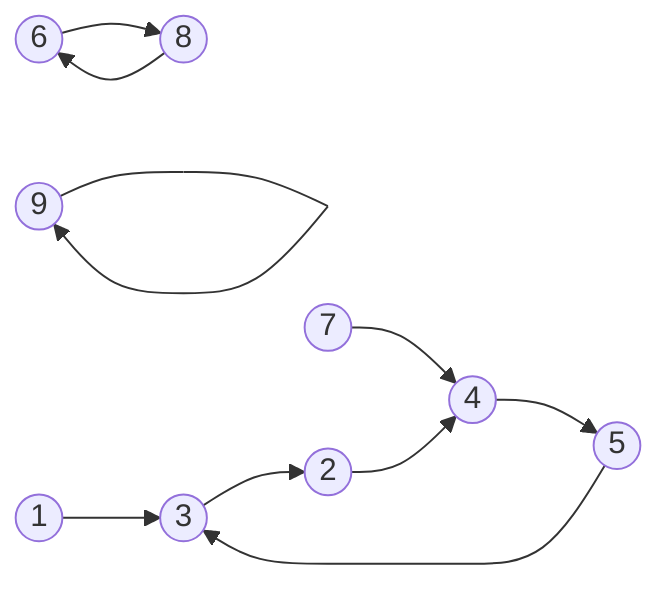

## 最大数字 lanqiao 2193
https://www.lanqiao.cn/problems/2193/learning/?page=1&first_category_id=1&name=%E6%9C%80%E5%A4%A7%E6%95%B0%E5%AD%97

**问题描述**

给定一个正整数 N 。你可以对 N 的任意一位数字执行任意次以下 2 种操 作：

1. 将该位数字加 1 。如果该位数字已经是 9 , 加 1 之后变成 0 。

2. 将该位数字减 1 。如果该位数字已经是 0 , 减 1 之后变成 9 。

你现在总共可以执行 1 号操作不超过 A 次, 2 号操作不超过 B 次。 请问你最大可以将 N 变成多少?
**输入格式**

第一行包含 3 个整数: N,A,B
**输出格式**

一个整数代表答案。
**样例输入**
```
123 1 2
```
**样例输出**
```
933
```
**样例说明**

对百位数字执行 2 次 2 号操作, 对十位数字执行 1 次 1 号操作。
**评测用例规模与约定**

对于 30%30% 的数据, 1≤N≤100; 0≤A,B≤10

对于 100%100% 的数据, 1≤N≤10^17;0≤A,B≤100
**运行限制**

- 最大运行时间: 1s
- 最大运行内存: 512M

**思路**: 
1. 贪心: 从左到右, 近可能构造9

```py
N, A, B = map(int, input().split())
sN = str(N)
lenN = len(sN)
res = 0
# 当前的贪心策略虽然高效, 但在某些情况下可能无法找到全局最优解
for i in range(len(sN)):
    base = 10 ** (lenN - i - 1)
    x = int(sN[i])
    if x != 9:
        need_add = 9 - x
        need_sub = x+1
        if need_add<= A  and (need_add <= need_sub or B < need_sub):
            A -= need_add
            res += 9 * base
        elif need_sub <= B:
            B -= need_sub
            res += 9 * base
        elif 0 < A:
            res += (x + A) * base
            A = 0
        else:
          res += x * base
    else:
        res += x * base
print(res)
```

```py
def dfs(i, curr, a, b):
    global res
    if  i == lenN:
        res = max(res, curr)
        return
    x = int(sN[i])
    d = min(9-x, a)
    dfs(i+1, curr*10+(x+d), a-d, b)
    if x+1<=b:
        dfs(i+1, curr*10+9, a, b-(x+1))
dfs(0, 0, A, B)
```

## 小朋友崇拜圈 lanqiao 182

https://www.lanqiao.cn/problems/182/learning/?page=1&first_category_id=1&name=%E5%B0%8F%E6%9C%8B%E5%8F%8B%E5%B4%87%E6%8B%9C%E5%9C%88

**题目描述**

班里 N 个小朋友，每个人都有自己最崇拜的一个小朋友（也可以是自己）。

在一个游戏中，需要小朋友坐一个圈，每个小朋友都有自己最崇拜的小朋友在他的右手边。

求满足条件的圈最大多少人？

小朋友编号为 1,2,3,⋯N
**输入描述**

输入第一行，一个整数 `N (3<N<10^5)`

接下来一行 N 个整数，由空格分开。
**输出描述**

要求输出一个整数，表示满足条件的最大圈的人数。
**输入输出样例**

示例

>输入
```
9
3 4 2 5 3 8 4 6 9
```

>输出

```
4
```

>样例解释

如下图所示，崇拜关系用箭头表示，红色表示不在圈中。

显然，最大圈是[2 4 5 3] 构成的圈。

运行限制

- 最大运行时间: 1s
- 最大运行内存: 256M

**分析**
- 每个节点 `u` 有且仅有一条出边 `u->v`, 给定数组 `g`, `g[u]==v` 表示这条出边

```py showLineNumbers
import sys
sys.setrecursionlimit(10**5)
n = int(input())
g = [0]+ list(map(int, input().split()))
res = 0 
dct = {}
def dfs(u, idx):
    global res
    if u in dct:
        res = max(res, idx - dct[u])
        return
    dct[u] = idx
    dfs(g[u], idx+1)
for u in range(1, n+1):
    dfs(u, 0)
print(res)
```
