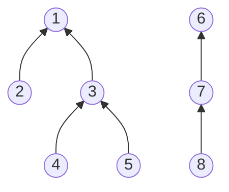

## overview

它可以高效地解决以下问题: 
1. 合并 (Union) ：将两个集合合并为一个集合。
2. 查询 (Find) ：查询某个元素属于哪个集合 (通常通过找到集合的代表元素, 即根节点)。 

并查集的核心思想是用一个数组表示集合，通过路径压缩和按秩合并优化，使得查询和合并操作的时间复杂度接近常数 (摊还时间复杂度为 $O(\alpha(n))$，其中 $\alpha(n)$ 是反阿克曼函数，增长极慢) 