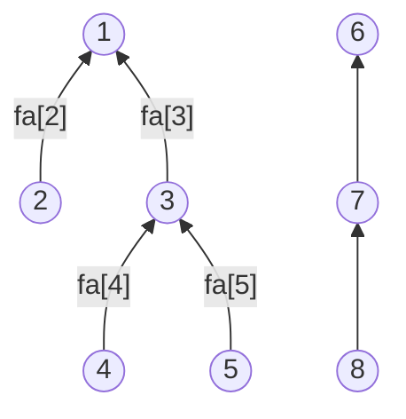

## overview

它可以高效地解决以下问题: 
1. 合并 (Union) ：将两个集合合并为一个集合 (合并对应的树)。
2. 查询 (Find) ：查询某个元素属于哪个集合 (通常通过找到集合的代表元素, 即根节点)。 

并查集的核心思想是用一个数组表示集合，通过路径压缩和按秩合并优化，使得查询和合并操作的时间复杂度接近常数 (摊还时间复杂度为 $O(\alpha(n))$，其中 $\alpha(n)$ 是反阿克曼函数，增长极慢) 

### find

```math
\begin{align}
& find(x) = x 所在集合的根节点的值 \\
& if\quad fa[x] = x : 表示 x 是根节点 \\
& else : find(fa[x]) 递归调用, 沿着树向上找
\end{align}
```
通常在判断是否可达, 连通性问题时 进行查询, 如需要判断 u, v 是否属于同一个集合, 则可以判断 find(u) == find(v)
```py
# 例如 fa[4] = 3 -> fa[3] = 1 -> fa[1] = 1
def find(x):
    if fa[x] != x:
        fa[x] = find(fa[x]) # 路径压缩
    return fa[x]
```
```py
# or 如下写法
def find(x):
    return x if fa[x] == x else find(fa[x])

find = lambda x: x if fa[x] == x else find(fa[x])
```

### union
有时需要将两个集合合并(例如两个家庭结婚), 例如将 u, v 合并为同一个集合, 则可以将 u 的根节点的父节点设为 v 的根节点
```math
```
> [!info]- python 的 `=` 操作是 **引用模型** (Reference Model)
> `a = b{:py}` 是将 a 指向 b
>```py
> # 赋值语法: 变量 = 字面量; 实际上是
> b = [1, 2, 3]
> # 引用语法: 变量 = 变量
> a = b
> a[0] = 4
> print(b) # [4, 2, 3]
> ```
