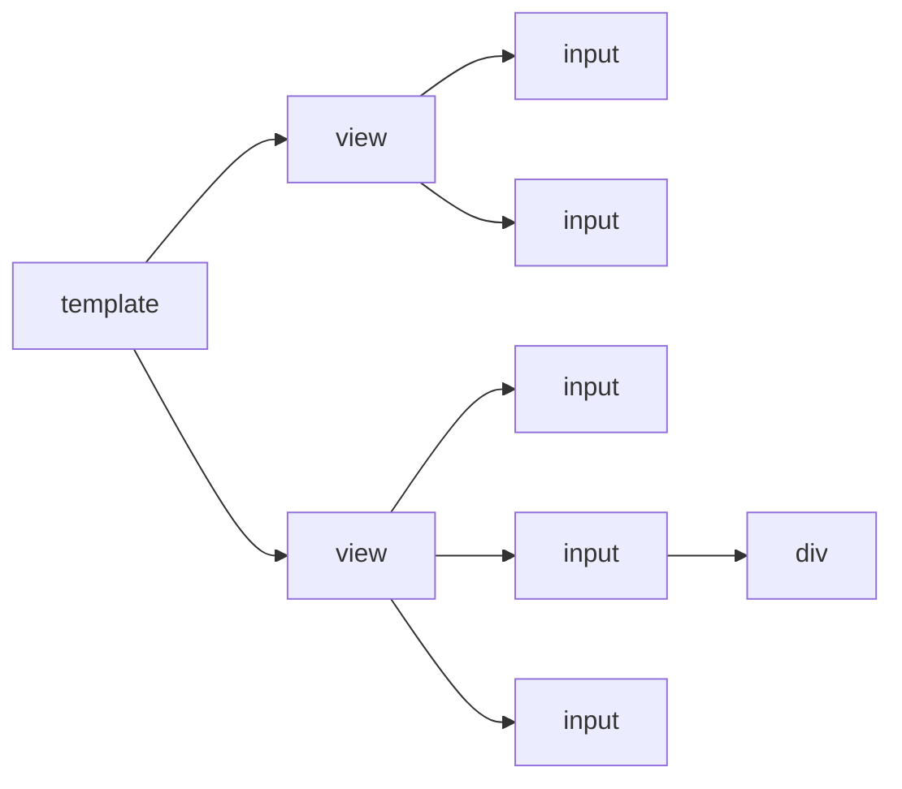

```html
<template>
  <view>
    <input />
    <input />
  </view>
  <view>
    <input />
    <input >
      <div ></div>
    </input>
    <input />
  </view>
</template>

<style scoped lang="scss">
view {
  display: block;
  input {
    display: block;
  }
}

div {
  display: block;
}
</style>
```

